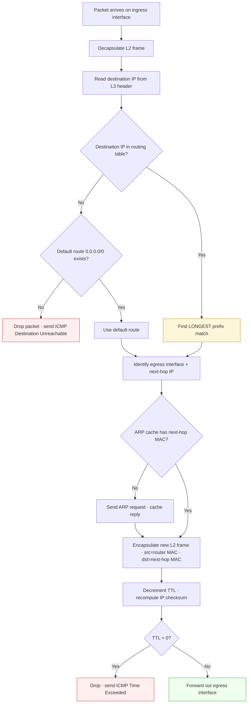

# Blueprint 1.1 — Network Components (Atomic Drill List)

> **Scope:** Cisco's blueprint stops at the lettered level (`1.1.a Routers`). This page extends each letter into atomic study points (`1.1.a.1`, `1.1.a.2`...) — single-fact drill cards. Each point is something you should be able to recall in <3 sec.
>
> **Source mix:** Cisco blueprint scaffolding · Jeremy's IT Lab Day 1 · community wisdom synthesized from r/ccna, Cisco Learning Network, NetworkLessons, NetworkAcademy, CBT Nuggets.
>
> **How to use:** Read each atomic point. If you can't explain it without looking, mark it. Drill marked points with [[../../cheat-sheets/day-01-network-devices|Day-1 cheat sheet]] open.

---

## Domain weight

`1.0 Network Fundamentals = 20%` of exam. `1.1` = the foundation everything else assumes.

---

## 1.1.a — Routers

| ID      | Fact                                                                                                                                                |
| ------- | --------------------------------------------------------------------------------------------------------------------------------------------------- |
| 1.1.a.1 | Operates at **Layer 3** (network).                                                                                                                  |
| 1.1.a.2 | Forwards by **destination IP address**.                                                                                                             |
| 1.1.a.3 | Lookup uses **longest-prefix match** in the routing table.                                                                                          |
| 1.1.a.4 | Connects **different networks** (LAN↔LAN, LAN↔Internet).                                                                                            |
| 1.1.a.5 | **Few** interfaces (2 → handful, vs switches' many).                                                                                                |
| 1.1.a.6 | **Separates broadcast domains** — one per interface.                                                                                                |
| 1.1.a.7 | Routing table sources by code: **C** (connected), **L** (local), **S** (static), **O** (OSPF), **D** (EIGRP), **B** (BGP), **i** (IS-IS). Memorize. |
| 1.1.a.8 | Cisco product line: **ISR** (Integrated Services Router) — 900/2900/4000.                                                                           |

**Community gotcha (r/ccna pattern):** Reading `show ip route` output is a *recurring* exam stem. Drill it until letter codes are reflex.

**Exam giveaway phrases:** "connect separate networks", "boundary device", "send over the Internet", "few interfaces".

---

## 1.1.b — Layer 2 and Layer 3 Switches

| ID | Fact |
|---|---|
| 1.1.b.1 | **L2 switch** = forwards by **MAC address**. |
| 1.1.b.2 | **L3 switch** = forwards by MAC AND IP (does inter-VLAN routing at wire speed). |
| 1.1.b.3 | Switches have **many** ports (24, 48 common). |
| 1.1.b.4 | L2 switch learns source MACs → builds **MAC address table**. |
| 1.1.b.5 | Unknown destination MAC → **flood** out all ports except source. |
| 1.1.b.6 | Each switch port = one **collision domain**. |
| 1.1.b.7 | Default broadcast domain = **one per VLAN** (or whole switch if no VLANs). |
| 1.1.b.8 | L3 switch use case: **campus distribution layer** (replaces router-on-a-stick). |
| 1.1.b.9 | L3 switch holds both **MAC table + routing table**. |
| 1.1.b.10 | Cisco product line: **Catalyst** (9200/9300/9500). |

**Community gotcha:** "L3 switch vs router" trips many. Same forwarding role, different optimization — switch is hardware-fast within campus, router does WAN/Internet edge.

**Exam giveaway phrases:** "many ports", "same LAN", "connect 30 PCs", "MAC".

---

## 1.1.c — Next-Generation Firewalls + IPS

| ID | Fact |
|---|---|
| 1.1.c.1 | **Traditional firewall** = packet filter (src/dst IP, ports, protocol) + stateful (tracks connections). |
| 1.1.c.2 | **NGFW** = traditional + **application awareness** + **integrated IPS** + URL filter + TLS decrypt + threat-intel feeds. |
| 1.1.c.3 | NGFW exists because modern apps tunnel inside HTTPS:443 — port-based rules can't separate Facebook from Dropbox. |
| 1.1.c.4 | **IPS (Intrusion Prevention)** = **inline**, inspects payload against signatures, **drops matches**. |
| 1.1.c.5 | **IDS (Intrusion Detection)** = **out-of-band** (SPAN/tap), **alerts only**, can't block. |
| 1.1.c.6 | Cisco NGFW: **Firepower / Cisco Secure Firewall**. |
| 1.1.c.7 | Cisco legacy: **ASA** (5500-X / 5505) — non-NGFW but still on exam. |
| 1.1.c.8 | **Network firewall ≠ host firewall** (host = software on one PC). |

**Community gotcha:** IPS vs IDS is a common trap. Mnemonic: **IPS = Prevent (inline+drop)**, **IDS = Detect (passive+alert)**.

**Exam giveaway phrases:** "block by application" → NGFW. "drop malicious packet inline" → IPS. "alert on suspicious traffic, no blocking" → IDS.

---

## 1.1.d — Access Points (APs)

| ID | Fact |
|---|---|
| 1.1.d.1 | Bridges **wireless clients ↔ wired LAN**. |
| 1.1.d.2 | Wireless is **half-duplex** (radio = shared medium). |
| 1.1.d.3 | Usually powered by **PoE** (one cable to ceiling). |
| 1.1.d.4 | **Autonomous AP** = self-contained config, own auth, bridges locally, managed individually. |
| 1.1.d.5 | **Lightweight AP (LWAP)** = dumb radio, paired with a **WLC** over **CAPWAP**. |
| 1.1.d.6 | **Split-MAC** (lightweight model): AP keeps time-critical functions (TX/RX, encryption, beacons); WLC does everything else (auth, key mgmt, QoS, roaming, RF tuning). |
| 1.1.d.7 | **CAPWAP control** port = **UDP 5246**. |
| 1.1.d.8 | **CAPWAP data** port = **UDP 5247**. |
| 1.1.d.9 | Cisco product line: **Catalyst 9120 / 9130** APs. |

**Community gotcha:** Memorize CAPWAP ports cold — recurring exam fact. Also: autonomous APs don't need a WLC; only lightweight do.

---

## 1.1.e — Controllers (WLC + Cisco DNA Center)

| ID | Fact |
|---|---|
| 1.1.e.1 | **WLC (Wireless LAN Controller)** = manages a fleet of lightweight APs. Wireless only. |
| 1.1.e.2 | **Cisco DNA Center** = manages the whole campus (switches, APs, WLCs, routers — wired + wireless). |
| 1.1.e.3 | WLC duties: SSID config, security policy, RF tuning, client association, roaming, channel/power planning. |
| 1.1.e.4 | WLC form factors: physical appliance (**Catalyst 9800**), VM, or embedded in a switch. |
| 1.1.e.5 | DNA Center model = **intent-based networking** — admin describes intent, DNA Center translates to device config. |
| 1.1.e.6 | DNA Center collects telemetry across the whole network (assurance + analytics). |
| 1.1.e.7 | "Manage 200 APs from one console" → **WLC**. "Manage entire campus by intent" → **DNA Center**. |

---

## 1.1.f — Endpoints

| ID | Fact |
|---|---|
| 1.1.f.1 | Endpoint = **source or final destination** of traffic. |
| 1.1.f.2 | Position: **edges** of the network, never the middle. |
| 1.1.f.3 | Examples: laptops, desktops, phones, IP cameras, IoT sensors, printers. |
| 1.1.f.4 | Connection method: **NIC** (Network Interface Card) — wired (RJ45/fiber) or wireless. |
| 1.1.f.5 | **Endpoint ≠ network device.** Endpoint generates/consumes; network device forwards/filters. |
| 1.1.f.6 | Trap: when stem says "joins/links/forwards" — endpoint is wrong. Endpoints get connected, they don't connect. |

---

## 1.1.g — Servers

| ID | Fact |
|---|---|
| 1.1.g.1 | Server = **endpoint that responds to client requests**. |
| 1.1.g.2 | Server is a **role**, not a category of network gear. |
| 1.1.g.3 | Common services: **HTTP/HTTPS, SMB/NFS, DB, mail, DNS, time, AAA**. |
| 1.1.g.4 | Same hardware can be client OR server depending on the transaction. |
| 1.1.g.5 | Example: your laptop = client when loading YouTube; server when a friend pulls a file off it. |
| 1.1.g.6 | "AirDrop sender" / "providing" / "responds to clients" → **server** (responder role). |

---

## 1.1.h — PoE (Power over Ethernet)

| ID | Fact |
|---|---|
| 1.1.h.1 | **PSE** = Power Sourcing Equipment (the switch supplying power). |
| 1.1.h.2 | **PD** = Powered Device (the AP / IP phone / IP camera being powered). |
| 1.1.h.3 | **Budget** = total wattage the PSE can deliver across all PoE ports — **per-switch**, NOT per-port. |
| 1.1.h.4 | **Mode A** = power on data pairs (1/2 + 3/6). |
| 1.1.h.5 | **Mode B** = power on spare pairs (4/5 + 7/8). |
| 1.1.h.6 | **802.3af (PoE)** = PSE 15.4 W / PD ~12.95 W, 2 pairs. |
| 1.1.h.7 | **802.3at (PoE+)** = PSE 30 W / PD ~25.5 W, 2 pairs. |
| 1.1.h.8 | **802.3bt Type 3 (PoE++/4PPoE)** = PSE 60 W / PD ~51 W, 4 pairs. |
| 1.1.h.9 | **802.3bt Type 4 (PoE++/4PPoE)** = PSE 100 W / PD ~71 W, 4 pairs. |
| 1.1.h.10 | PSE + PD **negotiate** during link bring-up so the PSE only delivers what the PD needs. |
| 1.1.h.11 | **Backward compat:** 802.3af device works on an 802.3at switch. **Reverse fails** (af switch can't power an at-only PD — not enough wattage). |
| 1.1.h.12 | **Trap:** A 24-port PoE+ switch with 370 W budget cannot run all 24 ports at 25.5 W simultaneously (24 × 25.5 = 612 W > 370 W). |

**Community wisdom:** PoE math questions show up as "given budget X, how many PDs at Y watts can the switch run?" Always subtract a safety margin (~10-15%).

---

## High-Value Confusable Pairs

| Pair | Key contrast |
|---|---|
| **L2 vs L3 switch** | L3 adds routing — does inter-VLAN forwarding at wire speed |
| **Switch vs Router** | Switch = same LAN, many ports, MAC. Router = between LANs, few ports, IP |
| **Traditional firewall vs NGFW** | NGFW adds app awareness + integrated IPS |
| **IPS vs IDS** | IPS = inline + blocks. IDS = out-of-band + alerts only |
| **Autonomous vs Lightweight AP** | Autonomous = self-contained. Lightweight = WLC-managed via CAPWAP |
| **WLC vs Cisco DNA Center** | WLC = wireless only. DNA = whole campus (wired + wireless) |
| **Endpoint vs Network device** | Endpoint = source/destination. Network device = forwarder/filter |
| **Client vs Server** | Role per transaction, not hardware |
| **Network firewall vs Host firewall** | Hardware appliance vs software on one PC |
| **PSE vs PD** | PSE supplies (switch). PD consumes (AP/phone/camera) |
| **PoE / PoE+ / PoE++** | 15 W / 30 W / 60–100 W |

---

## Exam Traps (high-frequency)

- **Router** is NOT for connecting many end hosts — too few ports.
- **Firewall** does NOT aggregate — it filters.
- **Server** is NOT a networking device — it's an endpoint role.
- **L2 switch alone** can NOT reach the internet — needs router or L3 switch.
- **Host-based firewall** is NOT a network firewall — software on one PC.
- **IDS** is NOT inline — alerts only. **IPS** is inline + blocks.
- **Autonomous APs** do NOT use a WLC — only lightweight APs do.
- **PoE budget** is NOT per-port — per-switch total.
- **Layer 2 switch** does NOT forward by IP — only L3 switch and router do.
- **Half-duplex** is forced by hubs and wireless — wired switch ports default to full-duplex.

---

## Quick-Answer Map (1-stem-1-answer)

| Stem | Answer |
|---|---|
| Connect 30 PCs in one LAN | L2 switch |
| Connect different LANs | Router or L3 switch |
| Inter-VLAN routing at wire speed | L3 switch |
| Block Facebook inside HTTPS | NGFW (app awareness) |
| Drop a known attack signature inline | IPS |
| Alert on suspicious traffic, can't block | IDS |
| Bridge wireless clients to wired LAN | Access point |
| Manage 200 APs from one console | WLC |
| Manage entire campus by intent | Cisco DNA Center |
| Source or destination of traffic | Endpoint |
| Endpoint that responds to clients | Server |
| Power an AP through Ethernet cable | PoE (PSE → PD) |
| Friend AirDrops you a video — friend's phone is | Server (responder) |
| You watching YouTube — your device is | Client (requester) |
| Block external attacker | Firewall (NGFW for advanced) |
| Forwards data over the Internet | Router |
| Forwards by MAC inside one LAN | L2 switch |

---

## One-Line Master Recall

> **1.1 = 8 components: routers (L3), L2/L3 switches (LAN), NGFW + IPS (security), APs (wireless bridge), controllers WLC + DNA (centralized mgmt), endpoints (edges), servers (responders), PoE (power+data on one cable).**

---

## Drill Plan

1. Read each atomic fact (1.1.a.1 → 1.1.h.12). Mark anything you can't recall in <3 sec.
2. For each marked fact: open [[../../cheat-sheets/day-01-network-devices|Day-1 cheat sheet]], read context, close, re-drill.
3. Run [Quick-Answer Map](#quick-answer-map-1-stem-1-answer) end-to-end. Goal: 17/17 with no peeking.
4. Run Exam Traps from memory. Goal: explain *why* each is a trap.
5. Click into [[1-2-network-topology-architectures|1.2]] when 1.1 is reflex.

---

## Sources

- Cisco 200-301 v1.1 blueprint (`200-301-CCNA-v1.1.pdf` in `~/dev/CCNA_study/data/`)
- Jeremy's IT Lab Day 1 — Network Devices · https://www.youtube.com/@JeremysITLab
- NetworkAcademy.io — PoE deep-dive
- CBT Nuggets — 802.3at vs 802.3af
- 101Labs — PoE comparison
- Cisco Learning Network — exam topics page
- r/ccna community gotchas (synthesized from recurring threads)

---

*Next: [[1-2-network-topology-architectures|1.2 — Network Topology Architectures]]*


## 2026-04-29 — Visual Deep-Dive: 1.1.a Routers (template pattern)

> **Why this section exists.** Atomic-fact tables above pass *recall*, not *understanding*. Below extends 1.1.a Routers with the visual + scenario layers Romeo asked for: mermaid flowcharts, animated SVG, packet walks, exam scenarios. **This is the pattern to repeat for every blueprint leaf in every domain.**

---

### Pattern manifest (replicate per leaf)

Every blueprint leaf (`1.1.a`, `1.1.b`, ..., `6.7.x`) gets these sections in order:

1. **Atomic fact table** — already exists above. Single-line recall cards.
2. **Mental model** — 2–4 sentences that build the right mental picture. Plain-English analogy when useful.
3. **Mermaid flowchart** — decision logic or topology. Drawn so it renders inside Obsidian.
4. **Animated SVG** — one motion that answers "what changes over time?" (per `feedback_animation_discipline`). Embedded HTML inside markdown.
5. **Packet walk / scenario** — concrete example: source IP, destination, what each device does, what each table looks like.
6. **`show` command output** — copy-paste from a real Cisco device output, with the line-by-line annotation.
7. **Exam-stem decoder** — phrases-to-answer cheat table. Reflex training.
8. **Common traps** — wrong-answer patterns, mnemonic to avoid them.
9. **Confusables** — pairs of similar-but-different concepts.
10. **One-line recall** — single sentence that, if remembered, reconstructs the rest.

---

### 1.1.a — Routers · Mental model

A router is a **boundary device between IP networks**. Picture an airport hub: planes (packets) come in, the airport reads each plane's destination tag (destination IP), looks up the best gate (longest-prefix match in the routing table), and sends the plane out the matching gate (egress interface). Different airports = different IP networks. The router never tries to remember the plane — every packet gets a fresh lookup. That stateless-by-default lookup is why routing scales to the entire Internet.

> **Compare to a switch:** switch is the conveyor belt *inside one terminal* — same airport, just moving bags between gates. It cares about MAC (bag tag), not IP (city name).

---

### 1.1.a — Routers · Forwarding decision flow (mermaid)



**Why this matters for the exam:** Cisco loves to ask "what happens when packet X arrives at router Y." This flowchart is the answer. Memorize the order: **decap → lookup → ARP → re-encap → TTL → forward**.

---

### 1.1.a — Routers · Longest-prefix match (animated SVG)

The single most-tested router concept. Three routes match destination `10.1.2.5` — only the *most specific* (longest mask) wins.

```html
<svg viewBox="0 0 720 320" xmlns="http://www.w3.org/2000/svg" style="background:#0b0f17;border-radius:8px;font-family:ui-monospace,SFMono-Regular,Menlo,monospace">
  <style>
    .label { fill:#cdd6f4; font-size:13px }
    .ip { fill:#89b4fa; font-size:14px; font-weight:bold }
    .mask { fill:#f9e2af; font-size:12px }
    .iface { fill:#a6e3a1; font-size:12px }
    .winner { fill:#f38ba8; font-size:14px; font-weight:bold }
    .pkt { fill:#f5c2e7 }
    .row { stroke:#313244; stroke-width:1; fill:#1e1e2e }
    .row-win { stroke:#f38ba8; stroke-width:2; fill:#2a1f2b }
    @keyframes scan {
      0%   { transform: translateY(0px);   opacity:0 }
      10%  { opacity:1 }
      33%  { transform: translateY(50px) }
      66%  { transform: translateY(100px) }
      90%  { opacity:1 }
      100% { transform: translateY(150px); opacity:0 }
    }
    @keyframes glow {
      0%, 60%   { fill:#1e1e2e; stroke:#313244 }
      70%, 100% { fill:#2a1f2b; stroke:#f38ba8; stroke-width:2 }
    }
    .scanner { animation: scan 4s ease-in-out infinite }
    .row-c   { animation: glow 4s ease-in-out infinite }
  </style>

  <text x="20" y="30" class="label">Destination IP arriving:</text>
  <text x="220" y="30" class="ip">10.1.2.5</text>
  <text x="20" y="55" class="label">Routing table (3 candidate routes):</text>

  <!-- header -->
  <rect x="20" y="75" width="680" height="32" class="row" />
  <text x="40"  y="96" class="label">Destination / Mask</text>
  <text x="320" y="96" class="label">Length</text>
  <text x="430" y="96" class="label">Next hop</text>
  <text x="580" y="96" class="label">Egress</text>

  <!-- row A -->
  <rect x="20" y="115" width="680" height="40" class="row" />
  <text x="40"  y="140" class="ip">10.0.0.0</text>
  <text x="125" y="140" class="mask">/8</text>
  <text x="320" y="140" class="mask">8 bits</text>
  <text x="430" y="140" class="iface">192.168.1.2</text>
  <text x="580" y="140" class="iface">Gi0/1</text>

  <!-- row B -->
  <rect x="20" y="160" width="680" height="40" class="row" />
  <text x="40"  y="185" class="ip">10.1.0.0</text>
  <text x="125" y="185" class="mask">/16</text>
  <text x="320" y="185" class="mask">16 bits</text>
  <text x="430" y="185" class="iface">192.168.1.3</text>
  <text x="580" y="185" class="iface">Gi0/2</text>

  <!-- row C (winner) -->
  <rect x="20" y="205" width="680" height="40" class="row-c" />
  <text x="40"  y="230" class="ip">10.1.2.0</text>
  <text x="125" y="230" class="mask">/24</text>
  <text x="320" y="230" class="winner">24 bits ← WIN</text>
  <text x="430" y="230" class="iface">192.168.1.4</text>
  <text x="580" y="230" class="iface">Gi0/3</text>

  <!-- scanner highlight -->
  <rect x="20" y="115" width="680" height="40" fill="#f9e2af" opacity="0.18" class="scanner" />

  <!-- explanation -->
  <text x="20" y="275" class="label">All three rows match. Router picks the row with the most</text>
  <text x="20" y="293" class="label">network bits set in the mask — /24 beats /16 beats /8.</text>
  <text x="20" y="311" class="winner">Forward 10.1.2.5 → 192.168.1.4 out Gi0/3.</text>
</svg>
```

**Drill:** if dest = `10.1.99.5`, who wins? *(/16 — only A and B match; B is more specific.)* If dest = `192.168.1.50`, who wins? *(none of these three — would need a default route or be dropped.)*

---

### 1.1.a — Routers · Two-LAN packet walk

```
PC-A  -------+                                         +-------  PC-B
10.1.1.10    |                                         |        10.2.2.20
/24          |   [ R1 ]----- 192.168.99.0/30 -----[ R2 ]         /24
gw=10.1.1.1  |   Gi0/0       Gi0/1        Gi0/0    Gi0/1
             |   10.1.1.1    192.168.99.1 192.168.99.2 10.2.2.1
```

Packet from PC-A → PC-B (`ping 10.2.2.20`):

| Step | Where | What happens |
|---|---|---|
| 1 | PC-A | Compares `10.2.2.20` to its own `/24` → not local. Sends frame to default gateway MAC (R1-Gi0/0). |
| 2 | R1 ingress | Strips L2 frame. Reads dest IP `10.2.2.20`. |
| 3 | R1 lookup | Routing table: `10.2.2.0/24 via 192.168.99.2`. Hit. |
| 4 | R1 ARP | Resolves `192.168.99.2` MAC (R2-Gi0/0). Caches. |
| 5 | R1 egress | Re-encapsulates. **Src MAC = R1-Gi0/1, Dst MAC = R2-Gi0/0**. TTL `64 → 63`. Forwards out Gi0/1. |
| 6 | R2 ingress | Same dance. Reads dest IP. |
| 7 | R2 lookup | `10.2.2.0/24 directly connected, Gi0/1`. |
| 8 | R2 ARP | Resolves `10.2.2.20` MAC (PC-B). |
| 9 | R2 egress | Re-encapsulates. **Src MAC = R2-Gi0/1, Dst MAC = PC-B**. TTL `63 → 62`. |
| 10 | PC-B | Receives. Replies; reverse trip. |

**Burn-in observations:**
- **Source/dest IP never change end-to-end.** Always `10.1.1.10 → 10.2.2.20`.
- **Source/dest MAC change at every router hop.** This is *the* L2-vs-L3 distinction.
- **TTL decrements once per router hop**, not per switch hop.

---

### 1.1.a — Routers · `show ip route` annotated

```
R1# show ip route
Codes: L - local, C - connected, S - static, R - RIP, M - mobile, B - BGP
       D - EIGRP, EX - EIGRP external, O - OSPF, IA - OSPF inter area
       N1 - OSPF NSSA external type 1, N2 - OSPF NSSA external type 2
       E1 - OSPF external type 1, E2 - OSPF external type 2
       i - IS-IS, su - IS-IS summary, L1 - IS-IS level-1, L2 - IS-IS level-2
       ia - IS-IS inter area, * - candidate default, U - per-user static route
       o - ODR, P - periodic downloaded static route, H - NHRP, l - LISP
       a - application route
       + - replicated route, % - next hop override, p - overrides from PfR

Gateway of last resort is 203.0.113.1 to network 0.0.0.0

S*    0.0.0.0/0 [1/0] via 203.0.113.1                    ← default route, AD=1, static
      10.0.0.0/8 is variably subnetted, 4 subnets, 2 masks
C        10.1.1.0/24 is directly connected, GigabitEthernet0/0   ← C = connected
L        10.1.1.1/32 is directly connected, GigabitEthernet0/0   ← L = local (the router's own IP)
O        10.2.2.0/24 [110/2] via 192.168.99.2, 00:14:22, GigabitEthernet0/1
                                                          ↑       ↑
                                                          AD=110  metric=2 (OSPF cost)
      192.168.99.0/30 is subnetted, 1 subnets
C        192.168.99.0 is directly connected, GigabitEthernet0/1
L        192.168.99.1/32 is directly connected, GigabitEthernet0/1
```

**Reading the bracket `[110/2]`:** first number is **administrative distance** (trustworthiness of the source), second is **metric** (cost within that protocol). When two protocols both offer a route, lower AD wins. AD table to memorize:

| Source | AD |
|---|---|
| Connected | 0 |
| Static | 1 |
| eBGP | 20 |
| EIGRP (internal) | 90 |
| OSPF | 110 |
| IS-IS | 115 |
| RIP | 120 |
| EIGRP (external) | 170 |
| iBGP | 200 |
| Unknown / unreachable | 255 |

**Mnemonic for the AD ladder:** `0-1` connected/static at the floor, `20` eBGP, then "**90, 110, 115, 120**" climb (EIGRP→OSPF→IS-IS→RIP), `170` ext-EIGRP, `200` iBGP, `255` dead.

---

### 1.1.a — Routers · Exam-stem decoder

| Stem phrase | Reflex answer |
|---|---|
| "connects different networks" | Router |
| "boundary device" | Router |
| "forwards over the Internet" | Router |
| "forwards by destination IP" | Router (or L3 switch) |
| "longest-prefix match" | Router (or L3 switch) |
| "decrements TTL" | Router (or L3 switch) |
| "few interfaces" | Router |
| "separates broadcast domains" | Router (one per interface) |
| "ISR / 4451 / 2900" | Cisco router product line |
| "2 codes in routing table for one network: C and L" | C = connected subnet, L = router's own IP on that subnet |

---

### 1.1.a — Routers · Common traps

- **TTL is decremented by routers, not switches.** L2 switches do not touch TTL. *Trap:* "switch decrements TTL" → false (unless it's specifically an L3 switch routing the packet).
- **Source/dest IP do not change end-to-end** (NAT excluded). *Trap:* "router rewrites source IP at every hop" → false.
- **A connected route's mask comes from the interface config**, not from a separate route statement. Configuring `ip address 10.1.1.1 255.255.255.0` creates **both** the `C 10.1.1.0/24` and the `L 10.1.1.1/32` entries.
- **Default route ≠ no route.** A router with `0.0.0.0/0` configured will *always* find a match. *Trap:* "router has no entry for 8.8.8.8 → packet dropped" → false if a default route exists.
- **Routing happens after de-encapsulation, not on the L2 frame.** The router strips the frame, looks at the L3 header, then builds a *new* frame for egress.

---

### 1.1.a — Routers · Confusables

| Pair | Quick contrast |
|---|---|
| **Router vs L3 switch** | Same forwarding role; router optimized for WAN/edge (fewer ports, more interface types), L3 switch optimized for in-campus inter-VLAN (many ports, ASIC-fast). |
| **Routing table vs ARP table** | Routing table = "which interface for which network." ARP table = "which MAC for the next-hop IP." Both are consulted on every forward. |
| **Connected (C) vs Local (L)** | C = the whole `/24` subnet on the interface. L = the router's own IP as a `/32` host route. |
| **Static vs Default route** | Static = explicit destination. Default = `0.0.0.0/0` catch-all when nothing else matches. |
| **Administrative distance vs Metric** | AD picks **between protocols**. Metric picks **within one protocol**. |

---

### 1.1.a — Routers · One-line master recall

> **A router is an L3 boundary device that strips the L2 frame, finds the longest-prefix match for the destination IP in its routing table, ARPs for the next-hop MAC, decrements TTL, builds a new L2 frame, and forwards it out the matching egress interface — with `show ip route` codes C/L/S/O/D/B/i revealing how each route was learned.**

---

## Pattern Status & Scaling Plan

This 1.1.a expansion is the **template proof**. Sections 2 → 10 of the manifest above are now demonstrated. Total render: 1 mermaid flowchart, 1 animated SVG, 5 detailed tables, 1 packet walk, 1 annotated `show` output.

**Remaining queue (52 leaves across 6 domains):**

| Domain | Leaves remaining | Est. token cost per leaf | Priority order |
|---|---|---|---|
| 1 Network Fundamentals | 1.1.b–h, 1.2.a–f, 1.3.a–b, 1.5–1.13 | ~3–4k | 1st (foundation) |
| 2 Network Access | 2.1–2.9 | ~4k | 2nd (heaviest tested w/ 1) |
| 3 IP Connectivity | 3.1–3.5 (esp. OSPF, static routing) | ~5k (visual-heavy) | 3rd |
| 4 IP Services | 4.1–4.9 (NAT, DHCP, NTP, QoS, etc.) | ~3k | 4th |
| 5 Security Fundamentals | 5.1–5.10 | ~3k | 5th |
| 6 Automation | 6.1–6.7 | ~2.5k | last (lowest blueprint weight) |

**Decision needed from Romeo before scaling:**

1. **Confirm pattern.** Does the 1.1.a expansion above match what you want every leaf to look like? Anything missing (e.g., flashcard JSON, audio script, Packet Tracer config snippet)?
2. **Cadence.** Should I rip through all 52 in one massive batch, or one domain at a time so you can drill as I write?
3. **Animations budget.** Each leaf gets 1 animated SVG by default. Skip for leaves where motion adds nothing (e.g., "list of QoS tools")?
4. **Mermaid placement.** Some leaves don't have decision flow (e.g., "list of address types"). For those, swap mermaid for a comparison matrix or topology diagram?

Once those are answered, this becomes a mechanical run.
