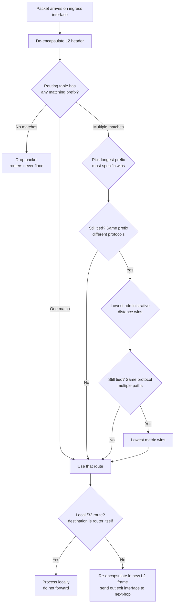
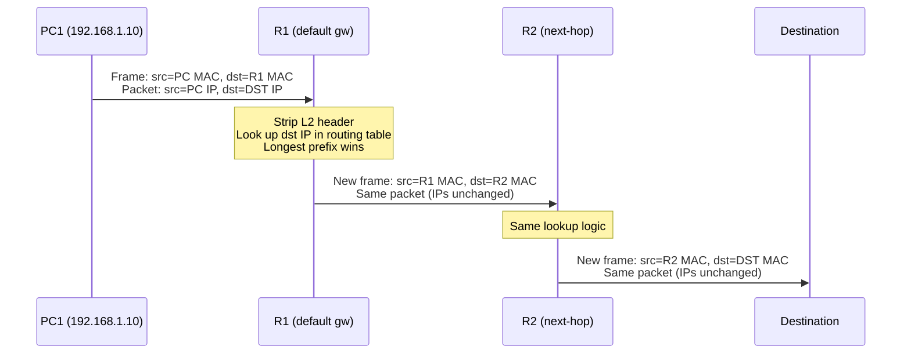

# Routing Fundamentals + Forwarding Decision

> **Domain 3.0 IP Connectivity (25% of exam)** · Blueprint 3.1 (interpret routing-table components) + 3.2 (determine how a router makes a forwarding decision)

## 📺 Sources
- [[../jeremy-it-videos/019-routing-fundamentals-day-11-part-1]] — Day 11 part 1 — Routing Fundamentals
- Inline `[Day 11 @ MM:SS]` anchors throughout reference back to specific moments in the transcript.

## 🎯 What you must walk away with
- Read every column of `show ip route` output: code letter, prefix/mask, AD/metric, next-hop, exit interface, age.
- Apply the forwarding decision in order: **longest prefix match → administrative distance → metric**.
- Explain why a router **drops** an unmatched packet while a switch **floods** an unknown unicast frame.
- Distinguish a Connected (`C`) route from a Local (`L`) route by their masks and roles.

## 🧠 Core Concept

**A router forwards each packet using the most specific matching route in its routing table; if nothing matches, the packet is dropped.** The routing table is the only thing standing between an arriving packet and the trash bin. Every later topic — static routing, OSPF, EIGRP, default routes, redistribution — is just a different way of writing entries into this same table. Master the forwarding rule and you have the spine of Domain 3.0.

`[Day 11 @ 01:40]` Routing is "the process that routers use to determine the path that IP packets should take over a network to reach their destination." Routers store everything they've learned in the routing table, then consult it on every single packet.

## 🔄 Decision Flow (Mermaid)



## 🔑 Reference Tables

### Routing-table codes you must recognize

| Code | Source | Default AD | When it appears |
|------|--------|-----------:|-----------------|
| `C`  | Connected | 0 | Interface has IP + is `no shutdown` |
| `L`  | Local | 0 | Auto-added /32 for the interface IP itself |
| `S`  | Static | 1 | Manually configured via `ip route` |
| `S*` | Static (candidate default) | 1 | Static `0.0.0.0/0` flagged as gateway of last resort |
| `R`  | RIP | 120 | Distance-vector dynamic |
| `D`  | EIGRP (internal) | 90 | Cisco hybrid |
| `D EX` | EIGRP external | 170 | Redistributed into EIGRP |
| `O`  | OSPF intra-area | 110 | Same area |
| `O IA` | OSPF inter-area | 110 | Different area, learned via ABR |
| `O E1 / E2` | OSPF external | 110 | Type-5 LSA from ASBR |
| `B`  | BGP | 20 (eBGP) / 200 (iBGP) | Internet routing |

### Forwarding decision tiebreakers — in order

| Step | Rule | Example |
|------|------|---------|
| 1 | **Longest prefix match** | `/32` beats `/24` beats `/0` regardless of protocol |
| 2 | **Lowest administrative distance** | Static (AD 1) beats OSPF (AD 110) when prefix lengths tie |
| 3 | **Lowest metric** | Within same protocol, lowest cost/hop-count/composite wins |
| 4 | **Equal-cost multi-path (ECMP)** | If still tied, install all paths and load-balance |

### Connected (C) vs Local (L) — the auto-pair

| Aspect | Connected (C) | Local (L) |
|--------|---------------|-----------|
| Prefix | Network address with **interface mask** (e.g. /24) | Always **/32** |
| Purpose | "How to reach the subnet behind my interface" | "This packet is for me, don't forward" |
| Trigger | IP configured + `no shutdown` | Same — added simultaneously |
| Next-hop in show output | "directly connected" | "directly connected" |
| Removed when | Interface shutdown or IP removed | Same |

## 🧪 Worked Examples

### Example 1 — Six routes from three interfaces

R1 has three GigabitEthernet interfaces, each configured with an IP and `no shutdown`:

- `G0/0` — `192.168.13.1/24`
- `G0/1` — `192.168.12.1/24`
- `G0/2` — `192.168.1.1/24`

**Question:** How many routes appear in `show ip route` immediately, with no static or dynamic routing configured?

**Step 1.** Each enabled interface contributes **two** auto-routes: one Connected (network), one Local (/32 of the interface IP).
**Step 2.** Three interfaces × two routes = **six routes**.
**Step 3.** Specifically:
- `C 192.168.13.0/24` + `L 192.168.13.1/32`
- `C 192.168.12.0/24` + `L 192.168.12.1/32`
- `C 192.168.1.0/24`  + `L 192.168.1.1/32`

`[Day 11 @ 09:07]` Jeremy confirms: "When you configure an IP address on an interface and enable it with the NO SHUTDOWN command, 2 routes per interface will automatically be added to the routing table."

### Example 2 — Longest-prefix tiebreak with three matches

R1's routing table contains:

```
C  192.168.0.0/16   directly connected, G0/0
S  192.168.1.0/24   via 10.0.0.2
L  192.168.1.1/32   directly connected, G0/0
```

A packet arrives destined for **`192.168.1.1`**. Which route wins?

**Step 1 — find every match.** Walk the table, check whether the destination falls inside each prefix.
- `192.168.0.0/16` covers `192.168.0.0` → `192.168.255.255` → match.
- `192.168.1.0/24` covers `192.168.1.0` → `192.168.1.255` → match.
- `192.168.1.1/32` covers exactly `192.168.1.1` → match.

**Step 2 — compare prefix lengths.** /32 > /24 > /16, so the /32 wins.
**Step 3 — act on the route.** It's a Local route, so R1 keeps the packet — de-encapsulates and processes it itself rather than forwarding.

The /16 and /24 entries never get a vote. Longest prefix is checked **before** administrative distance or metric.

### Example 3 — No match means drop

`[Day 11 @ 20:33]` Same R1, packet destined for `192.168.4.10`. R1 has only the six auto-routes from Example 1. Walk through:

- `192.168.13.0/24` → no, packet's first three octets are 192.168.4.
- `192.168.12.0/24` → no.
- `192.168.1.0/24` → no.
- The three /32 Locals → no.

**Result:** zero matches. R1 drops the packet. Unlike a switch, it does **not** flood it out every other interface — that behavior is exclusive to Layer 2.

## 📊 Per-packet flow (sequence diagram)



The packet's source/destination IPs never change end-to-end. The L2 header is rewritten at every hop. This is why the routing table only cares about Layer-3 destination addresses.

## 🚨 Exam Traps

1. **Routers do NOT flood.** Switches flood unknown-unicast frames; routers drop unmatched packets. This is the classic distractor.
2. **Local route is NOT /24.** It's always **/32** — the exact host address of the router's own interface. Don't write `L 192.168.1.0/24`; that doesn't exist.
3. **"Variably subnetted" is NOT a route.** It's a header line above grouped routes that share a parent network with different masks. Ignore it during route selection.
4. **Configuring an IP is NOT enough.** The interface must also be `no shutdown` or **neither C nor L appears**.
5. **Most specific is NOT lowest metric.** Prefix length is checked first; AD second; metric third. A `/32` route with metric 1000 beats a `/24` route with metric 1.
6. **AD ties between static `/24` and OSPF `/24`** → static wins (AD 1 vs 110). But if OSPF advertises a `/30` more specific than static's `/24`, OSPF wins on prefix length alone.
7. **A `/32` host route is NOT the same as a `/24` network route.** Even if both could match the same destination, the `/32` always wins.
8. **`show ip route` codes are case-sensitive.** Capital `D` is EIGRP, not "default." Capital `O` is OSPF. Capital `B` is BGP.

## ⚙️ Key Cisco IOS Commands

- `show ip route` — full routing table including codes legend.
- `show ip route <prefix>` — drills into one specific entry showing all candidate paths.
- `show ip route <ip>` — performs the forwarding lookup for a single destination, returns the chosen route.
- `show ip cef` — Cisco Express Forwarding table; what hardware actually uses for forwarding.
- `show ip interface brief` — quick check of interface status + IPs (verifies why C/L routes do or don't exist).
- `show running-config | section interface` — confirms `no shutdown` and IP config.
- `traceroute <destination>` — walks the forwarding path hop-by-hop, useful for verifying lookup behavior.
- `debug ip routing` — logs routing-table changes (lab only — chatty in production).

## 🧪 Self-Check Quiz

**Q1.** When you configure `ip address 10.0.0.1 255.255.255.252` and `no shutdown` on `GigabitEthernet0/0`, which two routes are automatically inserted into the routing table?

<details><summary>Answer</summary>
`C 10.0.0.0/30` (the connected network) and `L 10.0.0.1/32` (the local /32 for the router's own IP). Both get AD 0.
</details>

**Q2.** R1 has these routes: `S 10.1.0.0/16 [1/0] via 192.168.0.2`, `O 10.1.1.0/24 [110/2] via 192.168.0.3`, `D 10.1.1.128/25 [90/...] via 192.168.0.4`. A packet arrives for `10.1.1.130`. Which route wins?

<details><summary>Answer</summary>
The EIGRP `/25` wins. All three prefixes match `10.1.1.130`, but `/25` is the longest. Administrative distance (90 vs 1 vs 110) is irrelevant — prefix length is checked first.
</details>

**Q3.** A router receives a packet whose destination is unreachable from the routing table. What does it do?

<details><summary>Answer</summary>
It drops the packet. Routers never flood unknown destinations the way switches flood unknown-unicast frames. If a default route (`0.0.0.0/0`) exists, that route matches everything and the packet would be forwarded via it instead — but with no match at all, it dies.
</details>

**Q4.** True or false: the OSPF process ID and the EIGRP autonomous system number must match across neighbors for adjacencies to form.

<details><summary>Answer</summary>
False — only EIGRP. The OSPF process ID is locally significant; two routers can run `router ospf 1` and `router ospf 99` and still become neighbors. EIGRP AS numbers must match.
</details>

**Q5.** Which command would show every route in R1's table that could match destination `8.8.8.8`?

<details><summary>Answer</summary>
`show ip route 8.8.8.8` — performs a longest-prefix lookup for that destination and returns the chosen entry plus parent prefix info. Much faster than reading the whole table.
</details>

## 🧾 Recap

- The routing table is a list of forwarding **instructions**; one entry covers every packet that matches its prefix.
- Configuring an IP + `no shutdown` auto-installs two routes per interface — Connected (network) and Local (/32 of the interface IP).
- Forwarding tiebreakers run in order: **longest prefix match → admin distance → metric → ECMP**.
- A router with no matching route **drops** the packet — never floods. A default route turns "no match" into "match everything."
- If you can read `show ip route` line by line and explain the AD/metric brackets, the forwarding decision is unlocked — every other Domain 3.0 topic is just a way to populate this table.

---
**Source transcripts:**
- [Day 11 (Part 1) — Routing Fundamentals](https://www.youtube.com/watch?v=aHwAm8GYbn8)

**Cheat sheet companion:** [[../cheat-sheets/day-11p1-routing-fundamentals]]
