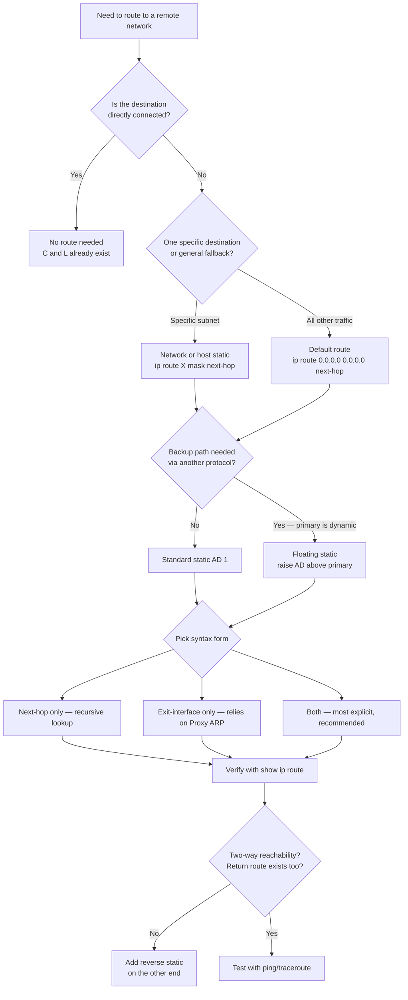
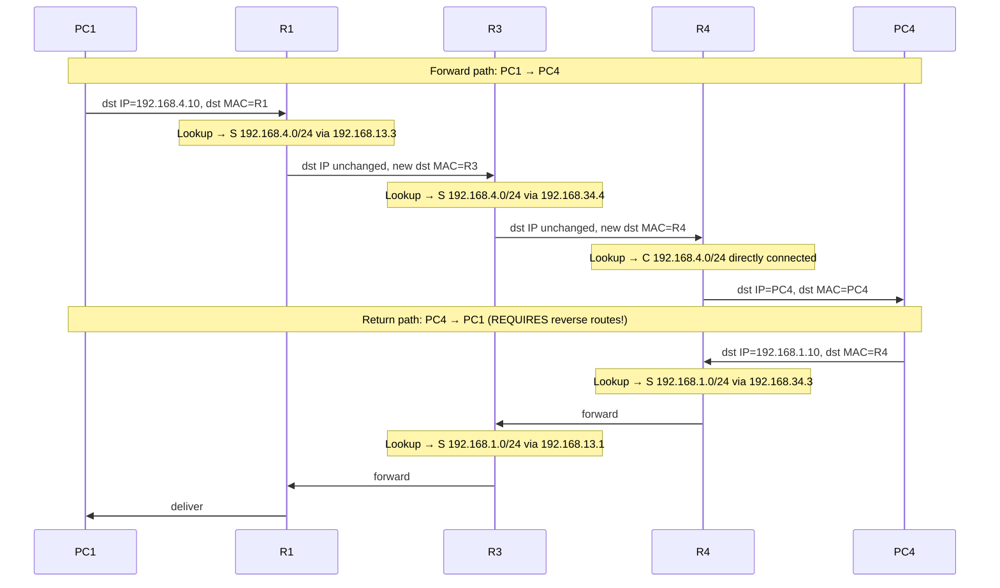

# Static Routing — IPv4 + IPv6 + Floating

> **Domain 3.0 IP Connectivity (25% of exam)** · Blueprint 3.3 (configure and verify IPv4 and IPv6 static routing — default, network, host, floating)

## 📺 Sources
- [[../jeremy-it-videos/020-static-routing-day-11-part-2]] — Day 11 part 2 — Static Routing
- Inline `[Day 11 @ MM:SS]` anchors throughout reference back to specific moments in the transcript.

## 🎯 What you must walk away with
- Write a static route in any of three forms: next-hop only, exit-interface only, or both combined — and explain when each is appropriate.
- Build **two-way reachability** by walking the path both directions and inserting return routes on every transit router.
- Configure a default route, host route, and floating static; recognize each in `show ip route` output.
- Translate IPv4 syntax to IPv6 (`ipv6 route <prefix>/<len> <next-hop|interface>`) without help.

## 🧠 Core Concept

**A static route is a manual instruction telling a router: "to reach network X, send packets to next-hop Y or out exit-interface Z."** It carries administrative distance 1 by default — beating every dynamic protocol — which is why floating statics raise the AD on purpose to step aside for OSPF/EIGRP. Connected and Local routes are free; static is what you write when the destination is more than one hop away and you don't want to run a routing protocol.

`[Day 11 @ 00:38]` Connected and Local routes alone "aren't enough" for remote destinations. Static routes "enable routers to send packets to remote destinations, that aren't directly connected to the router itself."

## 🔄 Decision Flow (Mermaid)



## 🔑 Reference Tables

### Static-route taxonomy

| Type | Prefix length | Use case | Command shape |
|------|---------------|----------|---------------|
| **Network route** | Any non-/32 (typical /24, /30) | Reach a remote subnet | `ip route 192.168.4.0 255.255.255.0 10.0.0.2` |
| **Host route** | `/32` (IPv4) / `/128` (IPv6) | Reach a specific single IP (mgmt, loopback) | `ip route 10.10.10.10 255.255.255.255 10.0.0.2` |
| **Default route** | `/0` | Catch-all "gateway of last resort" | `ip route 0.0.0.0 0.0.0.0 10.0.0.2` |
| **Floating static** | Any prefix, AD raised | Backup behind a dynamic protocol | `ip route 0.0.0.0 0.0.0.0 10.0.0.2 200` |

### Three syntax forms — when to use each

| Form | Command | Routing-table appearance | Behavior | Notes |
|------|---------|--------------------------|----------|-------|
| **Next-hop only** | `ip route 192.168.4.0 255.255.255.0 10.0.0.2` | `S 192.168.4.0/24 via 10.0.0.2` | Recursive lookup — router resolves `10.0.0.2` against another route to find an exit interface | Most common; flexible |
| **Exit-interface only** | `ip route 192.168.4.0 255.255.255.0 g0/1` | `S 192.168.4.0/24 directly connected, G0/1` | Treats the destination as if directly connected; relies on **Proxy ARP** | Avoid on multi-access (Ethernet) links |
| **Both combined** | `ip route 192.168.4.0 255.255.255.0 g0/1 10.0.0.2` | `S 192.168.4.0/24 via 10.0.0.2, G0/1` | No recursion, no Proxy ARP — most explicit | Recommended on point-to-point and multi-access |

### IPv4 → IPv6 syntax mapping

| IPv4 | IPv6 |
|------|------|
| `ip route 192.168.4.0 255.255.255.0 10.0.0.2` | `ipv6 route 2001:db8:4::/64 2001:db8::2` |
| `ip route 0.0.0.0 0.0.0.0 10.0.0.2` | `ipv6 route ::/0 2001:db8::2` |
| `ip route 10.10.10.10 255.255.255.255 10.0.0.2` | `ipv6 route 2001:db8::a/128 2001:db8::2` |
| `ip route 192.168.4.0 255.255.255.0 10.0.0.2 200` | `ipv6 route 2001:db8:4::/64 2001:db8::2 200` |

Note: IPv6 uses **slash notation** in the command; IPv4 requires dotted-decimal mask. This is a common exam trap.

### Bracket notation `[AD/metric]`

| Code | Default AD | Metric for static |
|------|-----------:|-------------------|
| Connected | 0 | 0 |
| Static | **1** | **0** (always — static has no metric to report) |
| EIGRP internal | 90 | composite |
| OSPF | 110 | cost |
| RIP | 120 | hop count |
| Floating static | **>110 typical** (e.g. 200) | 0 |

## 🧪 Worked Examples

### Example 1 — Build PC1 ↔ PC4 with two-way reachability

`[Day 11 @ 13:17]` Topology:

```
PC1 (192.168.1.10) -- R1 -- 192.168.13.0/24 -- R3 -- 192.168.34.0/24 -- R4 -- PC4 (192.168.4.10)
```

R1 already has `C 192.168.1.0/24` and `C 192.168.13.0/24`.
R3 already has `C 192.168.13.0/24` and `C 192.168.34.0/24`.
R4 already has `C 192.168.34.0/24` and `C 192.168.4.0/24`.

**Goal:** PC1 pings PC4 successfully (which requires PC4 → PC1 to also work — two-way reachability).

**Step 1 — list every router that needs new routes.** Each transit router needs a route to **both** end networks: `192.168.1.0/24` and `192.168.4.0/24`. R1 already has the first via Connected; R4 already has the second via Connected. So:

- R1 needs route → `192.168.4.0/24`
- R3 needs routes → `192.168.1.0/24` and `192.168.4.0/24`
- R4 needs route → `192.168.1.0/24`

**Step 2 — pick next-hops.** For each route, the next-hop is the IP of the neighbor in the path direction.
- R1 → `192.168.4.0/24` next-hop = `192.168.13.3` (R3's G0/0)
- R3 → `192.168.1.0/24` next-hop = `192.168.13.1` (R1's G0/0)
- R3 → `192.168.4.0/24` next-hop = `192.168.34.4` (R4's G0/1)
- R4 → `192.168.1.0/24` next-hop = `192.168.34.3` (R3's G0/1)

**Step 3 — write the commands.**
```
R1(config)# ip route 192.168.4.0 255.255.255.0 192.168.13.3
R3(config)# ip route 192.168.1.0 255.255.255.0 192.168.13.1
R3(config)# ip route 192.168.4.0 255.255.255.0 192.168.34.4
R4(config)# ip route 192.168.1.0 255.255.255.0 192.168.34.3
```

**Step 4 — verify.** `ping 192.168.4.10` from PC1 should yield `5 packets transmitted, 5 received, 0% packet loss`. If you only configured R1 and R3 forward but missed R4's reverse route, ping would fail — packets reach PC4 but PC4's reply has no route home.

### Example 2 — Default route on an Internet edge router

`[Day 11 @ 26:05]` R1 has internal routes for `10.0.0.0/8` and `172.16.0.0/16`. Everything else should go to the ISP at `203.0.113.2`.

**Step 1.** Recognize "everything else" = `0.0.0.0/0` — the least-specific possible prefix.
**Step 2.** Write the default route:
```
R1(config)# ip route 0.0.0.0 0.0.0.0 203.0.113.2
```
**Step 3.** Verify in `show ip route`. Look for the `S*` code (the asterisk = candidate default) and the line `Gateway of last resort is 203.0.113.2 to network 0.0.0.0`.

A packet for `8.8.8.8` matches no specific route — falls through to `0.0.0.0/0`, gets forwarded to the ISP.

### Example 3 — Floating static for OSPF backup

Primary path is OSPF-learned: `O 10.5.0.0/16 [110/20] via 192.168.0.5`. We want a backup via `192.168.99.5` that only activates if OSPF withdraws the route.

**Step 1.** Default static AD is 1 — that would override OSPF immediately, which is the opposite of what we want.
**Step 2.** Set the static's AD **higher** than OSPF's 110:
```
R1(config)# ip route 10.5.0.0 255.255.0.0 192.168.99.5 200
```
**Step 3.** While OSPF is healthy, the table shows the OSPF route. The static is invisible — it lives in a separate "candidate" pool because its AD lost the comparison.
**Step 4.** When OSPF withdraws (neighbor dies, link drops), the AD-200 static is re-evaluated and installed. Convergence is sub-second.

This is **floating** because the route "floats above" the table waiting for the primary to fail.

## 📊 Two-way reachability flow



If any single reverse route is missing, the ping appears to "fail" but really the request reached PC4 fine — PC4's reply silently dies on the way back.

## 🚨 Exam Traps

1. **Static routes are NOT automatic.** They must be manually configured. Connected and Local appear automatically; static does not.
2. **Default route is NOT `255.255.255.255`.** It's `0.0.0.0 0.0.0.0` (mask all zeros = "match everything"). All-ones mask would be a /32 host route.
3. **You CANNOT use slash notation in IPv4 `ip route`.** Must spell the netmask in dotted decimal. IPv6 is the opposite — `ipv6 route` requires slash notation.
4. **Two-way reachability requires routes BOTH directions on every transit router.** The most common exam trap is configuring forward-only and watching ping fail.
5. **Routers do NOT need routes to every transit network.** R1 doesn't need a route to `192.168.34.0/24` to reach PC4 — only the destination network. The transit network is irrelevant to forwarding decisions, only to next-hop resolution.
6. **Exit-interface-only static shows "directly connected"** in the routing table — but the network isn't actually connected to the router. This relies on Proxy ARP and can be confusing.
7. **`S*` (with asterisk) means candidate default**, not "starred important." It's the route that becomes "gateway of last resort."
8. **Floating static AD must be HIGHER than the primary protocol's AD**, not lower. Lower AD wins — that's why static (AD 1) by default beats OSPF (110).

## ⚙️ Key Cisco IOS Commands

- `ip route <prefix> <mask> <next-hop|interface> [AD]` — IPv4 static. AD is optional; default is 1.
- `ipv6 route <prefix>/<len> <next-hop|interface> [AD]` — IPv6 equivalent. Note the slash notation.
- `ip route 0.0.0.0 0.0.0.0 <next-hop>` — default route ("quad zero").
- `no ip route <prefix> <mask> <next-hop>` — remove a static route (must specify the same params used to create).
- `show ip route static` — filter routing table to only static-learned routes.
- `show ip route 0.0.0.0` — display the default route specifically.
- `show ipv6 route static` — IPv6 equivalent.
- `ping <destination>` — verifies forward and (implicitly) return reachability.
- `traceroute <destination>` — confirms each hop, useful when ping fails.

## 🧪 Self-Check Quiz

**Q1.** Write the command to configure a default route on R1 pointing to next-hop `203.0.113.2`. Use IPv4.

<details><summary>Answer</summary>
`ip route 0.0.0.0 0.0.0.0 203.0.113.2` — entered in global config mode. Slash notation is not allowed in `ip route`.
</details>

**Q2.** R1 learns `10.0.0.0/8` via OSPF (AD 110). You want a static backup via a different ISP that only activates if OSPF goes down. What's the minimum AD to use, and what is this called?

<details><summary>Answer</summary>
AD must be greater than 110 — typically 200 is used. The route is called a **floating static**. Command: `ip route 10.0.0.0 255.0.0.0 <backup-next-hop> 200`.
</details>

**Q3.** A static route appears as `S 172.20.0.0/16 is directly connected, GigabitEthernet0/1`. Which command was used to configure it?

<details><summary>Answer</summary>
`ip route 172.20.0.0 255.255.0.0 g0/1` — exit-interface-only form. The "directly connected" wording in `show ip route` is misleading; the route relies on Proxy ARP to resolve the next-hop MAC.
</details>

**Q4.** R3 sits between two LANs (1.0/24 and 4.0/24) and two transit links. To allow full two-way reachability between PC1 and PC4 via R3, how many static routes does R3 need (assuming the two end routers are configured)?

<details><summary>Answer</summary>
Two — one to `192.168.1.0/24` (toward PC1's network) and one to `192.168.4.0/24` (toward PC4's network). R3 already has Connected routes for the two transit links.
</details>

**Q5.** Translate `ip route 0.0.0.0 0.0.0.0 192.168.99.1 250` into IPv6 syntax with the equivalent meaning, using next-hop `fe80::1`.

<details><summary>Answer</summary>
`ipv6 route ::/0 fe80::1 250` — IPv6 default route is `::/0`, slash notation, and the AD modifier syntax is identical to IPv4.
</details>

## 🧾 Recap

- Static routes are manual `ip route` (or `ipv6 route`) entries with default AD 1 — they beat every dynamic protocol unless you raise the AD intentionally.
- Three syntax forms: next-hop, exit-interface, or both — prefer "both" for explicit point-to-point or `next-hop only` on multi-access.
- Default route (`0.0.0.0/0` or `::/0`) is the catch-all gateway of last resort, marked `S*` in the table.
- Floating static = static with AD raised above a dynamic protocol's AD, used as a backup that activates on primary failure.
- If you can write a default route, a host route, and a floating static from memory in IPv4 **and** IPv6, you've completed the static portion of Domain 3.0.

---
**Source transcripts:**
- [Day 11 (Part 2) — Static Routing](https://www.youtube.com/watch?v=YCv4-_sMvYE)

**Cheat sheet companion:** [[../cheat-sheets/day-11p2-static-routing]]
