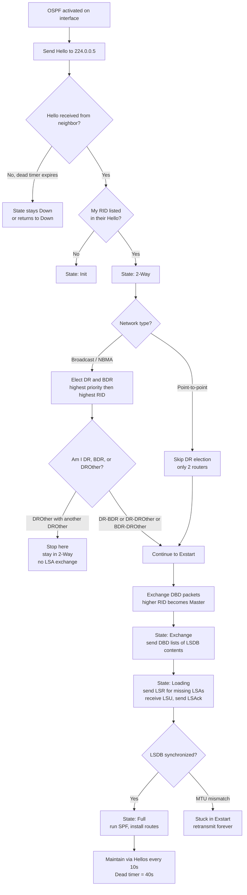
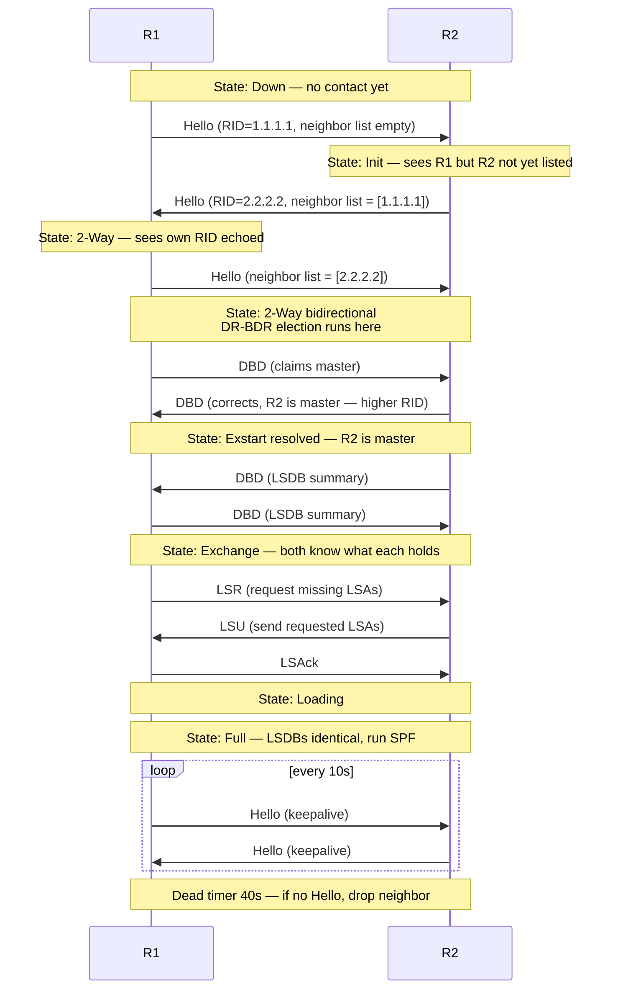

# OSPFv2 Single-Area

> **Domain 3.0 IP Connectivity (25% of exam)** · Blueprint 3.4 (configure and verify single area OSPFv2 — neighbor adjacencies, point-to-point, broadcast, router ID)

## 📺 Sources
- [[../jeremy-it-videos/053-ospf-part-1-day-26]] — Day 26 — OSPF Part 1 (basics, areas, configuration)
- [[../jeremy-it-videos/055-ospf-part-2-day-27]] — Day 27 — OSPF Part 2 (cost, neighbor states, additional config)
- [[../jeremy-it-videos/057-ospf-part-3-day-28]] — Day 28 — OSPF Part 3 (network types, DR/BDR, LSAs, neighbor requirements)
- Inline `[Day NN @ MM:SS]` anchors throughout reference back to specific moments.

## 🎯 What you must walk away with
- Recite the **7 neighbor states** in order and explain what happens at each: Down → Init → 2-Way → Exstart → Exchange → Loading → Full.
- Calculate OSPF cost from the formula `cost = reference_bandwidth ÷ interface_bandwidth` (Mbps), knowing the default ref-bw is 100 Mbps and why you must change it.
- Predict DR/BDR election outcomes given priority + router ID, and describe what fully adjacent vs 2-way means on a broadcast segment.
- Distinguish point-to-point vs broadcast network types and what changes (no DR election on P2P; same 10/40 timers).
- Identify the 3 LSA types CCNA tests: Type 1 (Router), Type 2 (Network), Type 5 (AS-External).
- Configure single-area OSPFv2 from scratch: process ID, network/area, router-id, passive-interface, ref-bw.

## 🧠 Core Concept

**OSPF is a link-state protocol — every router in the same area builds an identical map (the LSDB) by flooding LSAs, then independently runs Dijkstra's SPF algorithm to choose the lowest-cost path to every destination.** This is fundamentally different from distance-vector "routing by rumor": OSPF routers don't trust their neighbor's view, they reconstruct the whole topology themselves. That's why it converges fast and resists loops, but also why it's chattier and CPU-heavier than RIP.

`[Day 26 @ 02:41]` Link-state means "each router advertises information about its interfaces (its connected networks) to its neighbors. These advertisements are passed along to other routers, until all routers in the network develop the same map of the network."

OSPF's three macro-steps: **(1) become neighbors → (2) flood LSAs into a shared LSDB → (3) each router runs Dijkstra independently and installs the best routes at AD 110.**

## 🔄 Decision Flow (Mermaid)



## 🔑 Reference Tables

### The 7 neighbor states — memorize order and trigger

| # | State | What just happened | Key action |
|---|-------|--------------------|-----------:|
| 1 | **Down** | No Hello received yet | Send Hellos to 224.0.0.5 |
| 2 | **Init** | Received a Hello, but my own RID isn't in their neighbor list yet | One-way conversation |
| 3 | **2-Way** | Both routers list each other in Hellos | DR/BDR election occurs here on broadcast |
| 4 | **Exstart** | Decide Master/Slave for DBD exchange | Higher RID = Master |
| 5 | **Exchange** | Send DBD packets summarizing LSDB contents | "Here's a list of what I have" |
| 6 | **Loading** | Send LSR for missing LSAs, receive LSU, send LSAck | Actually transfer LSAs |
| 7 | **Full** | LSDBs synchronized, full adjacency formed | Run SPF, install routes |

### Cost formula — `cost = ref_bw ÷ interface_bw` (Mbps), min 1

| Interface | Speed | Default ref-bw 100 Mbps | Ref-bw 10,000 Mbps | Ref-bw 100,000 Mbps |
|-----------|-------|------------------------:|-------------------:|--------------------:|
| Ethernet (10 Mbps) | 10 | 10 | 1,000 | 10,000 |
| FastEthernet (100 Mbps) | 100 | **1** | 100 | **1,000** |
| Gigabit Ethernet (1000 Mbps) | 1000 | **1** (rounds up) | 10 | **100** |
| 10G Ethernet (10000 Mbps) | 10000 | **1** (rounds up) | 1 | **10** |
| 100G Ethernet (100000 Mbps) | 100000 | 1 | 1 | 1 |
| Loopback (virtual) | n/a | **1** (always added to total) | 1 | 1 |

`[Day 27 @ 02:36]` "In OSPF all values less than 1 will be converted to 1. Therefore FastEthernet, Gigabit Ethernet, 10Gig Ethernet, etc. are equal and all have a cost of 1 by default." This is why you must run `auto-cost reference-bandwidth 100000` on every router — without it, gigabit and 10-gig links collapse to identical costs.

### Network types — what OSPF defaults to

| Network type | Default on | DR/BDR? | Hello / Dead | Neighbors auto-discovered? | Notes |
|--------------|-----------|--------|--------------|---------------------------|-------|
| **Broadcast** | Ethernet, FDDI | **Yes** | 10 / 40 sec | Yes (multicast 224.0.0.5) | Most common — every modern LAN |
| **Point-to-point** | Serial PPP/HDLC | **No** | 10 / 40 sec | Yes | Two-router serial links |
| **Non-broadcast (NBMA)** | Frame Relay, X.25 | Yes (manual neighbor config) | 30 / 120 sec | No (manual `neighbor` statements) | Legacy; rarely tested |
| **Point-to-multipoint** | Manual | No | 30 / 120 sec | Yes | Sub-type, not on CCNA |

### DR / BDR election rules (broadcast segments)

| Step | Rule |
|------|------|
| 1 | Compare **OSPF interface priority** (default 1, range 0–255). Highest wins. |
| 2 | Tie? Highest **router ID** wins. |
| 3 | Priority **0** = router will NEVER be DR or BDR. |
| 4 | Election is **non-preemptive** — adding a higher-priority router later does NOT trigger re-election. |
| 5 | If the DR fails, the BDR is promoted to DR (no election); a new BDR is elected. |
| 6 | Only DR/BDR reach **Full** with everyone. DROthers reach **Full** only with DR/BDR; DROthers stay in **2-Way** with each other. |

### Router-ID selection priority

| Step | Rule |
|------|------|
| 1 | Manually configured `router-id A.B.C.D` wins (requires `clear ip ospf process` to apply). |
| 2 | Highest IP on any **loopback** interface (loopbacks are always up — most reliable). |
| 3 | Highest IP on any **active physical** interface. |
| 4 | Once chosen, sticky until OSPF process is reset. |

### LSA types — only 3 for CCNA

| Type | Name | Generated by | What it carries |
|------|------|--------------|-----------------|
| **Type 1** | Router LSA | **Every** OSPF router | Router ID + connected networks + cost per link |
| **Type 2** | Network LSA | **DR** of a multi-access segment (broadcast) | List of routers attached to the segment |
| **Type 5** | AS-External LSA | **ASBR** | Routes redistributed from outside OSPF (e.g. default route via `default-information originate`) |
| (Type 3 — Summary) | not on CCNA explicitly | ABR | Inter-area summary routes — common distractor |

### Multicast addresses + IP protocol number

| Address | Purpose |
|---------|---------|
| `224.0.0.5` | All OSPF routers — Hellos and LSU floods |
| `224.0.0.6` | DR/BDR only — DROthers send updates here |
| IP protocol **89** | OSPF identifier in the IP header (not a TCP/UDP port — OSPF rides directly on IP) |

### Common ADs — for tiebreaks on duplicate prefixes

| Source | AD |
|--------|---:|
| Connected | 0 |
| Static | 1 |
| eBGP | 20 |
| EIGRP internal | 90 |
| **OSPF** | **110** |
| RIP | 120 |
| EIGRP external | 170 |
| iBGP | 200 |

## 🧪 Worked Examples

### Example 1 — Cost calculation across multiple hops

`[Day 27 @ 05:54]` Topology: R1 → R2 → R4 to reach `192.168.4.0/24`. All Gigabit Ethernet links. `auto-cost reference-bandwidth 100000` is set on every router.

**Step 1.** Compute per-link cost: 100,000 ÷ 1,000 = **100** for each Gigabit hop.
**Step 2.** Total cost = sum of **outbound (exit) interfaces** along the path. Exits: R1 G0/0 (out toward R2), R2 G1/0 (out toward R4), R4's egress to the 4.0/24 network.
**Step 3.** 100 + 100 + 100 = **300**. That's the cost displayed in `show ip route` for the OSPF entry.

For a loopback destination `2.2.2.2` reachable via R1 → R2 + R2's loopback: cost = 100 (R1 G0/0) + 1 (loopback adds 1) = **101**.

### Example 2 — DR/BDR election with priority and RID

Five routers share the `192.168.2.0/29` broadcast segment. Their priorities and RIDs:

| Router | Priority | Router ID |
|--------|---------:|-----------|
| R1 | 1 (default) | 1.1.1.1 |
| R2 | 1 | 2.2.2.2 |
| R3 | 1 | 3.3.3.3 |
| R4 | 1 | 4.4.4.4 |
| R5 | 1 | 5.5.5.5 |

**Step 1.** Compare priorities — all 1, so it's a tie.
**Step 2.** Compare RIDs — `5.5.5.5` is highest → **R5 = DR**.
**Step 3.** Next-highest RID → **R4 = BDR**.
**Step 4.** R1, R2, R3 = DROthers.
**Step 5.** Now you raise R2's priority: `ip ospf priority 255`. Does R2 become DR? **No** — election is non-preemptive. R2 stays DROther.
**Step 6.** You then issue `clear ip ospf process` on R5 (the current DR). R5 leaves. R4 (the former BDR) automatically becomes DR. A new BDR election runs — and now R2's priority of 255 wins → **R2 = BDR**.

### Example 3 — Configure single-area OSPFv2 from scratch

Topology: R1 has G0/0 (`10.0.12.1/28`), G0/1 (`10.0.13.1/28`), G0/2 (`172.16.1.14/28` — user-facing, no OSPF neighbors).

**Step 1 — enter OSPF process and set process ID 1.**
```
R1(config)# router ospf 1
```

**Step 2 — set a manual router-id (best practice — predictable, sticky).**
```
R1(config-router)# router-id 1.1.1.1
```

**Step 3 — activate OSPF on interfaces using `network` + wildcard mask + area.** Wildcard `0.0.0.15` matches a /28.
```
R1(config-router)# network 10.0.12.0 0.0.0.15 area 0
R1(config-router)# network 10.0.13.0 0.0.0.15 area 0
R1(config-router)# network 172.16.1.0 0.0.0.15 area 0
```

**Step 4 — make the user-facing interface passive (advertised, but no Hellos sent).**
```
R1(config-router)# passive-interface GigabitEthernet0/2
```

**Step 5 — fix the cost calculation for modern speeds.**
```
R1(config-router)# auto-cost reference-bandwidth 100000
```

**Step 6 — apply the new router-id.**
```
R1# clear ip ospf process
```

**Step 7 — verify.**
```
R1# show ip ospf neighbor          # should show Full state with neighbors
R1# show ip ospf interface brief   # cost, priority, neighbor count per interface
R1# show ip protocols              # process ID, router-id, passive interfaces, ADs
R1# show ip route ospf             # OSPF-learned routes (code O)
```

Alternative: skip `network` entirely and activate OSPF directly on each interface:
```
R1(config-if)# ip ospf 1 area 0
```

## 📊 Neighbor adjacency sequence (broadcast segment)



## 🚨 Exam Traps

1. **OSPF process ID does NOT have to match between neighbors.** Unlike EIGRP's AS number, the process ID is **locally significant**. R1 can run `router ospf 1`, R2 can run `router ospf 99`, and they form neighbors fine.
2. **OSPF process ID does NOT equal area number.** They are unrelated — `router ospf 5` does not put you in area 5.
3. **Single-area OSPF does NOT have to be area 0.** Best practice and most exam questions use area 0, but technically any area number works for a single-area design.
4. **The `network` command does NOT advertise networks directly.** It activates OSPF on **interfaces** matching the wildcard, then those interfaces' subnets get advertised via Type 1 LSAs.
5. **`default-information originate` does NOT create a default route.** You must already have a default route on the router; the command then advertises the existing route into OSPF and makes the router an ASBR.
6. **DR election is NOT preemptive.** A new high-priority router does NOT take over an existing DR. You must reset the OSPF process on the current DR to force re-election.
7. **Priority 0 does NOT participate in DR/BDR election ever.** That router is permanently a DROther on that segment.
8. **DROther↔DROther is NOT Full.** They stop at **2-Way** — this is stable and expected, not a problem. Full only with DR/BDR.
9. **Point-to-point does NOT have a DR or BDR.** `show ip ospf neighbor` displays a dash in the role column, not "DR/BDR/DROther."
10. **MTU mismatch is NOT caught at Hello.** Neighbors form, but get **stuck in Exstart** because DBD packets exceed MTU and retransmit forever. Symptom: state oscillates around Exstart.
11. **Network-type mismatch is NOT flagged.** Neighbors reach Full but routes silently don't appear in the table. One side is Broadcast, the other is Point-to-point — silent breakage.
12. **`auto-cost reference-bandwidth` must be the SAME on every router**, or each router calculates inconsistent costs and routes diverge.
13. **224.0.0.5 vs 224.0.0.6 vs 224.0.0.9 vs 224.0.0.10** — confuse them and lose a point. OSPF=5/6, RIP=9, EIGRP=10.
14. **Hello and Dead timers must match** between neighbors or adjacency never forms (Init oscillation).
15. **OSPFv2 = IPv4, OSPFv3 = IPv6.** v3 can also carry IPv4 but the CCNA tests v2 for IPv4.

## ⚙️ Key Cisco IOS Commands

### Configuration
- `router ospf <process-id>` — enter OSPF config mode (process ID 1–65535, locally significant).
- `router-id A.B.C.D` — manually set router ID (requires `clear ip ospf process` to apply).
- `network <ip> <wildcard> area <area-id>` — activate OSPF on interfaces matching the wildcard.
- `ip ospf <process-id> area <area-id>` — alternative, applied directly to an interface.
- `passive-interface <interface>` — advertise the network but stop sending Hellos out.
- `passive-interface default` then `no passive-interface <int>` — invert the model when most interfaces should be passive.
- `auto-cost reference-bandwidth <Mbps>` — change the numerator in the cost formula (use 100000 for 100G).
- `ip ospf cost <value>` — manually set cost on a specific interface (overrides auto-calc).
- `ip ospf priority <0-255>` — change DR election priority (0 = never DR).
- `ip ospf hello-interval <seconds>` — change Hello timer (must match neighbor).
- `ip ospf dead-interval <seconds>` — change Dead timer (must match neighbor).
- `ip ospf network point-to-point` — skip DR election on a 2-router Ethernet link.
- `default-information originate` — advertise an existing default route into OSPF (becomes ASBR).
- `maximum-paths <n>` — change ECMP limit (default 4, max 32).

### Verification
- `show ip ospf neighbor` — neighbor state, role (DR/BDR/DROther), dead time, address, interface.
- `show ip ospf interface brief` — per-interface OSPF status: PID, area, IP, cost, state, neighbor count.
- `show ip ospf interface <int>` — full OSPF detail for one interface (timers, DR, priority).
- `show ip ospf database` — LSDB contents grouped by LSA type.
- `show ip protocols` — process ID, router-id, ADs, networks, passive interfaces, neighbors, max-paths.
- `show ip route ospf` — only OSPF-learned routes (codes O, O IA, O E1, O E2).
- `clear ip ospf process` — reset OSPF (applies new router-id; disruptive in production).

## 🧪 Self-Check Quiz

**Q1.** Put the seven OSPF neighbor states in order from initial contact to fully synchronized.

<details><summary>Answer</summary>
Down → Init → 2-Way → Exstart → Exchange → Loading → Full. Mnemonic: "Don't Initialize Two Engineers Exchanging Lousy Files."
</details>

**Q2.** Two OSPF routers reach Full state but no routes appear in either routing table. The interface IPs are in the same subnet, area, timers match, MTU matches. What is the most likely cause?

<details><summary>Answer</summary>
**Network type mismatch.** One side is configured as broadcast, the other as point-to-point. Neighbors form because Hellos are compatible, but LSDB sync silently fails because the LSAs are interpreted differently. Fix with `ip ospf network <type>` matching on both sides.
</details>

**Q3.** R1 has `router-id 1.1.1.1`, priority 200. R2 has `router-id 2.2.2.2`, priority 100. They share a broadcast segment with no DR yet. Who becomes DR?

<details><summary>Answer</summary>
**R1.** Priority 200 > priority 100. Priority is checked first; router-ID is only the tiebreaker. R2's higher RID is irrelevant because the priority comparison resolves first.
</details>

**Q4.** With `auto-cost reference-bandwidth 10000` configured, what is the OSPF cost of a single Gigabit Ethernet link?

<details><summary>Answer</summary>
10,000 ÷ 1,000 = **10**. (FastEthernet at 100 Mbps would be 100; 10-Gig at 10,000 Mbps would be 1.)
</details>

**Q5.** A router has a default route via static configuration. After issuing `default-information originate` in OSPF config mode, what role does the router take on, and what LSA type is generated?

<details><summary>Answer</summary>
The router becomes an **ASBR** (Autonomous System Boundary Router) because it now redistributes a route from outside OSPF into OSPF. It generates a **Type 5 (AS-External)** LSA carrying the default route, which floods to every OSPF router in the area.
</details>

## 🧾 Recap

- OSPF is link-state: every router in an area builds an identical LSDB by flooding LSAs, then independently runs Dijkstra to choose best paths. Default AD = 110, metric = cost.
- The 7 neighbor states (Down → Init → 2-Way → Exstart → Exchange → Loading → Full) are exam-required vocabulary; know what each transition means.
- DR/BDR election runs in 2-Way on broadcast segments — highest priority then highest RID, non-preemptive. DROthers reach Full only with DR/BDR.
- Cost = ref-bw ÷ interface-bw (Mbps), min 1 — always raise ref-bw to 100,000 so multi-gigabit links don't collapse to cost 1.
- Three LSA types for CCNA: Type 1 Router (every router), Type 2 Network (DR on broadcast), Type 5 AS-External (ASBR for redistributed routes).
- If you can configure single-area OSPFv2 with router-id, passive-interface, and ref-bw — and troubleshoot stuck-Exstart (MTU) and stuck-2-Way (network-type) by name — you own Domain 3.4 and the biggest single chunk of exam weight.

---
**Source transcripts:**
- [Day 26 — OSPF Part 1](https://www.youtube.com/watch?v=pvuaoJ9YzoI)
- [Day 27 — OSPF Part 2](https://www.youtube.com/watch?v=VtzfTA21ht0)
- [Day 28 — OSPF Part 3](https://www.youtube.com/watch?v=3ew26ujkiDI)

**Cheat sheet companions:** [[../cheat-sheets/day-26-ospf-part-1]] · [[../cheat-sheets/day-27-ospf-pt2]] · [[../cheat-sheets/day-28-ospf-pt3]]
