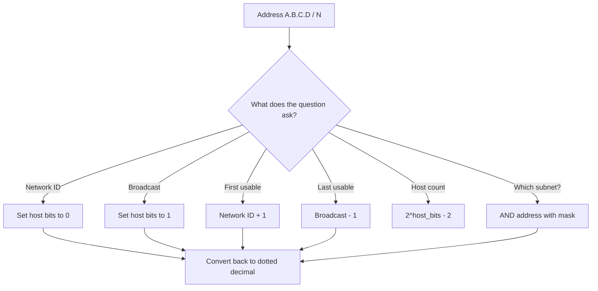
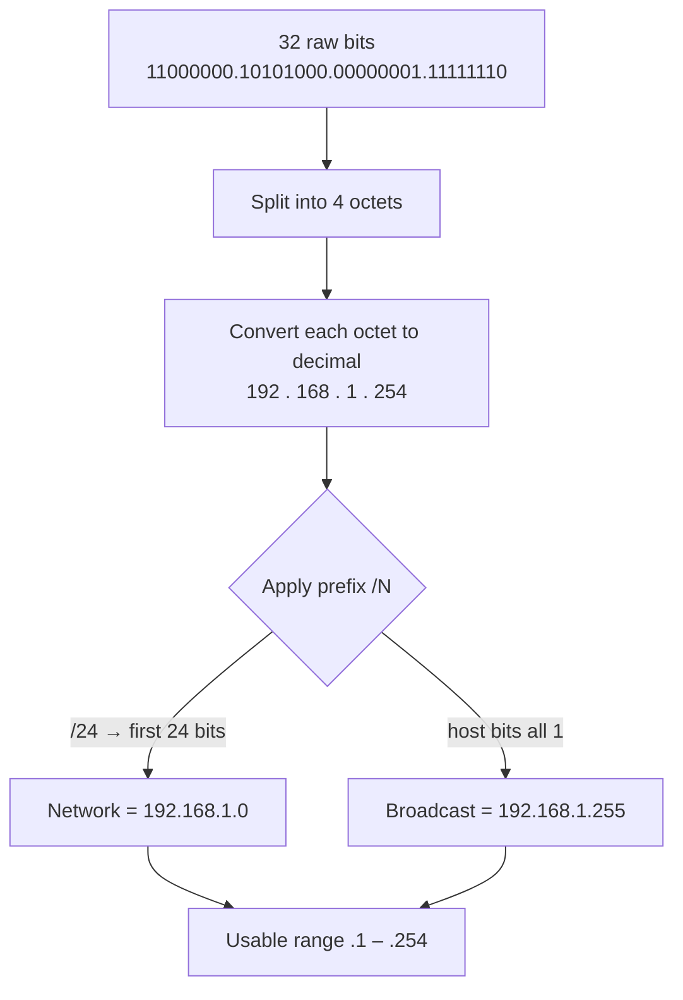

# IPv4 Addressing & Subnetting Pt 1 — Classes, Prefix, Block Size
> **Domain 1.0 Network Fundamentals (20%)** · Blueprint 1.6 (Configure & verify IPv4 addressing & subnetting) + 1.7 (Describe private IPv4 addressing)

## Sources

- **[Day 7 — IPv4 Addressing (Part 1)](https://www.youtube.com/watch?v=3ROdsfEUuhs)** — binary, dotted decimal, classes, network/broadcast.
- **[Day 8 — IPv4 Addressing (Part 2)](https://www.youtube.com/watch?v=FiAatRd84XI)** — five-value math (network, broadcast, first/last usable, host count) + Cisco CLI.
- **[Day 13 — Subnetting (Part 1)](https://www.youtube.com/watch?v=bQ8sdpGQu8c)** — CIDR, prefix table /8 → /32, block size, /30 vs /31 vs /32.

## What you must walk away with

1. Convert any octet between **decimal and binary in under 30 seconds**.
2. For any address `A.B.C.D/N`, produce the **network, broadcast, first usable, last usable, and host count** without a calculator.
3. Recall the **/24 → /32 prefix table** (mask, host bits, usable hosts, block size) cold.
4. Know the **block-size shortcut**: `block = 256 − mask_octet`, subnets start at multiples of the block.

---

## Core Concept

**An IPv4 address is 32 bits split into 4 octets. The prefix `/N` says the first N bits are network, the rest are host. Network = host bits all 0, broadcast = host bits all 1, neither is assignable to a real host.**

Layer 3 (network layer) gives logical addressing across LANs `[Day 7 @ 01:08]`. Switches do not separate networks — only routers do `[Day 7 @ 02:14]`. So when you see two switches and four PCs, that is **one** IP network. Drop a router in the middle and now you have two networks, and the router needs an IP per interface `[Day 7 @ 05:06]`.

---

## Decision Flow — "Given an address and a prefix, what do I produce?"



The same recipe handles every "/N math" question on the test. Find the host bits, manipulate them, convert back.

---

## Reference Tables

### Class table (legacy, but still tested)

| Class | First octet (decimal) | Leading bits | Default prefix | Default mask | Hosts per net |
|---|---|---|---|---|---|
| **A** | 1 – 126 (127 reserved) | `0…` | /8 | 255.0.0.0 | 16,777,214 |
| **B** | 128 – 191 | `10…` | /16 | 255.255.0.0 | 65,534 |
| **C** | 192 – 223 | `110…` | /24 | 255.255.255.0 | 254 |
| **D** | 224 – 239 | `1110…` | — | — | multicast — not for hosts |
| **E** | 240 – 255 | `1111…` | — | — | experimental — not for hosts |

`[Day 7 @ 23:40]` shows the leading-bits trick: just look at the first three bits of octet 1 and the class falls out. The **127.0.0.0/8** range is loopback `[Day 7 @ 25:49]` — you will get 0 ms RTT pinging yourself because the traffic never leaves the host.

### THE prefix table — memorize cold (/16 through /32)

| Prefix | Mask | Host bits | Usable hosts | Block size | Last-octet mask |
|---|---|---|---|---|---|
| /16 | 255.255.0.0 | 16 | 65,534 | 65,536 | .0 |
| /17 | 255.255.128.0 | 15 | 32,766 | 32,768 | (3rd octet 128) |
| /18 | 255.255.192.0 | 14 | 16,382 | 16,384 | (3rd octet 192) |
| /19 | 255.255.224.0 | 13 | 8,190 | 8,192 | (3rd octet 224) |
| /20 | 255.255.240.0 | 12 | 4,094 | 4,096 | (3rd octet 240) |
| /21 | 255.255.248.0 | 11 | 2,046 | 2,048 | (3rd octet 248) |
| /22 | 255.255.252.0 | 10 | 1,022 | 1,024 | (3rd octet 252) |
| /23 | 255.255.254.0 | 9 | 510 | 512 | (3rd octet 254) |
| **/24** | **255.255.255.0** | **8** | **254** | **256** | **.0** |
| **/25** | **255.255.255.128** | **7** | **126** | **128** | **.128** |
| **/26** | **255.255.255.192** | **6** | **62** | **64** | **.192** |
| **/27** | **255.255.255.224** | **5** | **30** | **32** | **.224** |
| **/28** | **255.255.255.240** | **4** | **14** | **16** | **.240** |
| **/29** | **255.255.255.248** | **3** | **6** | **8** | **.248** |
| **/30** | **255.255.255.252** | **2** | **2** | **4** | **.252** |
| /31 | 255.255.255.254 | 1 | 0 (RFC 3021 P2P) | 2 | .254 |
| /32 | 255.255.255.255 | 0 | 0 (host route) | 1 | .255 |

### Powers of two — memorize 2^1 through 2^16

| n | 2^n | n | 2^n |
|---|---|---|---|
| 1 | 2 | 9 | 512 |
| 2 | 4 | 10 | 1,024 |
| 3 | 8 | 11 | 2,048 |
| 4 | 16 | 12 | 4,096 |
| 5 | 32 | 13 | 8,192 |
| 6 | 64 | 14 | 16,384 |
| 7 | 128 | 15 | 32,768 |
| 8 | 256 | 16 | 65,536 |

### "When you see /N, the increment is X" — the magic-number lookup

| Last-octet mask | /N (in /24 base) | Magic number / block size |
|---|---|---|
| 128 | /25 | 128 |
| 192 | /26 | 64 |
| 224 | /27 | 32 |
| 240 | /28 | 16 |
| 248 | /29 | 8 |
| 252 | /30 | 4 |

**Block-size shortcut:** `block = 256 − mask_octet`. For /27 mask 224, block = 256 − 224 = **32**. Subnets start at multiples of 32: .0, .32, .64, .96, .128, .160, .192, .224.

---

## Worked Examples — show every step

### Example A — `172.16.5.100/22`: find network, broadcast, range, host count

**Step 1 — find host bits.** /22 means 32 − 22 = **10 host bits**. The mask spills into octet 3.

**Step 2 — find the mask.** /22 = 255.255.252.0. The 252 in octet 3 means block size = 256 − 252 = **4** in octet 3.

**Step 3 — find the network.** Octet 3 of address is 5. The block-4 multiples are 0, 4, 8, 12 ... so 5 falls into the **block starting at 4**. Network = `172.16.4.0/22`.

**Step 4 — broadcast.** Next block starts at octet 3 = 8, so broadcast = the address right before that = `172.16.7.255`.

**Step 5 — usable range.** First = `172.16.4.1`. Last = `172.16.7.254`.

**Step 6 — host count.** 2^10 − 2 = **1,022 usable hosts**.

### Example B — Subnet `192.168.10.0/24` into /27 subnets

`[Day 13 @ 14:28]` walks through this same idea. /27 = 5 host bits = 30 usable, and we are borrowing 3 bits (24 → 27), so 2^3 = **8 subnets**.

Block size = 256 − 224 = **32**. Subnets start at multiples of 32:

| # | Network | Broadcast | First usable | Last usable |
|---|---|---|---|---|
| 1 | 192.168.10.0 | 192.168.10.31 | .1 | .30 |
| 2 | 192.168.10.32 | 192.168.10.63 | .33 | .62 |
| 3 | 192.168.10.64 | 192.168.10.95 | .65 | .94 |
| 4 | 192.168.10.96 | 192.168.10.127 | .97 | .126 |
| 5 | 192.168.10.128 | 192.168.10.159 | .129 | .158 |
| 6 | 192.168.10.160 | 192.168.10.191 | .161 | .190 |
| 7 | 192.168.10.192 | 192.168.10.223 | .193 | .222 |
| 8 | 192.168.10.224 | 192.168.10.255 | .225 | .254 |

### Example C — Identify `10.0.34.250/19`'s subnet

**Step 1.** /19 = 32 − 19 = **13 host bits**. Mask is 255.255.224.0, so the math is in octet 3.

**Step 2.** Octet-3 mask = 224, block size = 256 − 224 = **32**.

**Step 3.** Octet 3 of address = 34. Multiples of 32: 0, 32, 64, 96 ... so 34 lives in the **block starting at 32**. Network = `10.0.32.0/19`.

**Step 4.** Broadcast = next block (64) − 1 in the host portion = `10.0.63.255`. First = `10.0.32.1`, Last = `10.0.63.254`. Hosts = 2^13 − 2 = **8,190**.

### Example D — Class B `172.20.0.0` borrowed 6 bits

`[Day 14 @ 15:55]` covers exactly this style. Default Class B is /16. Borrow 6 bits → /22.

- **Subnets:** 2^6 = **64 subnets**.
- **Hosts each:** /22 leaves 10 host bits → 2^10 − 2 = **1,022 hosts each**.
- **Octet-3 mask:** 252. **Block size in octet 3:** 4.

First few subnets: 172.20.0.0, 172.20.4.0, 172.20.8.0, 172.20.12.0 ...

---

## Diagram — how 32 bits become an address



The binary breakdown of `192.168.1.254` `[Day 7 @ 07:16]`:

```
192 = 1100 0000
168 = 1010 1000
  1 = 0000 0001
254 = 1111 1110
```

Each binary digit, right to left, is `1, 2, 4, 8, 16, 32, 64, 128`. Add the columns where the bit is 1.

---

## Exam Traps

- **/24 is NOT 24 hosts** — it is 24 *network* bits, leaving 8 host bits = 254 usable.
- **Network address is NOT assignable** — host bits all 0 names the subnet itself.
- **Broadcast is NOT assignable** — host bits all 1 reaches everyone.
- **Class A is NOT 0–127 for hosts** — 127.x.x.x is loopback, so usable Class A is 1–126 `[Day 8 @ 01:39]`.
- **/31 is NOT broken** — RFC 3021 says it is valid for point-to-point (2 addresses, both usable) `[Day 13 @ 18:19]`.
- **/32 is NOT for interfaces** — host route or loopback only.
- **Switches do NOT separate networks** — only routers do `[Day 7 @ 02:14]`.
- **Cisco CLI does NOT accept `/24`** — wants dotted-decimal mask `255.255.255.0` `[Day 8 @ 16:05]`.
- **Router interfaces are NOT up by default** — `shutdown` is applied; you must `no shutdown` `[Day 8 @ 11:20]`.

---

## Key Concepts to Memorize Cold

- **Powers of 2:** 2, 4, 8, 16, 32, 64, 128, 256, 512, 1024, 2048, 4096, 8192, 16384, 32768, 65536.
- **Last-octet mask values:** 128, 192, 224, 240, 248, 252, 254, 255 → /25 through /32.
- **Block size = 256 − mask octet.**
- **Host count = 2^h − 2** where h = host bits (except /31, /32).
- **Class A 0/127, B 128/191, C 192/223, D 224/239, E 240/255.**
- **Private (RFC 1918):** 10.0.0.0/8, 172.16.0.0/12, 192.168.0.0/16.
- **APIPA:** 169.254.0.0/16 (DHCP failed).
- **Loopback:** 127.0.0.0/8.
- **`show ip interface brief`** — verify L1/L2 status and IP `[Day 8 @ 09:42]`.
- **`no shutdown`** — bring router interface up.

---

## Self-Check Quiz

**Q1.** A host is assigned `10.10.10.50/29`. What is the broadcast address?
<details><summary>Answer</summary>
**10.10.10.55.** /29 mask = 255.255.255.248, block size = 8. The block starting at .48 spans .48–.55, so broadcast = `.55`.
</details>

**Q2.** Convert binary `11000111` to decimal.
<details><summary>Answer</summary>
**199.** 128 + 64 + 4 + 2 + 1 = 199.
</details>

**Q3.** What is the network ID of `172.16.150.99/19`?
<details><summary>Answer</summary>
**172.16.128.0.** /19 → mask 255.255.224.0 → octet-3 block size 32. Multiples of 32: 0, 32, 64, 96, 128, 160. Octet 3 of address is 150 → fits in the block starting at 128.
</details>

**Q4.** How many usable hosts does a /22 subnet allow?
<details><summary>Answer</summary>
**1,022.** /22 = 10 host bits → 2^10 − 2 = 1,022.
</details>

**Q5.** A point-to-point link between two routers needs the most efficient mask. Pick one — `/29`, `/30`, or `/31`.
<details><summary>Answer</summary>
**/31** is most efficient (RFC 3021, both addresses usable, zero waste). On the CCNA, if the question says "two hosts" without mentioning RFC 3021, **/30** is the safer pick. /29 wastes 4 addresses.
</details>

**Q6.** Class C network `192.168.50.0/24` is divided into 8 equal subnets. What is the prefix length and the network ID of subnet #5?
<details><summary>Answer</summary>
Borrow 3 bits → **/27**. Block size = 32. Subnet #5 starts at 4 × 32 = 128. Network ID = **192.168.50.128/27**.
</details>

**Q7.** What is the maximum number of host addresses on a Class A network?
<details><summary>Answer</summary>
**16,777,214.** /8 leaves 24 host bits → 2^24 − 2.
</details>

**Q8.** Cisco CLI: configure interface G0/0 with IP `10.255.255.254/8` and bring it up.
<details><summary>Answer</summary>

```
configure terminal
 interface gigabitethernet0/0
  ip address 10.255.255.254 255.0.0.0
  no shutdown
```
</details>

---

## Recap

- IPv4 = **32 bits → 4 octets → dotted decimal**, prefix `/N` splits network from host.
- **Network = host bits all 0**, **broadcast = host bits all 1**, neither is assignable.
- **Hosts = 2^(host bits) − 2**, except /31 (RFC 3021 P2P) and /32 (host route).
- **Block-size shortcut:** `256 − mask_octet`; subnets start at multiples of the block.
- **Green-light:** if you can produce all five values for any `/8 → /30` address in under 30 seconds, you are ready for VLSM.

---

**Source transcripts:** `[[../jeremy-it-videos/013-ipv4-addressing-part-1-day-7]]` · `[[../jeremy-it-videos/014-ipv4-addressing-part-2-day-8]]` · `[[../jeremy-it-videos/025-subnetting-part-1-day-13]]`
**Cheat sheet companions:** `[[../cheat-sheets/day-07-ipv4-addressing-part-1]]` · `[[../cheat-sheets/day-08-ipv4-addressing-pt2]]` · `[[../cheat-sheets/day-13-subnetting-pt1]]`
