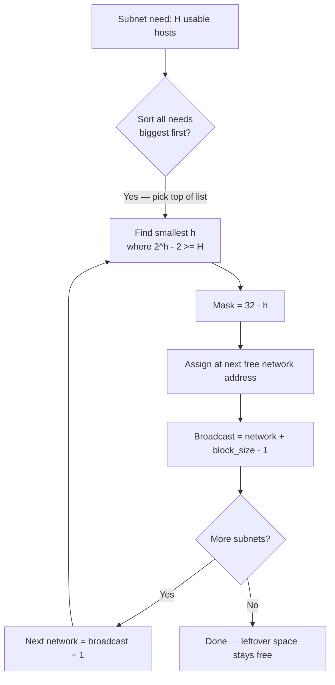
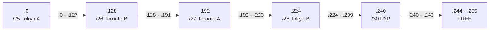

# VLSM — Variable Length Subnet Masking
> **Domain 1.0 Network Fundamentals (20%)** · Blueprint 1.6 (IPv4 subnetting — VLSM specifically)

## Sources

- **[Day 14 — Subnetting Part 2](https://www.youtube.com/watch?v=IGhd-0di0Qo)** — Class B math, "identify the subnet" trick, magic-number method.
- **[Day 15 — Subnetting Part 3: VLSM](https://www.youtube.com/watch?v=z-JqCedc9EI)** — variable masks, largest-first allocation, the Tokyo/Toronto case.

## What you must walk away with

1. The **6-step VLSM recipe**, executed cold without a calculator.
2. Sort needs **largest → smallest**, then carve from the top of the address block.
3. Pick the **smallest mask that still satisfies `2^h − 2 ≥ need`** for each subnet.
4. Walk the address space — next subnet's network = previous subnet's broadcast + 1.

---

## Core Concept

**VLSM = sort host needs largest-first, then assign the smallest mask that fits each one, advancing through the address block. No bit is wasted, no subnet is starved.**

Fixed-Length Subnet Masking (FLSM) gives every subnet the same prefix `[Day 15 @ 10:17]`. That works when sizes are similar, but a network with a 110-host LAN and a 2-host point-to-point link forces FLSM to size everyone for 110 hosts, blowing the address budget. VLSM fixes that — each subnet sized to its real need.

---

## Decision Flow — "Which mask for this subnet?"

---

## The 6-Step VLSM Recipe (memorize each numbered phrase)

1. **SORT** — list every subnet need, host counts descending. Largest first, smallest last.
2. **START** — set the cursor at the first address of the given block (e.g. .0).
3. **PICK** — for the current need, pick the smallest mask where `2^h − 2 ≥ need`.
4. **CARVE** — assign that subnet starting at the cursor. Network = cursor. Broadcast = cursor + block_size − 1.
5. **ADVANCE** — move the cursor to broadcast + 1.
6. **REPEAT** — back to step 3 until every need is satisfied. Leftover space is free for future use.

The cardinal sin of VLSM is **smallest first**. That fragments the block — a 2-host /30 carved at .0 burns through the alignment so a later /25 cannot fit. **Always biggest first.**

---

## Reference Tables

### Sizing table — pick the smallest mask that satisfies `2^h − 2 ≥ need`

| If you need this many hosts | Pick this prefix | Usable | Block size |
|---|---|---|---|
| 1–2 | **/30** | 2 | 4 |
| 3–6 | **/29** | 6 | 8 |
| 7–14 | **/28** | 14 | 16 |
| 15–30 | **/27** | 30 | 32 |
| 31–62 | **/26** | 62 | 64 |
| 63–126 | **/25** | 126 | 128 |
| 127–254 | **/24** | 254 | 256 |
| 255–510 | **/23** | 510 | 512 |
| 511–1022 | **/22** | 1,022 | 1,024 |
| 1023–2046 | **/21** | 2,046 | 2,048 |
| 2047–4094 | **/20** | 4,094 | 4,096 |
| 4095–8190 | **/19** | 8,190 | 8,192 |

### Boundary table — first-network alignment

| Mask | Network must start at multiples of | Common landings (last octet) |
|---|---|---|
| /25 | 128 | 0, 128 |
| /26 | 64 | 0, 64, 128, 192 |
| /27 | 32 | 0, 32, 64, 96, 128, 160, 192, 224 |
| /28 | 16 | 0, 16, 32 ... 240 |
| /29 | 8 | 0, 8, 16, 24 ... 248 |
| /30 | 4 | 0, 4, 8, 12 ... 252 |

A /26 subnet **must** start at .0, .64, .128, or .192 — never .32 or .96. The block-size cadence enforces this for free if you follow step 5 (cursor = previous broadcast + 1).

---

## Worked Example 1 — The Tokyo/Toronto VLSM (the Day 15 case)

**Block:** `192.168.1.0/24`. **Needs:**

| LAN | Hosts |
|---|---|
| Tokyo A | 110 |
| Toronto B | 45 |
| Toronto A | 29 |
| Tokyo B | 8 |
| P2P link | 2 |

`[Day 15 @ 11:23]` lays out the requirements. If we tried FLSM, we'd borrow 3 bits → /27 (8 subnets, 30 hosts each) and Tokyo A's 110 hosts would not fit. VLSM lets each subnet pick its own mask.

### Apply the 6 steps

**Step 1 — SORT (biggest first):** 110, 45, 29, 8, 2.

**Step 2 — START:** cursor = `192.168.1.0`.

**Step 3–6 — pick, carve, advance, repeat:**

| Order | LAN | Need | h bits needed | Mask | Block | Network | Broadcast | First / Last |
|---|---|---|---|---|---|---|---|---|
| 1 | Tokyo A | 110 | 7 (2^7−2 = 126 ≥ 110) | **/25** | 128 | 192.168.1.0 | 192.168.1.127 | .1 / .126 |
| 2 | Toronto B | 45 | 6 (2^6−2 = 62 ≥ 45) | **/26** | 64 | 192.168.1.128 | 192.168.1.191 | .129 / .190 |
| 3 | Toronto A | 29 | 5 (2^5−2 = 30 ≥ 29) | **/27** | 32 | 192.168.1.192 | 192.168.1.223 | .193 / .222 |
| 4 | Tokyo B | 8 | 4 (2^4−2 = 14 ≥ 8) | **/28** | 16 | 192.168.1.224 | 192.168.1.239 | .225 / .238 |
| 5 | P2P | 2 | 2 (2^2−2 = 2) | **/30** | 4 | 192.168.1.240 | 192.168.1.243 | .241 / .242 |

**Leftover:** 192.168.1.244 – 192.168.1.255 (12 addresses free for future use).

`[Day 15 @ 18:50]` makes the trap explicit: for Tokyo B's 8 hosts, `/29` allows 8 *total* but only **6 usable** (subtract net + broadcast), so you must go **one bigger to /28**. This is the single most common VLSM mistake — confusing total addresses with usable hosts.

### Why "biggest first" matters

If you carved P2P first at .0/30 (.0 – .3), then Tokyo B at .4/28 — wait, .4 is not a /28 boundary (/28 boundaries are 0, 16, 32, 48 ...). You'd have to skip to .16/28, wasting .4 – .15. Then Toronto A /27 must start at 32 or 64 — more waste. The block fragments and Tokyo A's /25 (which needs 128-alignment at 0 or 128) would have to live at .128, but everything before is wasted scrap.

**Largest first preserves alignment for free**, because each big block ends exactly where the next-smaller block can start.

---

## Worked Example 2 — WAN links plus a 200-host LAN

**Block:** `10.50.0.0/22` (1,022 usable). **Needs:**

| Link | Hosts |
|---|---|
| Main LAN | 200 |
| WAN link 1 (P2P) | 2 |
| WAN link 2 (P2P) | 2 |
| WAN link 3 (P2P) | 2 |

Why **/30 for WAN, /24 for LAN**? Each WAN link is just two router interfaces — using /24 (254 hosts) burns 252 addresses per link for nothing. /30 gives you exactly 2 usable + net + broadcast = perfect fit. The 200-host LAN needs `2^h − 2 ≥ 200`, so h = 8 → **/24** (254 usable).

### Apply the 6 steps

**SORT:** 200, 2, 2, 2.

**START:** cursor = `10.50.0.0`.

| Order | Link | Need | Mask | Block | Network | Broadcast |
|---|---|---|---|---|---|---|
| 1 | Main LAN | 200 | /24 | 256 | 10.50.0.0 | 10.50.0.255 |
| 2 | WAN 1 | 2 | /30 | 4 | 10.50.1.0 | 10.50.1.3 |
| 3 | WAN 2 | 2 | /30 | 4 | 10.50.1.4 | 10.50.1.7 |
| 4 | WAN 3 | 2 | /30 | 4 | 10.50.1.8 | 10.50.1.11 |

**Leftover:** 10.50.1.12 – 10.50.3.255. Plenty of room for growth — that is what VLSM buys you.

If you had used /24 for everything, you'd consume 4 full /24 blocks for what /24+/30+/30+/30 fit into less than two /24s.

---

## Worked Example 3 — Identify which subnet a host belongs to

**Question:** Which subnet does `172.25.217.192/21` belong to? (Day 14 quiz `[Day 14 @ 19:50]`.)

**Step 1 — host bits.** /21 = 32 − 21 = **11 host bits**. Mask = 255.255.248.0. Octet-3 mask = 248, block size = 256 − 248 = **8** (in octet 3).

**Step 2 — find which block octet 3 falls into.** Octet 3 of host = 217. Multiples of 8 below 217: ... 208, 216, 224. So 217 is in the **block starting at 216**.

**Step 3 — the network ID.** `172.25.216.0/21`.

**Step 4 — broadcast.** Next block starts at octet 3 = 224, so broadcast = `172.25.223.255`.

The trick: AND the address with the mask. Anywhere the mask is 0, force the address bit to 0. Octet 4 (host) and the lower 3 bits of octet 3 (also host) all become 0.

---

## Diagram — VLSM allocation walking the address space

The cursor only moves forward. Each block consumes exactly its block size. Alignment is automatic because we start big and step down.

---

## Exam Traps

- **Smallest first is NOT VLSM** — always **largest first**, or you fragment the block.
- **/29 is NOT correct for 8 hosts** — /29 has 6 usable. Need /28 (14 usable). Off-by-2 trap.
- **/30 is NOT wasteful for P2P on the CCNA** — pick /30 unless the question explicitly says RFC 3021. Then /31 is allowed.
- **Total addresses ≠ usable hosts.** Always subtract 2 (except /31, /32).
- **Next subnet's network is NOT broadcast** — it is **broadcast + 1**.
- **A /26 cannot start at .32** — /26 must align to multiples of 64. Step 5 of the recipe enforces this for free.
- **Subnetting Class A and Class B is NOT a different process** — same recipe, just more host bits to play with `[Day 15 @ 05:57]`.
- **Cisco CLI does NOT accept `/N`** — wants dotted-decimal mask.

---

## Key Concepts to Memorize Cold

- **Powers of 2** through 2^16 (instant recall).
- **Sizing table** above — every line.
- **Mask values** for last octet: 128, 192, 224, 240, 248, 252, 254, 255.
- **6-step recipe**: SORT, START, PICK, CARVE, ADVANCE, REPEAT.
- **`2^h − 2 ≥ need`** is the gate.
- **Subnet count** when borrowing X bits = 2^X (no minus 2; subnets are not reserved).
- **Hosts** in subnet with N host bits = 2^N − 2.
- **Magic number** = value of the *last* network bit. Add it to step through subnets `[Day 14 @ 06:06]`.
- **Wildcard mask** = inverse of subnet mask (used in OSPF and ACLs). /26 → 0.0.0.63.

---

## Self-Check Quiz

**Q1.** A company gets `192.168.1.0/24` and needs subnets for 60, 30, 10, and 2 hosts. What masks?

Answer

Sort biggest-first: 60, 30, 10, 2.
- 60 → **/26** (62 usable). Network 192.168.1.0/26, broadcast .63.
- 30 → **/27** (30 usable). Network .64/27, broadcast .95.
- 10 → **/28** (14 usable). Network .96/28, broadcast .111.
- 2 → **/30** (2 usable). Network .112/30, broadcast .115.
Leftover: .116 – .255.

**Q2.** What is the broadcast of `192.168.91.78/26`?

Answer

**192.168.91.127.** /26 → block size 64. Octet 4 = 78, multiples of 64 are 0, 64, 128. 78 lives in block starting at 64. Broadcast = 64 + 64 − 1 = 127.

**Q3.** A /16 is divided into subnets of 1,000 hosts each. How many subnets?

Answer

**64 subnets.** Need `2^h − 2 ≥ 1000` → h = 10 (2^10 − 2 = 1022). Borrowed bits = 16 − 10 = 6 → 2^6 = 64 subnets.

**Q4.** A /24 is divided into 4 equal subnets. What is the broadcast of subnet #2?

Answer

**Subnet 2 broadcast = .127.** Borrow 2 bits → /26, block 64. Subnet 2 = .64/26, broadcast = .127.

**Q5.** Why pick /30 over /29 for a P2P WAN link?

Answer

/30 has exactly 2 usable hosts — the two router interfaces. /29 has 6 usable, wasting 4 addresses per link. Across many WAN links, the waste compounds. /31 is even more efficient (RFC 3021) but on the CCNA, /30 is the safer answer unless the question references RFC 3021.

**Q6.** Which subnet does `10.0.34.250/19` belong to?

Answer

**10.0.32.0/19.** /19 → octet-3 block size 32. Multiples of 32 below 34: 0, 32. Address octet 3 = 34 → block starts at 32.

**Q7.** Walk through allocating `172.20.0.0/22` for needs of 250, 100, 50, 2, 2.

Answer

SORT: 250, 100, 50, 2, 2.
- 250 → **/24** (254 usable). 172.20.0.0/24, broadcast 172.20.0.255.
- 100 → **/25** (126 usable). 172.20.1.0/25, broadcast 172.20.1.127.
- 50 → **/26** (62 usable). 172.20.1.128/26, broadcast 172.20.1.191.
- 2 → **/30**. 172.20.1.192/30, broadcast 172.20.1.195.
- 2 → **/30**. 172.20.1.196/30, broadcast 172.20.1.199.
Leftover: 172.20.1.200 – 172.20.3.255.

**Q8.** Borrowing 5 bits from a /16 yields how many subnets, with how many hosts each?

Answer

**32 subnets, 2,046 hosts each.** 2^5 = 32 subnets. /21 leaves 11 host bits → 2^11 − 2 = 2,046.

---

## Recap

- **VLSM = sort largest-first, carve smallest mask that fits, walk forward.**
- The **6 steps**: SORT, START, PICK, CARVE, ADVANCE, REPEAT.
- **`2^h − 2 ≥ need`** picks the mask. **Block size = 2^h** lets you place the next subnet without thinking about alignment.
- **Next network = previous broadcast + 1.** No exceptions.
- **Green-light:** if you can solve the Tokyo/Toronto example cold from memory in under 5 minutes, your VLSM is exam-ready.

---

**Source transcripts:** `[[../jeremy-it-videos/026-subnetting-part-2-day-14]]` · `[[../jeremy-it-videos/027-subnetting-part-3---vlsm-day-15]]`
**Cheat sheet companions:** `[[../cheat-sheets/day-14-subnetting-pt2]]` · `[[../cheat-sheets/day-15-subnetting-vlsm]]`
