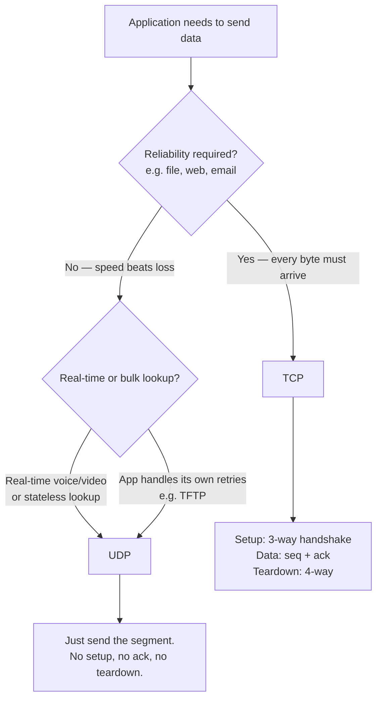
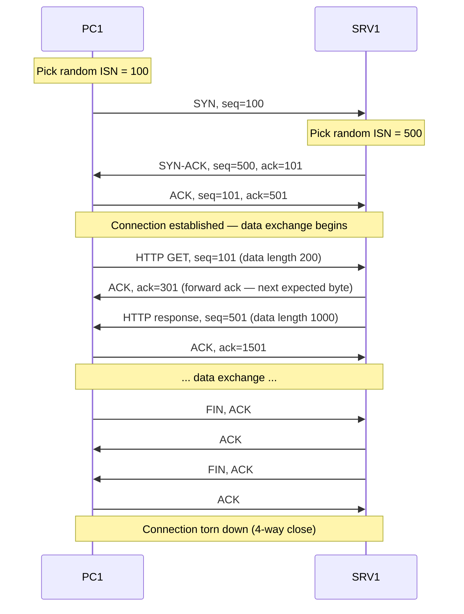
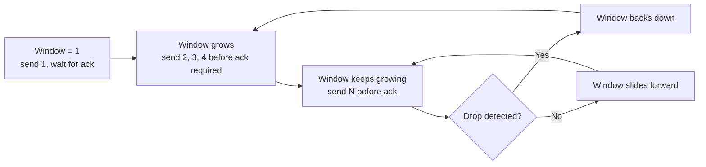

# TCP vs UDP — Transport Layer
> **Domain 1.0 Network Fundamentals (20%)** · Blueprint 1.5 (Compare TCP to UDP)

## Sources

- **[Day 30 — TCP & UDP](https://www.youtube.com/watch?v=LIEACBqlntY)** — L4 fundamentals, ports, TCP three-way handshake, sequencing, flow control, port-number table.

## What you must walk away with

1. **TCP vs UDP** comparison row, every cell, no hesitation.
2. The **three-way handshake**: SYN → SYN-ACK → ACK.
3. **Port-number table** — at minimum the 13 protocols listed below.
4. **Forward acknowledgment** — ack value = next expected sequence number, not the one received.

---

## Core Concept

**TCP is connection-oriented and reliable — it sets up a session, acknowledges every segment, retransmits losses, and paces the sender. UDP is connectionless and best-effort — fire-and-forget, lighter header, lower latency. Both use port numbers for L4 addressing and session multiplexing.**

`[Day 30 @ 02:05]` frames the role of Layer 4: encapsulate the data with an L4 header, hand it to L3/2/1 for transport, and have the destination host receive it as if the underlying network does not exist. That is "transparent transfer between end hosts."

---

## Decision Flow — "Which transport protocol fits?"

---

## Reference Tables

### THE comparison row (memorize cell-by-cell)

| Feature | **TCP** | **UDP** |
|---|---|---|
| Connection | Connection-oriented (3-way handshake) | Connectionless |
| Reliability | Reliable (ack + retransmit) | Best-effort |
| Sequencing | Yes (sequence + ack numbers) | No |
| Flow control | Yes (sliding window) | No |
| Error recovery | Yes | No |
| Header size | 20+ bytes | 8 bytes |
| Speed / overhead | Slower, more overhead | Faster, less overhead |
| Use case | File transfer, web, email, remote shell | Voice, video, DNS lookup, DHCP |
| L4 addressing (port numbers)? | Yes | Yes |
| Session multiplexing? | Yes | Yes |

### Port number ranges (IANA — `[Day 30 @ 07:52]`)

| Range | Name | Use |
|---|---|---|
| **0 – 1023** | Well-known | Major protocols (HTTP, FTP, SSH, DNS ...) |
| **1024 – 49151** | Registered | Vendor / app registration required |
| **49152 – 65535** | Ephemeral / dynamic | Source-port random selection |

### The 13 ports you must know cold

| Protocol | Port(s) | Transport | Purpose |
|---|---|---|---|
| FTP data | **20** | TCP | File transfer (data channel) |
| FTP control | **21** | TCP | File transfer (control channel) |
| SSH | **22** | TCP | Secure remote CLI |
| Telnet | **23** | TCP | Remote CLI (clear text) |
| SMTP | **25** | TCP | Send email |
| DNS | **53** | **TCP + UDP** | Name resolution (UDP normal, TCP for zone xfer / >512 B) |
| DHCP server | **67** | UDP | DHCP server listens here |
| DHCP client | **68** | UDP | DHCP client listens here |
| TFTP | **69** | UDP | Trivial file transfer |
| HTTP | **80** | TCP | Web |
| POP3 | **110** | TCP | Retrieve email |
| SNMP | **161 / 162** | UDP | Network management (162 = traps) |
| HTTPS | **443** | TCP | Web over TLS |
| Syslog | **514** | UDP | Logging |
| NTP | **123** | UDP | Time sync (covered in 4.2) |

**TCP-only memory cue:** the things that absolutely cannot lose data — FTP, SSH, Telnet, SMTP, HTTP, POP3, HTTPS.
**UDP-only memory cue:** the things that prefer speed or stateless transactions — DHCP, TFTP, SNMP, Syslog, NTP.
**Both:** DNS.

---

## TCP Header — fields you need to know

`[Day 30 @ 10:35]` shows the full Wikipedia TCP header. You do not memorize all of it — you need these fields:

| Field | Size | What it does |
|---|---|---|
| Source port | 16 bits | Sender's L4 address (often ephemeral) |
| Destination port | 16 bits | Receiver's L4 address (identifies the app) |
| Sequence number | 32 bits | Bytes-counter for ordering and reliability |
| Acknowledgment number | 32 bits | Forward ack — next byte expected from peer |
| Flags | (incl. SYN, ACK, FIN) | Connection setup / teardown |
| Window size | 16 bits | Flow control — bytes peer may send before ack required |

**UDP header** is just 4 fields: source port, destination port, length, checksum. 8 bytes total.

---

## Worked Examples

### Example 1 — DNS lookup: TCP or UDP?

A user types `www.example.com`. The resolver sends a single DNS query packet to a name server. Response usually fits in one UDP packet (<512 bytes).

**Pick: UDP.** Speed matters for name lookups, the query is tiny, and if it is lost the application can simply retry. The overhead of a TCP three-way handshake for a 50-byte query would multiply the round-trip cost.

**Caveat:** if the response is **>512 bytes** (DNSSEC, big TXT records) or this is a **zone transfer** between authoritative servers, DNS falls back to TCP. That is why DNS is one of the few "both" protocols.

### Example 2 — Streaming video: TCP or UDP?

A user opens Zoom or a Skype call. Audio/video frames arrive at 30+ fps; a 200 ms delay is more disruptive than a single dropped frame.

**Pick: UDP.** TCP's retransmissions would freeze the stream waiting for a single lost packet, which is worse than just losing that frame. The application layer handles dropped audio by smoothing or asking the speaker to repeat.

`[Day 30 @ 21:13]` makes this exact point: "If you're talking to someone over Skype and the audio cuts out for a few seconds, you can simply ask the other person to repeat what they said." That is application-level retransmission — UDP itself has no mechanism.

**Counter-example:** *downloaded* video (Netflix, YouTube via HTTPS) uses TCP because pre-buffering hides retransmission latency and you want every byte. Live-streamed video uses UDP-based protocols (RTP, QUIC).

### Example 3 — TCP three-way handshake with sequence numbers

PC1 wants to load a webpage from SRV1 (port 80). PC1's initial sequence number = 100. SRV1's initial sequence number = 500.

**Forward acknowledgment trap.** If SRV1 receives a segment with seq=27, it acks with **28** — meaning "I got everything through 27, send me 28 next" `[Day 30 @ 14:51]`. Acking with 27 would tell PC1 the segment was lost.

---

## Sliding Window — flow control in one image

The window dynamically adjusts so the receiver is never overwhelmed and the sender never sits idle waiting for unnecessary acks.

---

## Exam Traps

- **UDP is NOT broken** — it is *best-effort*. Apps that use UDP (TFTP, voice, DNS) handle reliability themselves when they need to.
- **Port numbers are NOT TCP-only** — UDP uses ports too. Both have source/destination port fields.
- **Session multiplexing is NOT TCP-only** — UDP supports it via port pairs.
- **Forward ack `28` does NOT mean "got 28"** — it means "received through 27, send 28 next."
- **Three-way handshake is NOT four messages** — it is SYN, SYN-ACK, ACK. Termination is the 4-way (FIN, ACK, FIN, ACK).
- **Source port range is NOT 1024–49151** — that is *registered*. Random source ports come from **49152–65535** (ephemeral).
- **DHCP is NOT TCP** — it is UDP, ports 67 (server) and 68 (client).
- **TFTP is NOT TCP** — it is UDP port 69. Regular FTP is TCP 20/21.
- **DNS is NOT exclusively UDP** — it falls back to TCP for large responses and zone transfers.

---

## Key Concepts to Memorize Cold

- **Comparison row** — every TCP-vs-UDP cell.
- **Three-way handshake** — SYN → SYN-ACK → ACK.
- **Forward ack** — ack = next expected seq.
- **Sliding window** — flow control, dynamic.
- **Port ranges** — 0-1023 well-known, 1024-49151 registered, 49152-65535 ephemeral.
- **The 13 ports** — 20, 21, 22, 23, 25, 53, 67, 68, 69, 80, 110, 161/162, 443, 514, 587, 993, 995 (the bonus mail ports often appear too: SMTP-submission 587, IMAPS 993, POP3S 995 — TCP).
- **Header sizes** — TCP 20+ bytes, UDP 8 bytes.
- **TCP-only services** — error recovery, flow control, sequencing.

---

## Self-Check Quiz

**Q1.** A host randomly selects a source port. From which range?

Answer

**Ephemeral, 49152 – 65535.** Well-known is 0-1023 (server destinations). Registered is 1024-49151.

**Q2.** Which three features does TCP provide that UDP does not? (pick three)

Answer

**Error recovery, flow control, sequencing.** Both have port numbers and session multiplexing.

**Q3.** A TCP segment arrives with seq=27. The receiver acks. What is the value in the ACK field?

Answer

**28.** Forward acknowledgment — "I got 27, send me 28 next."

**Q4.** Which protocols use TCP, which use UDP, which use both?
SMTP, SNMP, HTTPS, DHCP, Syslog, SSH, TFTP, DNS, FTP, NTP.

Answer

**TCP:** SMTP (25), HTTPS (443), SSH (22), FTP (20/21).
**UDP:** SNMP (161/162), DHCP (67/68), Syslog (514), TFTP (69), NTP (123).
**Both:** DNS (53).

**Q5.** What are the three messages of the TCP three-way handshake, in order?

Answer

**SYN, SYN-ACK, ACK.** PC1 sends SYN with random initial sequence number. Server responds with its own SYN + an ACK of PC1's seq+1. PC1 sends final ACK. Connection is now established.

**Q6.** Why does Voice-over-IP prefer UDP over TCP?

Answer

Real-time voice is delay-sensitive. TCP retransmissions would freeze playback waiting for a lost packet, producing audible stalls. UDP just drops the bad packet — the listener may hear a small glitch, which is less disruptive than a freeze. The application or human on the call handles "real" retransmission ("can you repeat that?").

**Q7.** How big is the UDP header? What four fields does it contain?

Answer

**8 bytes.** Source port, destination port, length, checksum. That's it. The minimal header is exactly why UDP is faster than TCP — no seq, no ack, no flags, no window.

**Q8.** Which port does each of these run on? FTP control, SSH, SMTP, HTTPS, DHCP server, TFTP, SNMP, Syslog.

Answer

FTP control = **TCP 21**. SSH = **TCP 22**. SMTP = **TCP 25**. HTTPS = **TCP 443**. DHCP server = **UDP 67**. TFTP = **UDP 69**. SNMP = **UDP 161** (162 for traps). Syslog = **UDP 514**.

---

## Recap

- **TCP** = connection-oriented, reliable, sequenced, flow-controlled, 20+ byte header, slower.
- **UDP** = connectionless, best-effort, no sequencing, no flow control, 8-byte header, faster.
- Both use **port numbers** for L4 addressing and session multiplexing.
- **Three-way handshake**: SYN → SYN-ACK → ACK. **Forward ack** = next expected seq.
- **Green-light:** if you can fill the comparison row plus 10 of the 13 ports from memory in under 2 minutes, this section is exam-ready.

---

**Source transcript:** `[[../jeremy-it-videos/061-tcp-udp-day-30]]`
**Cheat sheet companion:** `[[../cheat-sheets/day-30-tcp-udp]]`
