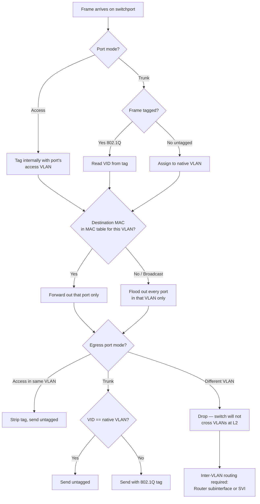
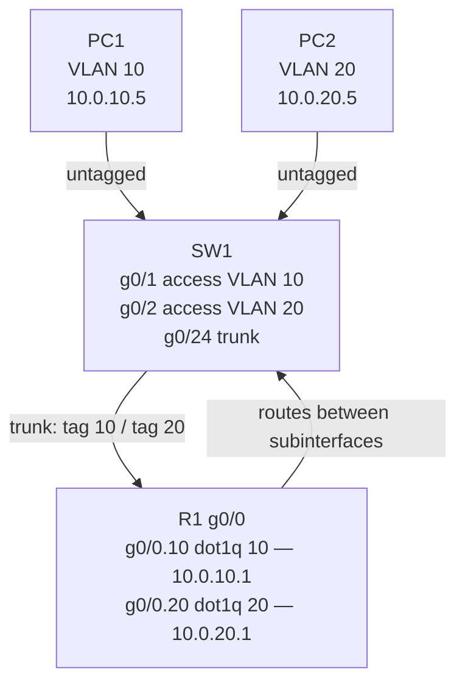

# VLANs — Access, Trunks, 802.1Q, Inter-VLAN, Voice VLAN
> **Domain 2.0 Network Access (20%)** · Blueprint 2.1 (configure/verify VLANs spanning multiple switches) + 2.2 (configure/verify interswitch connectivity — trunks, native VLAN) + 2.4 (inter-VLAN routing)

## 📺 Sources
- [[../jeremy-it-videos/029-vlans-part-1-day-16]] — Day 16 — VLAN basics, access ports, default VLAN
- [[../jeremy-it-videos/031-vlans-part-2-day-17]] — Day 17 — Trunks, 802.1Q, native VLAN, ROAS
- [[../jeremy-it-videos/033-vlans-part-3-day-18]] — Day 18 — Layer 3 switching, SVIs, routed ports
- [[../jeremy-it-videos/035-dtpvtp-day-19]] — Day 19 — DTP and VTP
- Inline `[Day N @ MM:SS]` anchors point back to source moments.

## 🎯 What you must walk away with
- Define a VLAN as a logical Layer-2 broadcast domain and configure access ports for it.
- Build an 802.1Q trunk between two switches and explain the 4-byte tag's location and fields.
- Recognize the native VLAN as the one VLAN sent **untagged** on a trunk and the security risk of leaving it as VLAN 1.
- Configure **router-on-a-stick (ROAS)** with subinterfaces and `encapsulation dot1q`.
- Replace ROAS with a **Layer 3 switch + SVIs** for hairpin-free inter-VLAN routing.
- Predict DTP outcomes (active/passive pairings) and explain why VTP is dangerous.
- Configure a **voice VLAN** so an IP phone and PC share one access port.

## 🧠 Core Concept

**A VLAN is one Layer-2 broadcast domain inside a switch. Access ports carry exactly one VLAN untagged. Trunks carry many VLANs tagged with 802.1Q (except the native VLAN, which stays untagged). To send packets between VLANs you need a router or a Layer-3 switch.**

`[Day 16 @ 03:10]` "One VLAN equals one LAN equals one broadcast domain equals one IP subnet." That mapping is the spine of every VLAN exam question. A switch by default treats every port as one big LAN; VLANs let you slice that single switch into multiple isolated LANs without buying more hardware. `[Day 17 @ 02:30]` Trunks make those slices stretch across multiple switches by tagging the frame on the wire so the receiving switch knows which VLAN it belongs to. `[Day 18 @ 01:15]` Once you have multiple VLANs you need a routing device — either an external router-on-a-stick or, modern preference, a Layer-3 switch using SVIs.

## 🔄 Decision Flow (Mermaid)



## 🔑 Reference Tables

### VLAN ranges

| Range | Type | Notes |
|-------|------|-------|
| **0** | Reserved | Cannot use |
| **1** | Default VLAN | Cannot delete; every port starts here |
| **2–1001** | Normal range | Stored in `vlan.dat`; sync via VTP v1/v2 |
| **1002–1005** | Reserved | Legacy FDDI/Token Ring; cannot delete |
| **1006–4094** | Extended range | Requires VTP transparent or VTPv3 |
| **4095** | Reserved | Cannot use |

### Access vs Trunk port

| Property | Access port | Trunk port |
|----------|-------------|------------|
| VLAN count | One | Many (default: all 1–4094) |
| Tagging | Untagged | 802.1Q tagged (except native) |
| Connects to | End host (PC, phone, printer, server) | Other switch, router, hypervisor |
| Mode command | `switchport mode access` | `switchport mode trunk` |

### 802.1Q tag (4 bytes, inserted between Source MAC and EtherType)

| Field | Bits | Value | Purpose |
|-------|------|-------|---------|
| **TPID** | 16 | `0x8100` | Identifies frame as 802.1Q-tagged |
| **PCP** | 3 | 0–7 | Priority (CoS) for QoS |
| **DEI** | 1 | 0/1 | Drop Eligible Indicator |
| **VID** | 12 | 0–4095 | The VLAN ID itself |

### Inter-VLAN routing options

| Method | Where routing happens | When to use |
|--------|----------------------|-------------|
| **Router-on-a-stick (ROAS)** | External router with subinterfaces | Small networks, no L3 switch |
| **Layer 3 switch + SVI** | `interface vlan N` on multilayer switch | Modern preferred — no hairpin |
| **Routed port** | `no switchport` on a physical L3 switch port | Point-to-point uplink to router |

### DTP mode pairings (will a trunk form?)

| ↓ Local / Right → | Access | Trunk | Dynamic Auto | Dynamic Desirable |
|---|---|---|---|---|
| **Access** | Access | ❌ misconfig | Access | Access |
| **Trunk** | ❌ misconfig | Trunk | Trunk | Trunk |
| **Dynamic Auto** | Access | Trunk | **Access** | Trunk |
| **Dynamic Desirable** | Access | Trunk | Trunk | Trunk |

The trap row is **auto + auto = access** — both passive, no one initiates.

### VTP modes

| Mode | Edit VLANs? | Sync from server? | Forward advertisements? | VLAN db storage |
|------|-------------|-------------------|-------------------------|-----------------|
| **Server (default)** | Yes | Yes (highest revision wins) | Yes | NVRAM (`vlan.dat`) |
| **Client** | No | Yes | Yes | RAM only |
| **Transparent** | Yes (local only) | **No** | Yes (pass-through) | NVRAM |

## 🧪 Worked Example 1 — Configure access port + trunk + native VLAN

Scenario: SW1 g0/1 connects to a PC in VLAN 10. SW1 g0/24 trunks to SW2, allowing only VLANs 10 and 20, with VLAN 99 as the (unused, security-hardened) native VLAN.

```text
SW1(config)# vlan 10
SW1(config-vlan)# name DATA
SW1(config-vlan)# vlan 20
SW1(config-vlan)# name SERVERS
SW1(config-vlan)# vlan 99
SW1(config-vlan)# name NATIVE-DROP
SW1(config-vlan)# exit

! Access port to PC
SW1(config)# interface g0/1
SW1(config-if)# switchport mode access
SW1(config-if)# switchport access vlan 10
SW1(config-if)# spanning-tree portfast

! Trunk port to SW2
SW1(config)# interface g0/24
SW1(config-if)# switchport trunk encapsulation dot1q   ! only on switches that support ISL too
SW1(config-if)# switchport mode trunk
SW1(config-if)# switchport trunk allowed vlan 10,20,99
SW1(config-if)# switchport trunk native vlan 99
SW1(config-if)# switchport nonegotiate                  ! disable DTP
```

Verification:

```text
SW1# show vlan brief
SW1# show interfaces trunk           ! lists allowed/native/encapsulation
SW1# show interfaces g0/24 switchport
```

Step-by-step why each line matters: **`switchport mode access` first** — without it, `switchport access vlan` may silently leave the port in dynamic-auto. **`encapsulation dot1q` before `mode trunk`** on dual-capable switches. **`native vlan 99`** must match SW2's native — mismatch causes CDP warnings and unpredictable VLAN landing for untagged frames `[Day 17 @ 14:20]`. **`nonegotiate`** kills DTP frames so no one accidentally re-negotiates the trunk down `[Day 19 @ 12:00]`.

## 🧪 Worked Example 2 — Voice VLAN on shared port

Phone has built-in 3-port mini-switch: uplink to SW, downlink to PC, internal. We want voice on VLAN 100 (tagged by phone), data on VLAN 10 (untagged from PC).

```text
SW1(config)# vlan 10
SW1(config-vlan)# name DATA
SW1(config)# vlan 100
SW1(config-vlan)# name VOICE
SW1(config)# interface g0/2
SW1(config-if)# switchport mode access
SW1(config-if)# switchport access vlan 10           ! data VLAN — untagged from PC
SW1(config-if)# switchport voice vlan 100           ! tells phone via CDP/LLDP to tag voice with VLAN 100
SW1(config-if)# spanning-tree portfast
```

The port is **still an access port** but acts like a mini-trunk for two VLANs. The phone learns "tag voice with VLAN 100" via CDP. PC traffic stays untagged in VLAN 10. This is a frequent v1.1 exam item under blueprint 2.2.

## 🧪 Worked Example 3 — Inter-VLAN routing two ways

**Option A: Router-on-a-stick (ROAS)** — VLANs 10/20/99 trunked from SW1 g0/24 to R1 g0/0:

```text
R1(config)# interface g0/0
R1(config-if)# no shutdown                          ! must enable physical first

R1(config)# interface g0/0.10
R1(config-subif)# encapsulation dot1q 10
R1(config-subif)# ip address 10.0.10.1 255.255.255.0

R1(config)# interface g0/0.20
R1(config-subif)# encapsulation dot1q 20
R1(config-subif)# ip address 10.0.20.1 255.255.255.0

R1(config)# interface g0/0.99
R1(config-subif)# encapsulation dot1q 99 native     ! native = no tag
R1(config-subif)# ip address 10.0.99.1 255.255.255.0
```

**Option B: Layer 3 switch with SVIs** (no external router):

```text
MLS(config)# ip routing                             ! REQUIRED — silent killer if missed
MLS(config)# vlan 10
MLS(config)# vlan 20
MLS(config)# interface vlan 10
MLS(config-if)# ip address 10.0.10.1 255.255.255.0
MLS(config-if)# no shutdown
MLS(config)# interface vlan 20
MLS(config-if)# ip address 10.0.20.1 255.255.255.0
MLS(config-if)# no shutdown
```

`[Day 18 @ 09:40]` SVI requires four conditions to come up/up: VLAN exists, ≥1 active port in that VLAN, VLAN is not shut, SVI itself has `no shutdown`.

## 📊 Diagram — Router-on-a-stick



## 🚨 Exam Traps

- **Native VLAN is NOT tagged** — that is its definition. Mismatched native VLANs across the trunk are not a hard failure but cause untagged frames to land in the wrong VLAN and trigger CDP warnings.
- **Auto + Auto = NOT a trunk** — both DTP-passive, both stay access. Active-active and active-passive both succeed.
- **`switchport mode trunk` does NOT disable DTP** — DTP frames still flow. Use `switchport nonegotiate` to silence them.
- **VTP transparent does NOT sync** the VLAN database, **but it DOES forward** advertisements within the same domain. Old switch in transparent mode = relay.
- **Higher VTP revision is NOT safer** — a stale switch with revision 50 plugged in can wipe your production VLAN database. Reset by changing domain or moving to transparent before insertion.
- **`ip routing` is NOT optional** on a Layer 3 switch — without it, SVIs come up but inter-VLAN packets are dropped silently.
- **VLAN 1 is NOT deletable** — neither are 1002–1005. Best practice still says move user traffic and the trunk native VLAN off VLAN 1.
- **`no switchport` is NOT the same as creating an SVI** — `no switchport` makes one physical port a routed port; SVI is `interface vlan N`.

## ⚙️ Key Cisco IOS Commands

```text
! Create / name a VLAN
vlan 10
 name DATA

! Access port
interface g0/1
 switchport mode access
 switchport access vlan 10
 switchport voice vlan 100        ! optional — phone+PC

! Trunk port
interface g0/24
 switchport trunk encapsulation dot1q
 switchport mode trunk
 switchport trunk allowed vlan 10,20,99
 switchport trunk native vlan 99
 switchport nonegotiate

! ROAS subinterface
interface g0/0.10
 encapsulation dot1q 10
 ip address 10.0.10.1 255.255.255.0

! L3 switch SVI
ip routing
interface vlan 10
 ip address 10.0.10.1 255.255.255.0
 no shutdown

! VTP / DTP hardening
vtp mode transparent
vtp domain LAB
vtp version 3                     ! supports extended range

! Verify
show vlan brief
show interfaces trunk
show interfaces g0/24 switchport
show vtp status
show interfaces status            ! 'routed' in VLAN column = no switchport
```

## 🧪 Self-Check Quiz

1. What is the only VLAN sent untagged on an 802.1Q trunk?
2. Two switches: SW1 g0/24 = `dynamic auto`, SW2 g0/24 = `dynamic auto`. What mode forms?
3. Where exactly is the 4-byte 802.1Q tag inserted in the Ethernet frame?
4. You configure `interface vlan 50` with an IP and `no shutdown`, but it stays down/down. Name two of the four conditions that must be true for it to come up/up.
5. SP-side switch should run which guard on the customer-facing port to keep the customer from becoming root? (foreshadow Topic 8) — and what command makes the SP switch's port also reject DTP negotiation? (Topic 7)
6. A spare switch with VTP server, domain "LAB", revision 47 is plugged into your production network (also "LAB", revision 12). What happens to your VLAN database?
7. On a Layer-3 switch with three VLANs, two PCs in different VLANs cannot ping each other even though SVIs are up/up. What is the most common cause?
8. Voice VLAN configuration: on which port type does `switchport voice vlan 100` go — access or trunk?

<details>
<summary>Answers</summary>

1. The **native VLAN** (default VLAN 1; best practice = unused VLAN like 999).
2. **Access** — both DTP-passive, neither initiates.
3. Between the **Source MAC address** and the **Type/Length** field. 4 bytes total: TPID (`0x8100`) + 3-bit PCP + 1-bit DEI + 12-bit VID.
4. Any two of: VLAN exists in VLAN db; at least one access/trunk port in that VLAN is up; VLAN is not shutdown; SVI itself has `no shutdown`.
5. Root Guard (Topic 8); `switchport nonegotiate` (Topic 7).
6. Production database is **overwritten** by the spare's revision-47 db — VLANs missing from the spare disappear from production. Reset by booting the spare in transparent mode or different VTP domain first.
7. **`ip routing` is missing** in global config — SVIs are L3 interfaces but the switch is not routing.
8. **Access** — `switchport voice vlan` requires `switchport mode access`. The phone tags voice traffic via CDP/LLDP-learned VLAN ID; PC traffic stays untagged in the data VLAN.

</details>

## 🧾 Recap

- **One VLAN = one Layer-2 broadcast domain = one IP subnet**; access ports carry one VLAN untagged, trunks carry many tagged with 802.1Q.
- **Native VLAN is the untagged exception** on a trunk — must match both ends, change off VLAN 1 for security.
- **Inter-VLAN routing options**: ROAS (router subinterfaces with `encapsulation dot1q`) or Layer-3 switch SVIs (`ip routing` + `interface vlan N`).
- **DTP and VTP both default on, both should be disabled in production** — `switchport nonegotiate` per port, `vtp mode transparent` per switch.
- 🟢 **Green-light to Topic 8 (STP)** when you can build a trunk + ROAS + voice-enabled access port from blank in under 6 minutes and predict every DTP pairing outcome cold.

---
Source videos: Jeremy's IT Lab — Days 16/17/18/19
