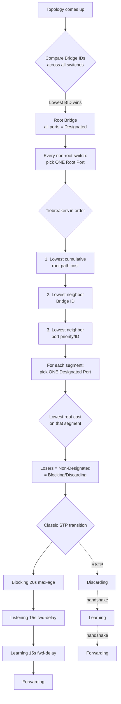
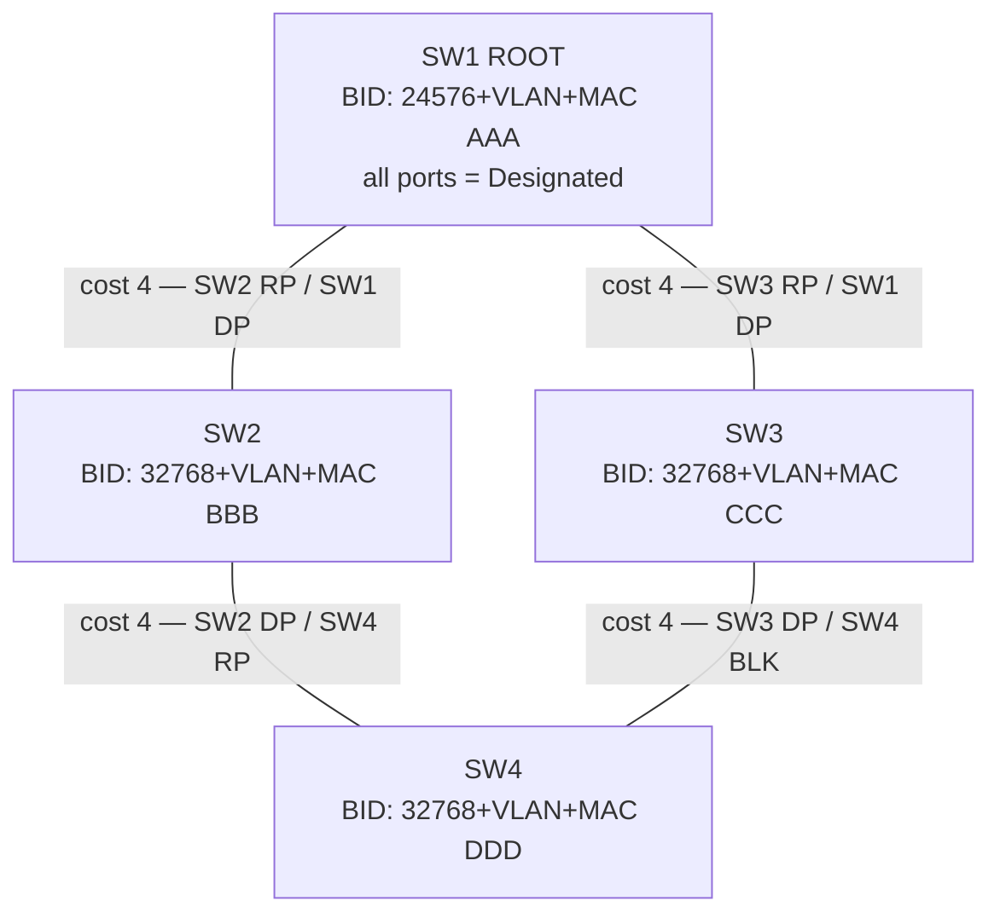

# STP, RSTP, and the STP Toolkit
> **Domain 2.0 Network Access (20%)** · Blueprint 2.5 (configure and verify Layer 2 discovery and Spanning Tree — RPVST+ root primary/secondary, port states, port roles, PortFast, BPDU Guard, BPDU Filter, Root Guard, Loop Guard)

## 📺 Sources
- [[../jeremy-it-videos/037-spanning-tree-protocol-part-1-day-20]] — Day 20 — Root bridge, port roles, BID, path cost
- [[../jeremy-it-videos/039-spanning-tree-protocol-part-2-day-21]] — Day 21 — Port states, timers, root config
- [[../jeremy-it-videos/040-portfast-stp-toolkit-ccna-200-301-day-21-part-1]] — Day 21p1 — PortFast
- [[../jeremy-it-videos/041-bpdu-guard-bpdu-filter-stp-toolkit-ccna-200-301-day-21-part-2]] — Day 21p2 — BPDU Guard / Filter
- [[../jeremy-it-videos/042-root-guard-stp-toolkit-ccna-200-301-day-21-part-3]] — Day 21p3 — Root Guard
- [[../jeremy-it-videos/043-loop-guard-stp-toolkit-ccna-200-301-day-21-part-4]] — Day 21p4 — Loop Guard
- [[../jeremy-it-videos/045-rapid-spanning-tree-protocol-day-22]] — Day 22 — RSTP / Rapid PVST+
- Inline `[Day N @ MM:SS]` anchors throughout.

## 🎯 What you must walk away with
- Compute the **Bridge ID** and pick the root bridge for any topology (priority + extended-system-ID + MAC).
- Identify **root port**, **designated port**, and **non-designated/blocking** ports on a 4-switch diagram by hand.
- List path costs at every speed for **classic STP** (10M=100, 100M=19, 1G=4, 10G=2) and **RSTP revised** values.
- Walk a port through **Blocking → Listening (15s) → Learning (15s) → Forwarding** and explain why total recovery = **50s**.
- Map the four classic states to the **three RSTP states** (Discarding, Learning, Forwarding) and four roles (Root, Designated, **Alternate**, **Backup**).
- Apply each STP-toolkit feature — **PortFast, BPDU Guard, BPDU Filter, Root Guard, Loop Guard** — to the right port type for the right reason.
- Configure Rapid PVST+ root primary/secondary and verify with `show spanning-tree`.

## 🧠 Core Concept

**Spanning Tree Protocol prevents Layer-2 loops by electing one root bridge per VLAN, then blocking redundant paths. Each non-root switch picks one root port toward the root; each link picks one designated port; everything else blocks. Modern Cisco runs Rapid PVST+ (802.1w per VLAN), which converges in seconds instead of 30–50.**

`[Day 20 @ 02:30]` Without STP, a single broadcast frame in a redundant Layer-2 topology becomes a broadcast storm in milliseconds — frames have no TTL at L2, so they loop forever, MAC tables flap, CPUs hit 100%, and the whole switch fabric melts. STP is the protocol that lets you build redundant L2 paths without the fire. The cost: blocked links sit idle until a failure, and convergence with classic STP takes up to 50 seconds. RSTP fixes the convergence time; **EtherChannel** (Topic 9) reclaims the idle bandwidth.

## 🔄 Decision Flow (Mermaid)



## 🔑 Reference Tables

### Bridge ID composition (8 bytes total)

| Field | Size | Notes |
|-------|------|-------|
| **Priority** | 4 bits | Configurable in increments of **4096**. Default 32768. |
| **Extended System ID** | 12 bits | The VLAN number — added automatically (PVST+/RPVST+). |
| **MAC address** | 48 bits | The switch's base MAC; used as final tiebreaker. |

Default priority for VLAN 10 = 32768 + 10 = **32778**. `root primary` = **24576** (or 4096 below current root). `root secondary` = **28672**.

### Path cost — memorize both columns

| Link speed | Classic STP cost | RSTP revised cost |
|-----------:|----:|----:|
| 10 Mbps  | 100 | 2,000,000 |
| 100 Mbps | 19  | 200,000 |
| 1 Gbps   | 4   | 20,000 |
| 10 Gbps  | 2   | 2,000 |
| 100 Gbps | (n/a classic) | 200 |
| 1 Tbps   | (n/a classic) | 20 |

CCNA exam usually uses classic values (19/4/2). Know them cold.

### Classic STP port states (802.1D)

| State | Forwards data? | Sends BPDUs? | Receives BPDUs? | Learns MACs? | Duration |
|-------|:-:|:-:|:-:|:-:|--------|
| **Disabled** | No | No | No | No | — |
| **Blocking** | No | No | **Yes** | No | until topology change |
| **Listening** | No | Yes | Yes | No | **15s** (forward-delay) |
| **Learning** | No | Yes | Yes | **Yes** | **15s** (forward-delay) |
| **Forwarding** | **Yes** | Yes | Yes | Yes | steady state |

Total Blocking → Forwarding worst case = **20s max-age + 15s listening + 15s learning = 50s**.

### Classic STP timers

| Timer | Default | Purpose |
|-------|:-:|---------|
| **Hello** | 2s | Root sends BPDU every Hello |
| **Forward Delay** | 15s | Length of Listening AND of Learning |
| **Max Age** | 20s | Wait this long without a BPDU before reconverging |

### RSTP — port states (802.1w)

| State | Forwards data? | Learns MACs? | Replaces classic states |
|-------|:-:|:-:|---|
| **Discarding** | No | No | Disabled + Blocking + Listening |
| **Learning** | No | Yes | Learning |
| **Forwarding** | Yes | Yes | Forwarding |

### RSTP — port roles

| Role | Purpose | Receives superior BPDU from… |
|------|---------|------------------------------|
| **Root** | Best path toward root | (its upstream neighbor on the root path) |
| **Designated** | Forwards on a segment | (none — it sends the best BPDU there) |
| **Alternate** | Backup root path | A **different** switch |
| **Backup** | Backup designated path | The **same** switch (only when a hub is on the segment) |

### RSTP link types

| Link type | Used on | Behavior |
|-----------|---------|----------|
| **Edge** | End-host port | Goes straight to forwarding (PortFast) |
| **Point-to-point** | Switch-to-switch full-duplex | Fast handshake — sub-second convergence |
| **Shared** | Half-duplex (hub) | Falls back to classic 802.1D timers |

### STP toolkit — full comparison (the highest-leverage table on this page)

| Feature | Where to deploy | Trigger | Action on trigger | Recovery | Configure (per-port) | Configure (global default) |
|---------|-----------------|---------|-------------------|----------|----------------------|----------------------------|
| **PortFast** | Access ports to end hosts | Port comes up | Skip Listening + Learning, jump to Forwarding | n/a — speeds up boot | `spanning-tree portfast` | `spanning-tree portfast default` (access ports only) |
| **BPDU Guard** | PortFast/edge access ports | **Receive** any BPDU | err-disable the port | Manual `shut/no shut` OR `errdisable recovery cause bpduguard` (off by default) | `spanning-tree bpduguard enable` | `spanning-tree portfast bpduguard default` (only on PortFast ports) |
| **BPDU Filter** | PortFast access ports (with care) | **Send** BPDUs | Stop sending. Per-port also stops processing received → loop risk | n/a | `spanning-tree bpdufilter enable` ⚠ DANGEROUS | `spanning-tree portfast bpdufilter default` ✅ safer |
| **Root Guard** | Designated ports facing untrusted switches (e.g., SP toward customer) | Receive a **superior** BPDU | Move port to **root-inconsistent (BKN)** state — still up, just blocked | **Auto** — clears once superior BPDUs stop (~Max Age 20s) | `spanning-tree guard root` (interface only — no global) | n/a |
| **Loop Guard** | **Root + non-designated** ports (where BPDUs are expected) | BPDUs **stop** arriving (unidirectional link) | Move port to **loop-inconsistent (BKN)** state — still up, blocked | **Auto** — clears when BPDUs return | `spanning-tree guard loop` | `spanning-tree loopguard default` |

Mutual exclusivity: **Root Guard and Loop Guard cannot coexist on the same port** — last command wins. Conceptually they protect opposite roles (designated vs root/non-designated), so this is rarely a real conflict.

### STP version landscape

| Version | IEEE | Per-VLAN? | Convergence | Cisco default? |
|---------|------|:-:|---|:-:|
| **STP** | 802.1D | No | 30–50s | — |
| **PVST+** | Cisco | Yes | 30–50s | (legacy) |
| **RSTP** | 802.1w | No | seconds | — |
| **Rapid PVST+** | Cisco | **Yes** | seconds | ✅ **modern default** |
| **MST / MSTP** | 802.1s | Group VLANs into instances | seconds | scaling option |

## 🧪 Worked Example 1 — Identify root bridge + port roles

Topology (4 switches, all 1 Gbps links):

```text
                +---SW1 (priority 32768, MAC AAA)---+
                |                                    |
                |                                    |
              SW2                                   SW3
        (priority 32768,                       (priority 32768,
          MAC BBB)                                MAC CCC)
                |                                    |
                +-----------SW4 (priority----------+
                            32768, MAC DDD)
```

All switches have priority 32768 in VLAN 1 → BID priority field = 32769 across the board. **Tiebreaker = MAC**. Lowest MAC = `AAA` → **SW1 is root**.

Per-link cost (1G = 4):

- **SW1**: every port on the root bridge is **Designated** by definition.
- **SW2** picks its root port. Direct path SW2→SW1 has cost **4**. Alternate path SW2→SW4→SW3→SW1 has cost **12**. Root Port = **SW2's link to SW1**.
- **SW3** symmetric: Root Port = **SW3's link to SW1**, cost **4**.
- **SW4** sees two equal-cost paths to root: SW4→SW2→SW1 = 8, SW4→SW3→SW1 = 8. Tie. Tiebreaker = lowest **neighbor BID**. SW2's MAC `BBB` < SW3's MAC `CCC` → **SW4's Root Port = link to SW2**. The other (toward SW3) is non-designated.

Now segments:
- SW2↔SW4 link: SW2's port has root cost 4, SW4's port has root cost 8 (going via SW2 it would be 4+4=8 from SW4's perspective on that segment). SW2's side wins → SW2's port = **Designated**, SW4's port = **Root** (already chosen above).
- SW3↔SW4 link: SW3 has root cost 4, SW4 has root cost 8. SW3's side wins → **Designated**. SW4's side = **non-designated / Blocking**.

Result: ring still connects, the SW3↔SW4 path is blocked on SW4's side, no loop.

`[Day 20 @ 12:50]` Same logic appears in every CCNA STP question. Practice on paper until you can do this without thinking.

## 🧪 Worked Example 2 — Configure Rapid PVST+ + root primary

Make SW1 the primary root for VLAN 10 and the secondary root for VLAN 20; make SW2 the opposite for load balancing.

```text
SW1(config)# spanning-tree mode rapid-pvst
SW1(config)# spanning-tree vlan 10 root primary       ! priority becomes 24576
SW1(config)# spanning-tree vlan 20 root secondary     ! priority becomes 28672

SW2(config)# spanning-tree mode rapid-pvst
SW2(config)# spanning-tree vlan 10 root secondary
SW2(config)# spanning-tree vlan 20 root primary
```

Verify:

```text
SW1# show spanning-tree vlan 10
SW1# show spanning-tree vlan 10 detail
SW1# show spanning-tree summary               ! shows mode, blocked-port count
```

Look for "This bridge is the root" on SW1 for VLAN 10, and root MAC = SW2's MAC for VLAN 20. Per-VLAN load balancing means VLAN-10 traffic flows one way and VLAN-20 traffic the other across the same physical mesh.

## 🧪 Worked Example 3 — Apply the STP toolkit correctly

Network has access switches with end hosts, an uplink toward a distribution switch, and one untrusted port toward a third-party network.

```text
! 1. All access ports — fast boot + protect against rogue switches
SW1(config)# interface range g0/1-20
SW1(config-if-range)# switchport mode access
SW1(config-if-range)# switchport access vlan 10
SW1(config-if-range)# spanning-tree portfast
SW1(config-if-range)# spanning-tree bpduguard enable

! Or globally for the whole switch:
SW1(config)# spanning-tree portfast default
SW1(config)# spanning-tree portfast bpduguard default
SW1(config)# spanning-tree portfast bpdufilter default     ! safer global form
SW1(config)# errdisable recovery cause bpduguard
SW1(config)# errdisable recovery interval 300              ! 5 min auto-recovery

! 2. Designated port toward a customer / untrusted switch — protect root role
SW1(config)# interface g0/24
SW1(config-if)# spanning-tree guard root

! 3. Non-designated/root ports between trusted switches — protect against unidirectional link
SW1(config)# interface g0/23
SW1(config-if)# spanning-tree guard loop
! (or globally: spanning-tree loopguard default)
```

Why this layout:
- **Access ports get PortFast + BPDU Guard** — fast user experience, but if anyone plugs a rogue switch in the wall jack, the port shuts down `[Day 21p2 @ 04:30]`.
- **Untrusted designated link gets Root Guard** — lets the link stay up but refuses to be promoted to root if the foreign switch lies about a better priority `[Day 21p3 @ 06:00]`.
- **Trusted root/non-designated links get Loop Guard** — if the BPDUs stop (broken fiber Tx or Rx), the port goes broken instead of accidentally going to forwarding and creating a loop `[Day 21p4 @ 07:10]`.

## 📊 Diagram — Root election + port roles



## 🚨 Exam Traps

- **Lowest BID wins** root, not highest. Common distractor in question stems.
- **Priority changes only in increments of 4096** — values like 30000 are illegal.
- **All ports on the root bridge are Designated**, not "root ports". A switch never has a root port to itself.
- **Listening does NOT learn MACs**, only Learning does. Both still block data; both pass BPDUs.
- **Recovery = 50s, NOT 30s** — 20s Max Age + 15s Listening + 15s Learning. The 30s figure (just forward delay) is for cold start when the port comes up freshly.
- **PortFast on a switch-to-switch link causes a temporary loop.** PortFast belongs on access ports only. The trunk-PortFast variant exists for ROAS or hypervisor uplinks only.
- **BPDU Guard ≠ Root Guard.** BPDU Guard err-disables the port if **any** BPDU arrives (used on access ports). Root Guard only acts on **superior** BPDUs (used on designated ports), and it doesn't err-disable — it sets root-inconsistent and self-recovers.
- **BPDU Filter per-port disables STP on that port** — practically suicide. Use the `default` global form, which only stops sending and reverts to normal STP if a BPDU is heard.
- **Loop Guard and Root Guard are mutually exclusive** on the same port.
- **RSTP Backup port requires a hub** on the segment — almost never seen in modern networks. Alternate is the common one.
- **RSTP collapses Disabled + Blocking + Listening into Discarding** — three states, not five. If the question lists "blocking" in an RSTP context, it usually means discarding.
- **In RSTP every switch sends BPDUs** every Hello, not just the root (classic STP behavior).
- **Root Guard auto-recovers** after Max Age (20s) once the superior BPDU stops; **BPDU Guard does NOT auto-recover** unless `errdisable recovery cause bpduguard` is enabled.

## ⚙️ Key Cisco IOS Commands

```text
! Mode + root macros
spanning-tree mode rapid-pvst
spanning-tree vlan 10 root primary
spanning-tree vlan 20 root secondary
spanning-tree vlan 10 priority 4096           ! manual — must be multiple of 4096

! PortFast
spanning-tree portfast                         ! per access port
spanning-tree portfast default                 ! global, access only
spanning-tree portfast trunk                   ! ROAS / hypervisor trunk
spanning-tree portfast disable                 ! exception when global is on

! BPDU Guard
spanning-tree bpduguard enable                 ! per port
spanning-tree portfast bpduguard default       ! global, applies to PortFast ports
errdisable recovery cause bpduguard
errdisable recovery interval 300

! BPDU Filter
spanning-tree portfast bpdufilter default      ! ✅ recommended global form
spanning-tree bpdufilter enable                ! ⚠ per-port — disables STP

! Root Guard / Loop Guard
spanning-tree guard root                        ! interface only
spanning-tree guard loop                        ! interface
spanning-tree loopguard default                 ! global
spanning-tree guard none                        ! disable on a specific port

! Verify
show spanning-tree
show spanning-tree vlan 10
show spanning-tree vlan 10 detail
show spanning-tree summary
show spanning-tree interface g0/1 detail
show errdisable recovery
```

## 🧪 Self-Check Quiz

1. Five switches, all priority 32768, VLAN 1. MACs are AAA, BBB, CCC, DDD, EEE. Which is root?
2. Step size you must use when changing STP priority?
3. Default priority on VLAN 30, with no manual changes?
4. List the four classic STP port states a port passes through from cable-up to data-forwarding (cold start), and the time spent in each.
5. Which two states **forward BPDUs** but **do not learn MACs**?
6. RSTP — name the three port states and four port roles.
7. A port shows `BKN ROOT_Inc`. Which guard caused this, and how does it recover?
8. A port shows `BKN LOOP_Inc`. Which guard caused this, and what real-world failure typically triggers it?
9. You enable `spanning-tree portfast` on a switch-to-switch trunk. What can go wrong?
10. SP-side switch has Root Guard on the customer-facing port. Customer plugs in a switch with priority 0. What happens to the SP port?
11. You globally enable `spanning-tree bpdufilter default`. A rogue PC injects a BPDU. What does the port do?
12. Two interfaces in RSTP: Alternate vs Backup — what's the structural difference?

<details>
<summary>Answers</summary>

1. **AAA-MAC switch** — priorities tied, lowest MAC wins.
2. **4096**.
3. **32768 + 30 = 32798**.
4. Listening (15s, forward-delay) → Learning (15s, forward-delay) → Forwarding. (Blocking is the steady-state for non-designated ports; Listening is reached after Max Age = 20s if recovering from a topology change, hence 50s recovery total. Cold start = 30s because Blocking is skipped when the port comes up.)
5. **Listening and Learning** both forward BPDUs and block data. Only **Learning** learns MACs.
6. States: **Discarding, Learning, Forwarding**. Roles: **Root, Designated, Alternate, Backup**.
7. **Root Guard** — superior BPDU received on a Root-Guard-protected port. **Auto-recovers** in ~20s (Max Age) after superior BPDUs stop.
8. **Loop Guard** — BPDUs stopped arriving on a port that should receive them. Typical cause = **damaged fiber (unidirectional link)** — Tx or Rx broken, link still shows up. **Auto-recovers** when BPDUs return.
9. **Temporary loop** — the trunk port jumps to forwarding before STP converges, frames loop until BPDUs propagate. Use `spanning-tree portfast trunk` only on real edge trunks (ROAS, hypervisor) and never on switch-to-switch links.
10. SP port enters **root-inconsistent (BKN)** state — port stays up but blocks all traffic. Customer cannot become root for the SP's VLANs. Recovers automatically once the customer stops advertising the superior BPDU.
11. With the **global default** form, BPDU Filter only suppresses outbound BPDUs on PortFast ports. If a BPDU arrives, the port reverts to **normal STP** (loses PortFast). With the **per-port** form, the port would ignore the incoming BPDU and continue forwarding — loop risk.
12. **Alternate** = backup for the **Root Port**, sees superior BPDU from a **different switch**. **Backup** = backup for a **Designated Port**, sees superior BPDU from the **same switch** (only possible when a hub creates a shared segment).

</details>

## 🧾 Recap

- **Root election: lowest Bridge ID** (priority + extended-system-ID + MAC). Default priority 32768; `root primary` macro = 24576.
- **Per non-root switch: one Root Port** (lowest cumulative cost → lowest neighbor BID → lowest neighbor port ID).
- **Per segment: one Designated Port**; everything else **blocks** (classic) or **discards** (RSTP).
- **Classic STP states**: Blocking → Listening (15s) → Learning (15s) → Forwarding. Recovery = **50s** worst case.
- **RSTP** collapses to **Discarding / Learning / Forwarding** with four roles (Root, Designated, **Alternate, Backup**) and three link types (Edge, Point-to-point, Shared) — converges in seconds.
- **STP toolkit**: PortFast (skip wait), BPDU Guard (kill on receive), BPDU Filter (mute outbound), Root Guard (no foreign root), Loop Guard (block when BPDUs disappear). Match feature to port role.
- 🟢 **Green-light to Topic 9 (EtherChannel)** when you can hand-trace root + RP + DP on a 4-switch diagram, predict every toolkit feature's trigger and recovery, and write a Rapid-PVST+ load-balancing config from blank in under 5 minutes.

---
Source videos: Jeremy's IT Lab — Days 20 / 21 / 21p1 / 21p2 / 21p3 / 21p4 / 22
