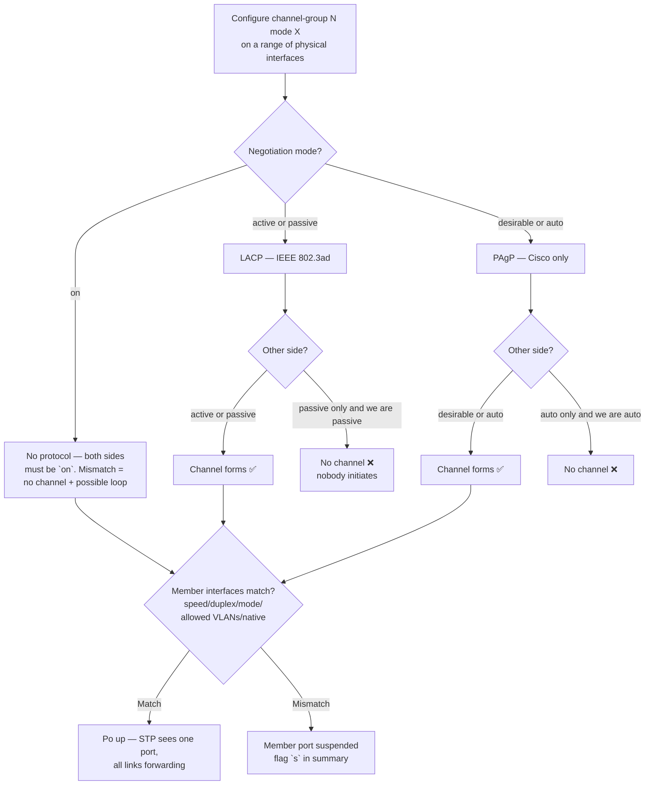
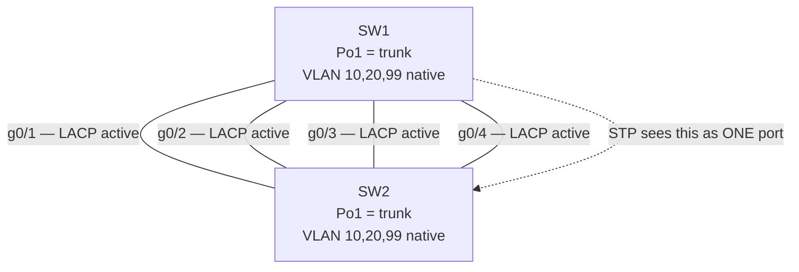

# EtherChannel — LACP / PAgP / Static
> **Domain 2.0 Network Access (20%)** · Blueprint 2.4 (configure and verify (Layer 2 / Layer 3) EtherChannel — LACP)

## 📺 Sources
- [[../jeremy-it-videos/047-etherchannel-day-23]] — Day 23 — EtherChannel modes, configuration, verification
- Inline `[Day 23 @ MM:SS]` anchors point back to source moments.

## 🎯 What you must walk away with
- Bundle multiple physical links into one **logical port-channel** so STP treats them as one port with no blocked links.
- Pick the right mode pair — **LACP (active/passive)**, **PAgP (desirable/auto)**, or **static (on/on)** — and predict whether a channel forms.
- Configure both **Layer 2** and **Layer 3** EtherChannel and verify with `show etherchannel summary`.
- Read the flag column (`P`, `S`, `R`, `D`, `s`) in the summary output.
- Recognize the consistency rules — **speed, duplex, switchport mode, allowed VLANs, native VLAN** must all match across member interfaces.
- Pick a load-balancing method that fits the traffic pattern (`src-mac`, `dst-mac`, `src-dst-ip`, etc.).

## 🧠 Core Concept

**EtherChannel bundles up to 8 active physical links between two devices into a single logical interface (port-channel / `Po`). Spanning Tree sees one port, so every link forwards traffic at once — no blocked redundancies, no idle capacity. Three protocols control how the bundle forms: LACP (open standard, IEEE 802.3ad), PAgP (Cisco-proprietary), and Static `on` (no negotiation).**

`[Day 23 @ 02:10]` Without EtherChannel, two switches with two cables between them get one cable forwarding and one blocked by STP — half the bandwidth wasted, no faster failover than STP itself. With EtherChannel, both cables forward, they share traffic per-flow, and if one fails the others pick up automatically without an STP reconvergence event. It's the cleanest way to scale L2 bandwidth and is the foundation for **MLAG/vPC** (multi-chassis EtherChannel) in modern data centers.

## 🔄 Decision Flow (Mermaid)



## 🔑 Reference Tables

### Three EtherChannel protocols

| Protocol | Standard | Active mode | Passive mode | Initiates? |
|----------|----------|-------------|--------------|-----------|
| **LACP** | IEEE 802.3ad | `active` | `passive` | active does, passive responds |
| **PAgP** | Cisco proprietary | `desirable` | `auto` | desirable does, auto responds |
| **Static** | none | `on` | (none) | no negotiation at all |

### Will a channel form? — mode-pairing matrix

| ↓ Local / Right → | on | active | passive | desirable | auto |
|---|---|---|---|---|---|
| **on** | ✅ Static | ❌ | ❌ | ❌ | ❌ |
| **active** | ❌ | ✅ LACP | ✅ LACP | ❌ | ❌ |
| **passive** | ❌ | ✅ LACP | ❌ | ❌ | ❌ |
| **desirable** | ❌ | ❌ | ❌ | ✅ PAgP | ✅ PAgP |
| **auto** | ❌ | ❌ | ❌ | ✅ PAgP | ❌ |

The two trap rows: **passive + passive = no channel**, **auto + auto = no channel**. (Same shape as DTP from Topic 7.)

### `show etherchannel summary` flags you must know

| Flag | Meaning |
|------|---------|
| `D` | Down |
| `P` | Bundled in port-channel (member is up and contributing) |
| `s` (lowercase) | Suspended — member misconfigured |
| `H` | Hot-standby (LACP, only first 8 of up to 16 are active) |
| `S` (uppercase, on the Po line) | **Layer 2** EtherChannel (switchport) |
| `R` | **Layer 3** routed (Po with `no switchport`) |
| `U` | In use |

### Member-interface consistency rules

All members of a single port-channel must agree on:
- **Speed** (1G + 1G, not 1G + 10G)
- **Duplex** (full + full)
- **Switchport mode** (access + access, or trunk + trunk — not mixed)
- **Allowed VLAN list** on a trunk (`switchport trunk allowed vlan`)
- **Native VLAN** on a trunk
- **STP cost / port priority** (recommended)
- Each member must be a **physical interface**, not another port-channel

If any of these mismatch, the offending member is **suspended** (`s` flag) — Po stays up with the surviving members.

### Layer 2 vs Layer 3 EtherChannel

| | Layer 2 EtherChannel | Layer 3 EtherChannel |
|---|---|---|
| Switchport mode | `switchport` (default) | `no switchport` on members **first** |
| IP address | Lives on SVIs that the Po trunks | Configured on the **Po**, never on members |
| Carries | VLANs (access or trunk) | Routed packets (treat Po as a single L3 interface) |
| Summary flag | `S` | `R` |

### Load-balancing methods (`port-channel load-balance ...`)

| Method | Hash input | When to use |
|--------|-----------|-------------|
| `src-mac` | Source MAC | Many clients, few servers (downstream Po) |
| `dst-mac` | Destination MAC | One source, many destinations |
| `src-dst-mac` | Both MACs | Mixed traffic (often default on older switches) |
| `src-ip` / `dst-ip` / `src-dst-ip` | Layer 3 addresses | Routed environments — typical default |
| `src-dst-port` | TCP/UDP ports | Heavy server-to-server (load-balances flows between same pair of hosts) |

Hash chooses **one link per flow**; a single TCP session never splits across links (avoids out-of-order delivery).

## 🧪 Worked Example — Build a 4-link LACP bundle (Layer 2 trunk)

Goal: bundle SW1 g0/1–g0/4 with SW2 g0/1–g0/4 as a trunk carrying VLANs 10, 20, 99 (native).

```text
! ---- SW1 side ----
SW1(config)# interface range g0/1 - 4
SW1(config-if-range)# shutdown                              ! prevent flaps during config
SW1(config-if-range)# switchport mode trunk
SW1(config-if-range)# switchport trunk allowed vlan 10,20,99
SW1(config-if-range)# switchport trunk native vlan 99
SW1(config-if-range)# channel-group 1 mode active           ! LACP active
SW1(config-if-range)# no shutdown

! the Po1 interface auto-creates — apply settings there too if needed
SW1(config)# interface port-channel 1
SW1(config-if)# switchport mode trunk
SW1(config-if)# switchport trunk allowed vlan 10,20,99
SW1(config-if)# switchport trunk native vlan 99

! ---- SW2 side (passive responder) ----
SW2(config)# interface range g0/1 - 4
SW2(config-if-range)# shutdown
SW2(config-if-range)# switchport mode trunk
SW2(config-if-range)# switchport trunk allowed vlan 10,20,99
SW2(config-if-range)# switchport trunk native vlan 99
SW2(config-if-range)# channel-group 1 mode passive
SW2(config-if-range)# no shutdown
```

Verify:

```text
SW1# show etherchannel summary
Flags: D - down P - bundled in port-channel ...
Group  Port-channel  Protocol    Ports
------+-------------+-----------+-------------------------------------
1      Po1(SU)       LACP        Gi0/1(P) Gi0/2(P) Gi0/3(P) Gi0/4(P)

SW1# show etherchannel port-channel
SW1# show interfaces port-channel 1 trunk
SW1# show spanning-tree vlan 10                  ! Po1 listed as one port, not 4
```

`SU` on Po1 = **Layer 2 EtherChannel, in use**. All four members show `(P)` = bundled. STP sees one port, no blocked links.

Step-by-step why each command order matters: **shutdown the members first** so half-configured ports don't bounce STP `[Day 23 @ 12:40]`. **Configure trunk + allowed VLANs + native on the members** so when the Po inherits / propagates, settings are already consistent. **`channel-group 1 mode active`** on SW1 + **`mode passive`** on SW2 is a valid LACP combo (one initiator is enough). **`no shutdown` last**. Inconsistent settings between members = suspended port (`s`); inconsistent settings across the two switches = Po doesn't form at all.

## 🧪 Worked Example — Layer 3 EtherChannel between two routers/L3 switches

Two L3 switches connected by 2× 10 Gbps links; treat them as a single /30 routed link.

```text
! Member interfaces — strip switchport FIRST
MLS1(config)# interface range Te1/1 - 2
MLS1(config-if-range)# no switchport                  ! makes them routed
MLS1(config-if-range)# channel-group 1 mode active

! Now configure IP on the Po, NOT the members
MLS1(config)# interface port-channel 1
MLS1(config-if)# no switchport                        ! Po also routed
MLS1(config-if)# ip address 10.0.0.1 255.255.255.252

! Other side
MLS2(config)# interface range Te1/1 - 2
MLS2(config-if-range)# no switchport
MLS2(config-if-range)# channel-group 1 mode active

MLS2(config)# interface port-channel 1
MLS2(config-if)# no switchport
MLS2(config-if)# ip address 10.0.0.2 255.255.255.252
```

Verify:

```text
MLS1# show etherchannel summary
Po1(RU)         LACP    Te1/1(P) Te1/2(P)
                ^
                R = Layer 3, U = in use

MLS1# ping 10.0.0.2
```

## 📊 Diagram — 4 physical links → 1 logical port-channel



## 🚨 Exam Traps

- **Passive + Passive = no channel**, **Auto + Auto = no channel** — both sides must have at least one initiator (`active` or `desirable`).
- **`on` only pairs with `on`** — `on` + `active` = no channel; `on` + `desirable` = no channel. Mode `on` does not speak any protocol.
- **You cannot mix LACP and PAgP** in the same bundle — they're different protocols.
- **Member interface mismatch = suspended (`s`)** — speed, duplex, switchport mode, allowed VLANs, native VLAN, voice VLAN all must match. The Po itself stays up on the surviving members; you just lose the bad one's bandwidth.
- **IP address goes on the Po**, never on a member, for Layer 3 EtherChannel. Configure `no switchport` on the **members first** so the Po inherits routed mode cleanly, then `no switchport` on the Po and apply the IP.
- **Channel-group number does NOT need to match across the two switches** — only locally consistent. SW1 can use `channel-group 1`, SW2 can use `channel-group 5`, the channel still forms.
- **STP cost on a Po** is computed from the aggregate bandwidth, not a single member. A Po with four 1G links has cost ≈ 3 (RSTP recalculates around 5,000 in revised values).
- **Channel forms before consistency is checked.** A misconfigured member can leave you with a Po that "looks up" but is missing one link's worth of capacity — always verify with `show etherchannel summary` not just `show ip interface brief`.
- **Max active members per LACP bundle = 8** (you can configure up to 16 with the rest in **hot standby**, flag `H`).

## ⚙️ Key Cisco IOS Commands

```text
! Build the bundle on members (range)
interface range g0/1 - 4
 channel-group 1 mode active        ! LACP active
 channel-group 1 mode passive       ! LACP passive
 channel-group 1 mode desirable     ! PAgP active
 channel-group 1 mode auto          ! PAgP passive
 channel-group 1 mode on            ! static, no protocol

! Apply trunk/access settings (also on the Po if needed)
interface port-channel 1
 switchport mode trunk
 switchport trunk allowed vlan 10,20,99
 switchport trunk native vlan 99

! Layer 3 EtherChannel
interface range Te1/1 - 2
 no switchport
 channel-group 1 mode active
interface port-channel 1
 no switchport
 ip address 10.0.0.1 255.255.255.252

! Load balancing (global)
port-channel load-balance src-dst-ip          ! typical default for L3
port-channel load-balance src-dst-mac          ! L2 mixed traffic

! Verify
show etherchannel summary
show etherchannel port-channel
show etherchannel load-balance
show interfaces port-channel 1
show interfaces port-channel 1 trunk
show lacp neighbor
show pagp neighbor
show spanning-tree                              ! confirm Po appears once, not 4 times
```

## 🧪 Self-Check Quiz

1. SW1 has `channel-group 1 mode passive`, SW2 has `channel-group 1 mode passive`. Does a channel form?
2. SW1 has `channel-group 1 mode on`, SW2 has `channel-group 1 mode active`. Does a channel form?
3. Maximum number of **active** member links in a single LACP EtherChannel?
4. What flag in `show etherchannel summary` indicates a member is misconfigured / suspended?
5. To build a Layer 3 EtherChannel between two routers, which command must come **first** on the member interfaces?
6. Where does the IP address go on a Layer 3 EtherChannel — on a member port or on the port-channel?
7. Which protocol is the IEEE standard, and what's its number?
8. You bundle four links: g0/1–g0/3 are 1 Gbps, g0/4 is 100 Mbps. What happens?
9. Two switches use `channel-group 1` on SW1 and `channel-group 5` on SW2. Does the channel form?
10. Default load-balancing method on most Cisco platforms (typical)?
11. What does the flag `R` next to `Po1(RU)` mean?
12. Why does STP not block one of the four physical links inside the bundle?

<details>
<summary>Answers</summary>

1. **No** — both passive, neither initiates LACP negotiation. Same trap as DTP auto+auto.
2. **No** — `on` is static, it doesn't speak LACP. The other side speaking LACP active gets no response. `on` only pairs with `on`.
3. **8 active** (16 configured max, with the extras in `H`/hot-standby; only the 8 with the lowest LACP port priority become active).
4. **Lowercase `s`** = suspended. Common cause: speed, duplex, switchport mode, allowed VLAN, or native VLAN mismatch with the other members.
5. **`no switchport`** — turns the physical interface into a routed port. Apply this **before** `channel-group`, otherwise the Po inherits switchport mode and your IP-on-Po command will fail.
6. **On the port-channel**, never on a member. Members carry no IP — they're slaves to the Po.
7. **LACP — IEEE 802.3ad** (sometimes also written 802.1AX after the rename).
8. The 100 Mbps member is **suspended** (`s` flag) because of the speed mismatch. The Po stays up with the three 1G members.
9. **Yes** — channel-group numbers are locally significant. Only the mode pairing and member consistency matter.
10. Most modern Cisco LAN switches default to **`src-dst-ip`**. Older 2950/3550 era used `src-mac`. Verify on your platform with `show etherchannel load-balance`.
11. **R = routed** (Layer 3 EtherChannel — Po has `no switchport` and an IP address). **U = in use**. So `(RU)` = Layer 3 Po, currently active.
12. STP only sees the **logical port-channel** (Po1), not the four physical members. Bundling four links into one Po collapses them to a single STP port — there's nothing to block, and the inherent loop they would form at L2 is hidden by the bundling logic at the bottom of L2 itself.

</details>

## 🧾 Recap

- **EtherChannel = N physical links → 1 logical port-channel.** STP sees one port, all links forward, capacity scales linearly up to 8 active members.
- **Three modes**: LACP `active`/`passive` (IEEE 802.3ad), PAgP `desirable`/`auto` (Cisco), Static `on`/`on` (no negotiation).
- **Trap pairings**: passive+passive ❌, auto+auto ❌, on+anything-but-on ❌. CCNA loves these.
- **Member interfaces must match** speed, duplex, switchport mode, allowed VLANs, native VLAN — mismatch = suspended `s` flag, Po keeps surviving members.
- **L2 vs L3 EtherChannel**: L2 = switchport (flag `S`); L3 = `no switchport` on members **first**, then IP on the **Po** (flag `R`). Never put the IP on a member.
- **Load balancing is per-flow** via configurable hash (`src-dst-ip` typical default); a single TCP session always uses one member, never splits.
- 🟢 **Green-light to Topic 10** when you can build a 4-link L2 LACP bundle and a 2-link L3 LACP bundle from blank in under 4 minutes, predict every mode-pairing outcome cold, and read every flag in `show etherchannel summary`.

---
Source video: Jeremy's IT Lab — Day 23 — https://www.youtube.com/watch?v=xuo69Joy_Nc
