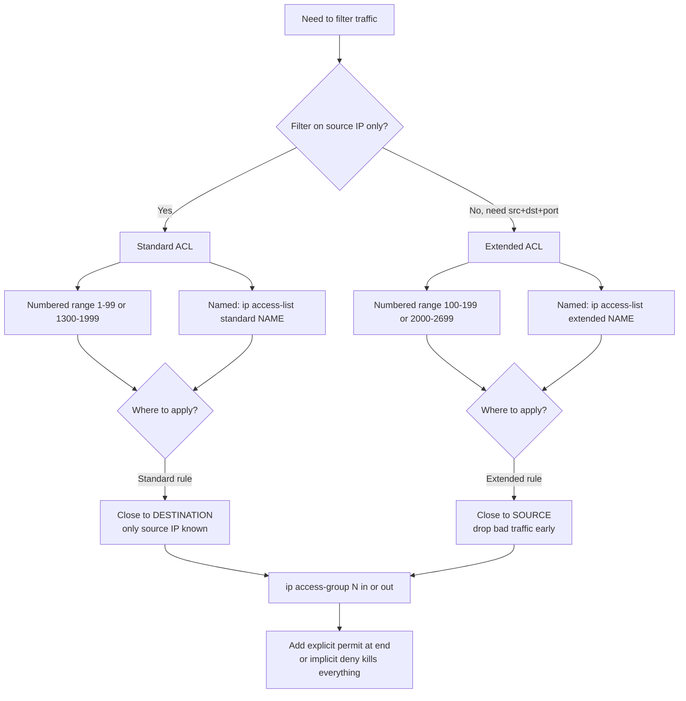
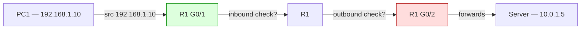

# ACLs — Standard + Extended

> **Domain 5.0 Security Fundamentals (15% of exam)** · Blueprint 5.6 (configure and verify access control lists)

## 📺 Sources
- [[../jeremy-it-videos/069-standard-acls-day-34]] — Day 34 — Standard ACLs
- [[../jeremy-it-videos/071-extended-acls-day-35]] — Day 35 — Extended ACLs
- Inline `[Day N @ MM:SS]` anchors point at specific moments in the transcripts.

## 🎯 What you must walk away with
- Tell standard from extended apart by **what they match** and **where you apply them**.
- Convert any subnet mask to its **wildcard mask** (the inverse) without thinking.
- Write a working ACL for "block one host / one subnet, allow everything else" — including the explicit `permit` to defeat the implicit deny.
- Pick the right interface + direction for any ACL placement question (close to destination for standard, close to source for extended).

## 🧠 Core Concept

**An ACL is an ordered list of permit/deny entries that the router walks top-down, takes the FIRST match, then stops — and if nothing matches, an invisible `deny any` at the end drops the packet.** Standard ACLs match on **source IP only**. Extended ACLs match the full **5-tuple**: protocol + source IP + destination IP + source port + destination port. Configuration only writes the rule into the router's brain — the rule has zero effect until you bind it to a specific interface in a specific direction with `ip access-group`.

`[Day 34 @ 02:44]` — "ACLs function as a packet filter, instructing the router to permit or discard specific traffic." `[Day 34 @ 15:32]` — "There is an implicit deny at the end of all ACLs."

## 🔄 Decision Flow



## 🔑 Reference Tables

### Standard vs Extended at a glance

| Attribute | Standard | Extended |
|---|---|---|
| Matches on | Source IP only | Protocol + src IP + dst IP + src port + dst port |
| Numbered range | **1-99**, **1300-1999** | **100-199**, **2000-2699** |
| Apply close to | **Destination** | **Source** |
| Single host syntax | `host 1.1.1.1`, `1.1.1.1`, or `1.1.1.1 0.0.0.0` | `host 1.1.1.1` or `1.1.1.1 0.0.0.0` (bare IP NOT valid) |
| "Allow everything else" | `permit any` | `permit ip any any` |
| Named CLI | `ip access-list standard NAME` | `ip access-list extended NAME` |

### Numbered vs Named — what changes

| Capability | Numbered (global config) | Named (sub-mode) |
|---|---|---|
| Insert one entry | ❌ Not supported | ✅ Use sequence numbers |
| Delete one entry | ❌ Whole ACL only (`no access-list 10`) | ✅ `no <seq>` from sub-mode |
| Resequence | `ip access-list resequence N start step` | Same |
| Auto-numbering | Increments by 10 | Increments by 10 |

### Direction matrix (`ip access-group N {in|out}`)

| Direction | When ACL is checked | Mental model |
|---|---|---|
| `in` | Packet **entering** the interface, before routing decision | Bouncer at the door |
| `out` | Packet **leaving** the interface, after routing decision | Bouncer at the exit |

Max **two** ACLs per interface — one inbound, one outbound. Apply a second ACL in the same direction and it **replaces** the first.

### Wildcard mask — the inverted subnet mask

The trick: `subnet_mask + wildcard_mask = 255.255.255.255`. Subtract each octet from 255.

| Subnet mask | Wildcard mask | Prefix |
|---|---|---|
| 255.255.255.255 | 0.0.0.0 | /32 (one host) |
| 255.255.255.252 | 0.0.0.3 | /30 |
| 255.255.255.248 | 0.0.0.7 | /29 |
| 255.255.255.240 | 0.0.0.15 | /28 |
| 255.255.255.224 | 0.0.0.31 | /27 |
| 255.255.255.192 | 0.0.0.63 | /26 |
| 255.255.255.128 | 0.0.0.127 | /25 |
| 255.255.255.0 | 0.0.0.255 | /24 |
| 255.255.0.0 | 0.0.255.255 | /16 |
| 255.0.0.0 | 0.255.255.255 | /8 |
| 0.0.0.0 | 255.255.255.255 | /0 (any) |

In a wildcard: `0` bits **must match**, `1` bits are **wildcards** (don't care). That is the inverse of a subnet mask, where `1` bits are network and `0` bits are host.

### Common ports for extended ACLs

| Service | Protocol | Port | IOS keyword |
|---|---|---|---|
| FTP control | TCP | 21 | `eq ftp` |
| SSH | TCP | 22 | `eq 22` (no keyword) |
| Telnet | TCP | 23 | `eq telnet` |
| SMTP | TCP | 25 | `eq smtp` |
| DNS | TCP/UDP | 53 | `eq domain` |
| TFTP | UDP | 69 | `eq tftp` |
| HTTP | TCP | 80 | `eq www` |
| HTTPS | TCP | 443 | `eq 443` |

## 🧪 Worked Examples

### Example 1 — block one host, allow everything else (standard)

**Requirement:** Block host `10.1.1.50` from reaching subnet `192.168.1.0/24`. Allow all other traffic.

```
R1(config)# access-list 10 deny host 10.1.1.50
R1(config)# access-list 10 permit any
R1(config)# interface GigabitEthernet0/2
R1(config-if)# ip access-group 10 out
```

**Walk-through:**
1. Standard ACL → number from `1-99`. Picked `10`.
2. `host 10.1.1.50` is shorthand for `10.1.1.50 0.0.0.0` (a /32 wildcard).
3. Without the explicit `permit any`, the implicit deny would kill ALL traffic — only `10.1.1.50` was specified, but everything else has no match either.
4. Standard ACL → apply **close to destination**. The destination subnet is `192.168.1.0/24`, so we put it outbound on R1's interface facing that subnet. `[Day 34 @ 28:14]`

### Example 2 — extended with port matching

**Requirement:** From `192.168.50.0/24`, allow ONLY HTTP (80) and HTTPS (443) to host `172.16.10.5`. Deny everything else from that subnet.

```
R1(config)# ip access-list extended WEB-ONLY
R1(config-ext-nacl)# permit tcp 192.168.50.0 0.0.0.255 host 172.16.10.5 eq 80
R1(config-ext-nacl)# permit tcp 192.168.50.0 0.0.0.255 host 172.16.10.5 eq 443
R1(config-ext-nacl)# deny ip 192.168.50.0 0.0.0.255 any
R1(config-ext-nacl)# permit ip any any
R1(config-ext-nacl)# exit
R1(config)# interface GigabitEthernet0/0
R1(config-if)# ip access-group WEB-ONLY in
```

**Walk-through:**
1. Extended named ACL — easier to maintain than numbered.
2. `192.168.50.0 0.0.0.255` matches the whole /24 (wildcard `0.0.0.255` = "ignore the last octet").
3. `host 172.16.10.5` is a single destination /32.
4. `eq 80` and `eq 443` filter on **destination** TCP port. Source port is unspecified, so it matches any.
5. The third line denies anything else FROM that subnet (overrides the implicit deny so we can be explicit and watch the hit counters).
6. The fourth line lets all OTHER subnets keep working — without it the implicit deny would block them.
7. Extended ACL → apply **close to source**. G0/0 is the interface facing `192.168.50.0/24`, inbound. `[Day 35 @ ~10:00]`

### Example 3 — wildcard math, /27 → wildcard

**Requirement:** Match subnet `10.20.30.0/27`. What's the wildcard mask?

**Step 1.** /27 means the first 27 bits are the network. Subnet mask = `255.255.255.224`.

How? Octet 4 of /27: 27 - 24 = 3 host-bits-from-the-left in this octet. Mask binary = `11100000` = 128 + 64 + 32 = **224**.

**Step 2.** Subtract from `255.255.255.255`:
- 255 - 255 = **0**
- 255 - 255 = **0**
- 255 - 255 = **0**
- 255 - 224 = **31**

Wildcard = `0.0.0.31`. Means "match the first 27 bits, the last 5 bits are don't-care."

**ACL:**
```
access-list 25 permit 10.20.30.0 0.0.0.31
```

**Quick recall:** /27 has 2^5 = **32** addresses, and 32-1 = **31** in the wildcard's last octet. Always (block size - 1).

## 📊 Diagram — direction matters



- **Inbound on G0/1** = check before R1 routes the packet. If denied, the packet never enters the routing engine.
- **Outbound on G0/2** = check after R1 routed it. If denied, the packet was almost forwarded and is dropped at the exit.

For a **standard** ACL controlling access to "the network behind G0/2," **outbound on G0/2** is the textbook answer because applying it inbound on G0/1 would also block traffic to other destinations the user IS allowed to reach. `[Day 34 @ 28:46]`

## 🚨 Exam Traps (8)

1. **Implicit deny is invisible** but always present. `show access-lists` does not display it. Forget the explicit `permit any` (or `permit ip any any` for extended) and you blackhole everything.
2. **Wildcard mask is INVERTED subnet mask.** A common stem shows `255.255.255.0` in an ACL — that's wrong syntax. The correct wildcard for a /24 is `0.0.0.255`.
3. **Standard ACLs filter SOURCE only**, applied close to **destination**. Apply it close to source and you over-block — the user can't reach anything else either.
4. **Extended ACLs apply close to SOURCE.** Drop bad traffic before it traverses the network and wastes bandwidth.
5. **Top-down, first match wins.** Order matters. `permit any` placed BEFORE `deny host X` makes the deny dead code.
6. **Bare IP without `host` is rejected in extended ACLs** — must be `host 1.1.1.1` or `1.1.1.1 0.0.0.0`. (Standard ACLs accept all three forms, but be careful on the exam.) `[Day 35 @ ~05:30]`
7. **`no access-list 100` deletes the ENTIRE ACL** — not the matching entry. To delete one entry, use named-ACL config mode and `no <seq>`.
8. **Two ACLs per interface, max** — one in, one out. Applying a second ACL in the same direction silently REPLACES the first. `[Day 34 @ 14:31]`

## ⚙️ Key Cisco IOS Commands

### Standard numbered

```
access-list 10 remark Block PC2
access-list 10 deny host 192.168.1.50
access-list 10 deny 192.168.1.0 0.0.0.255
access-list 10 permit any

interface GigabitEthernet0/2
 ip access-group 10 out
```

### Standard named

```
ip access-list standard BLOCK-DEV
 deny host 192.168.1.50
 permit any
exit

interface Gi0/2
 ip access-group BLOCK-DEV out
```

### Extended numbered

```
access-list 100 permit tcp 192.168.50.0 0.0.0.255 host 172.16.10.5 eq 443
access-list 100 deny   ip  192.168.50.0 0.0.0.255 any
access-list 100 permit ip  any any

interface Gi0/0
 ip access-group 100 in
```

### Extended named (preferred — supports insert/delete)

```
ip access-list extended WEB-ONLY
 5  permit tcp 192.168.50.0 0.0.0.255 host 172.16.10.5 eq 80
 10 permit tcp 192.168.50.0 0.0.0.255 host 172.16.10.5 eq 443
 20 deny   ip  192.168.50.0 0.0.0.255 any
 30 permit ip  any any
exit
```

### Verify

```
show access-lists                      ! all ACLs + hit counters
show ip access-lists                   ! IP ACLs only
show running-config | section access-list
show ip interface Gi0/0 | include access list
```

### VTY ACL (restrict who can SSH/Telnet to the router)

```
access-list 5 permit host 10.0.0.10
line vty 0 15
 access-class 5 in
```

Note: VTY uses **`access-class`**, not `ip access-group`.

## 🧪 Self-Check Quiz

1. What is the wildcard mask for `/26`?
   <details><summary>Answer</summary>`0.0.0.63`. /26 = 64 addresses per block, 64-1=63.</details>

2. Should a standard ACL be applied close to the source or destination?
   <details><summary>Answer</summary>**Destination.** Standard ACLs only see source IP, so placing them at the source over-blocks legitimate traffic.</details>

3. You configured `access-list 10 deny 10.1.1.0 0.0.0.255` and applied it. Hosts in 10.1.1.0/24 can't reach anything. Why?
   <details><summary>Answer</summary>You forgot `access-list 10 permit any`. The implicit deny at the end blocks every other source.</details>

4. Maximum number of ACLs per interface, per direction?
   <details><summary>Answer</summary>**One.** A second ACL in the same direction replaces the first. Max two total per interface (1 in + 1 out).</details>

5. Which command applies an ACL to a VTY line?
   <details><summary>Answer</summary>`access-class N in` (NOT `ip access-group`).</details>

6. Write an extended ACL line that allows DNS lookups (UDP/53) from any source to host 8.8.8.8.
   <details><summary>Answer</summary>`permit udp any host 8.8.8.8 eq 53`</details>

7. What's the implicit deny at the end of every ACL match on?
   <details><summary>Answer</summary>Anything. It's effectively `deny ip any any` (or `deny any` for standard) — drops everything that didn't match an earlier permit.</details>

8. In `permit tcp 192.168.50.0 0.0.0.255 host 172.16.10.5 eq 443`, where is the destination port specified?
   <details><summary>Answer</summary>The `eq 443` AFTER the destination address is the destination port. A source port would appear AFTER the source wildcard, before the destination address.</details>

## 🧾 Recap

- **Standard = source IP only, applied close to destination. Extended = full 5-tuple, applied close to source.**
- **Wildcard mask is the inverse of the subnet mask** — subtract each octet from 255, or use (block size - 1) for the variable octet.
- **Top-down, first match wins, then stop.** Order is everything; one misplaced `permit any` ruins the rest.
- **The implicit `deny` at the end is invisible but always there** — add an explicit `permit any` (or `permit ip any any`) when you only want to filter a few sources.
- **Green light:** if you can write a 4-line extended ACL that permits HTTP+HTTPS to one host, denies all other traffic from one /24, and lets the rest of the network keep working — without breaking return paths — move to topic 11 (L2 Security).
