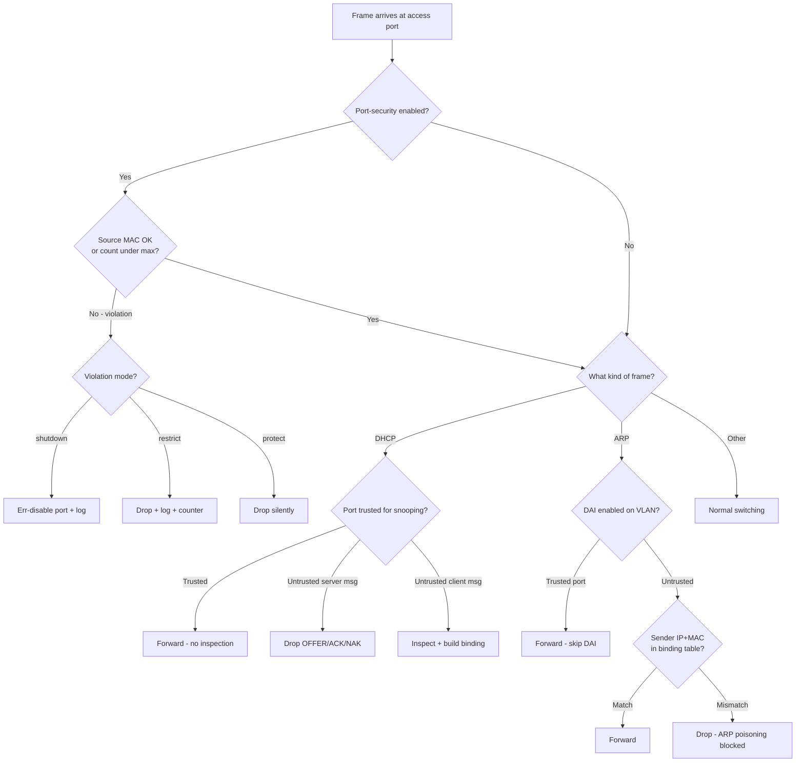
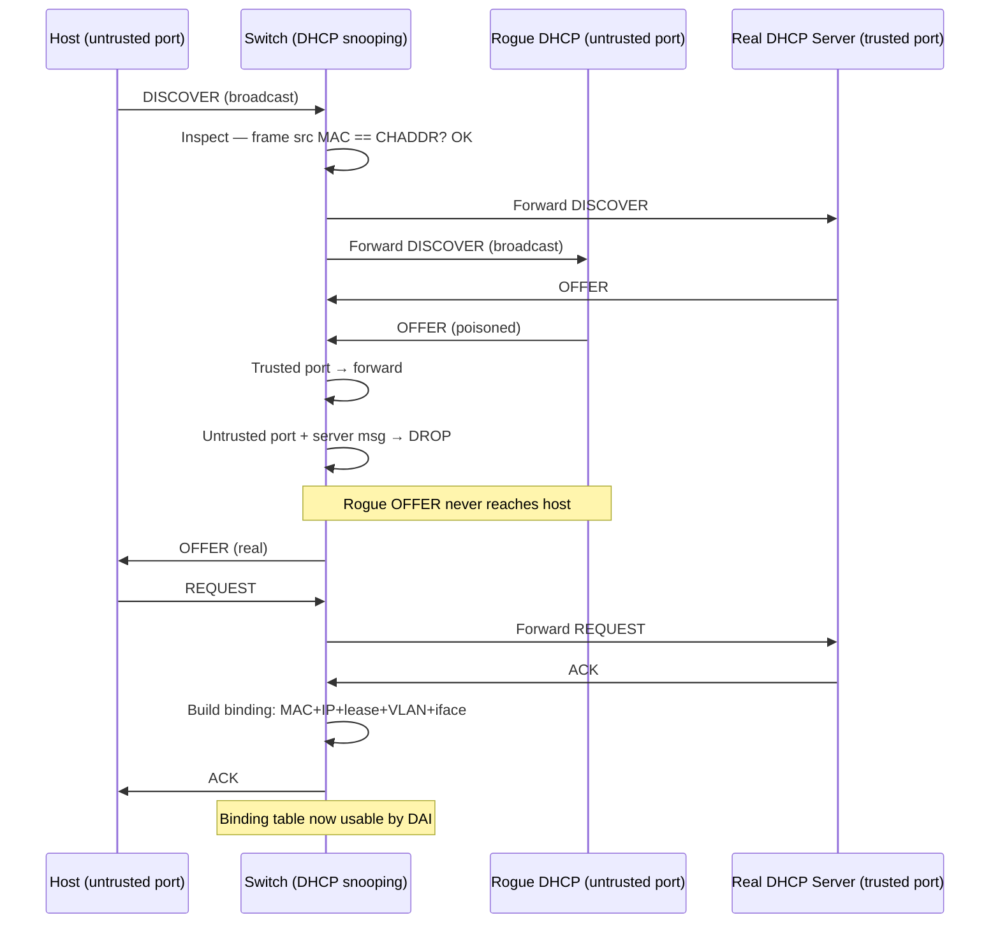

# Layer 2 Security — Port Security, DHCP Snooping, DAI

> **Domain 5.0 Security Fundamentals (15% of exam)** · Blueprint 5.7 (configure Layer 2 security features: DHCP snooping, dynamic ARP inspection, port security)

## 📺 Sources
- [[../jeremy-it-videos/099-port-security-day-49]] — Day 49 — Port Security
- [[../jeremy-it-videos/101-dhcp-snooping-day-50]] — Day 50 — DHCP Snooping
- [[../jeremy-it-videos/103-dynamic-arp-inspection-day-51]] — Day 51 — Dynamic ARP Inspection
- Inline `[Day N @ MM:SS]` anchors back to the transcripts.

## 🎯 What you must walk away with
- Configure **port security** end-to-end: max MACs, sticky learning, and the right violation mode for the scenario.
- Configure **DHCP snooping** globally + per-VLAN, trust the right port, and explain how the binding table is built.
- Enable **DAI** on a VLAN, trust uplinks, and explain why DAI without DHCP snooping is useless.
- Recall the DEFAULT trust state for each feature — they DIFFER (port-sec depends on max, snooping/DAI default to UNTRUSTED).

## 🧠 Core Concept

**These three features harden Layer 2 by validating WHO is on a port (port security = MAC count), WHAT they're handing out (DHCP snooping = legit DHCP server), and WHO they say they are (DAI = legit IP↔MAC mapping).** Together they form the standard switchport hardening stack and they STACK — DAI builds on DHCP snooping's binding table; port security is independent but complements both.

`[Day 49 @ ~01:30]` Port-security restricts source MACs per port. `[Day 50 @ ~02:00]` DHCP snooping turns ports trusted/untrusted to block rogue servers. `[Day 51 @ ~01:50]` DAI inspects ARP messages against the snooping binding table to defeat ARP poisoning.

## 🔄 Decision Flow



## 🔑 Reference Tables

### Port-security — violation modes

| Mode | Drops? | Logs (Syslog/SNMP)? | Counter? | Err-disables? | Use case |
|---|---|---|---|---|---|
| **shutdown** (default) | Yes | One log only | Yes | **Yes** | Strict — alerts the NOC |
| **restrict** | Yes | Yes (every violation) | Yes | No | Want logs + uptime |
| **protect** | Yes | **No** | **No** | No | Silent drop — invisible defense |

### Port-security — secure MAC types

| Type | How learned | Saved across reboot? |
|---|---|---|
| **Static** | Manually configured `switchport port-security mac-address X.X.X` | Yes (in startup-config) |
| **Dynamic** | Auto-learned from incoming frames | **No** — lost on reload/disable |
| **Sticky** | Auto-learned, written into running-config as if static | **Only if you `copy running startup`** |

Defaults — exam classics:
- Max secure MACs per port = **1**
- Violation mode = **shutdown**
- Aging = **0** (never)
- Aging type = **absolute**

### DHCP snooping — port trust + message rules

| Direction | Trusted port (uplink) | Untrusted port (default — host) |
|---|---|---|
| **Server msgs** (OFFER, ACK, NAK) | Forwarded | **DROPPED** |
| **Client msgs** (DISCOVER, REQUEST, RELEASE, DECLINE) | Forwarded | Inspected; valid → forward, invalid → drop |
| **Binding table built?** | No | Yes — when client successfully leases an IP |

Binding-table fields: **MAC + IP + lease time + VLAN + interface**. Default gateway is NOT stored.

### DAI — port trust + checks

| Property | Trusted port | Untrusted port (default) |
|---|---|---|
| ARP inspection | Skipped | Active — sender IP+MAC checked against binding table |
| Default rate limit | Disabled | **15 packets per second** |
| Failure action | n/a | Drop ARP; rate-limit exceedance err-disables port |

Optional `validate` checks (must all be in ONE command — last command wins):
- `src-mac` — Ethernet src MAC == ARP sender MAC
- `dst-mac` — Ethernet dst MAC == ARP target MAC (in ARP replies)
- `ip` — sanity check on sender/target IPs (no 0.0.0.0, no 255.255.255.255, no multicast)

### Default trust state — easy to confuse

| Feature | Default trust state |
|---|---|
| **Port security** | n/a — feature off until enabled per port |
| **DHCP snooping** | All ports **untrusted** once enabled |
| **DAI** | All ports **untrusted** once enabled |

Memorize: snooping and DAI default to **deny-by-default** posture. Trust uplinks toward the real DHCP server / next-hop switch.

## 🧪 Worked Examples

### Example 1 — Port security on Fa0/1 with sticky learning + restrict

**Requirement:** Max 2 MACs on `Fa0/1` (phone + PC), learn them automatically, drop violations and log them but keep the port up.

```
Switch(config)# interface FastEthernet0/1
Switch(config-if)# switchport mode access            ! port-sec needs static mode
Switch(config-if)# switchport port-security
Switch(config-if)# switchport port-security maximum 2
Switch(config-if)# switchport port-security mac-address sticky
Switch(config-if)# switchport port-security violation restrict
Switch(config-if)# end
Switch# copy running-config startup-config           ! preserve sticky MACs
```

**Walk-through:**
1. `switchport mode access` is mandatory — port-security refuses to enable on `dynamic auto` or `dynamic desirable`. `[Day 49 @ ~07:00]`
2. `maximum 2` covers the IP-phone-with-PC scenario (one MAC for the phone, one for the daisy-chained PC).
3. `sticky` tells the switch: learn dynamically, but write the learned MACs to running-config. Without `copy run start`, those sticky entries vanish on reload.
4. `restrict` drops violations + logs + increments the counter, but does NOT err-disable the port. Compare with `shutdown` (default) which would err-disable on the first violation. `[Day 49 @ ~05:00]`

**Verify:**
```
show port-security interface Fa0/1
show port-security address
show mac address-table secure
```

### Example 2 — DHCP snooping on a small access switch

**Topology:** Real DHCP server is upstream through `Gi0/24`. Hosts live on Fa0/1-Fa0/23 in VLAN 10.

```
Switch(config)# ip dhcp snooping                                 ! global enable
Switch(config)# ip dhcp snooping vlan 10                         ! per-VLAN enable
Switch(config)# no ip dhcp snooping information option           ! disable Option 82 (L2 switch isn't a relay)
Switch(config)# interface GigabitEthernet0/24
Switch(config-if)# ip dhcp snooping trust                        ! uplink toward real DHCP server
Switch(config-if)# exit
Switch(config)# interface range FastEthernet0/1 - 23
Switch(config-if-range)# ip dhcp snooping limit rate 10          ! 10 DHCP pps cap
```

**Walk-through:**
1. **Global + per-VLAN** are BOTH required. Forgetting `ip dhcp snooping vlan 10` is a silent failure — the feature appears enabled but does nothing on that VLAN. `[Day 50 @ ~07:30]`
2. By default ALL ports are untrusted. Trust ONLY the uplink toward the real server.
3. `no ip dhcp snooping information option` is a Cisco trap — Option 82 insertion breaks DHCP on L2-only switches without a relay agent that's been configured to trust Option 82. Disable it unless you're a relay. `[Day 50 @ ~10:00]`
4. Rate-limit on host ports prevents DHCP starvation attacks. Exceeding the rate err-disables the port; recover with `errdisable recovery cause dhcp-rate-limit`.

**Verify:**
```
show ip dhcp snooping
show ip dhcp snooping binding   ! the table DAI relies on
```

### Example 3 — DAI on VLAN 10 with trusted uplink

**Requirement:** Stop ARP poisoning on VLAN 10. Switch-to-switch link is `Gi0/24`.

```
Switch(config)# ip arp inspection vlan 10
Switch(config)# ip arp inspection validate src-mac dst-mac ip   ! all 3 checks in ONE command
Switch(config)# interface GigabitEthernet0/24
Switch(config-if)# ip arp inspection trust                       ! uplink — skip inspection
Switch(config-if)# exit
Switch(config)# interface FastEthernet0/5
Switch(config-if)# ip arp inspection limit rate 20 burst interval 2  ! tighter limit on host port
```

**Walk-through:**
1. DAI per-VLAN is a single command — much simpler than DHCP snooping.
2. The `validate` line MUST list all options at once. Running `validate src-mac` then `validate ip` overwrites the first — only the last setting survives. `[Day 51 @ ~08:30]`
3. Trust the uplink — the switch on the other side already inspected the ARP. Leave host ports untrusted (the default).
4. **Pre-requisite:** `ip dhcp snooping` and `ip dhcp snooping vlan 10` must be enabled FIRST so DAI has a binding table to consult. Without it, every legit ARP from a DHCP host gets dropped.
5. **Static-IP hosts** have no snooping entry. To exempt them, build an ARP ACL:
   ```
   arp access-list STATIC-SERVERS
    permit ip host 10.10.10.5 mac host aaaa.bbbb.cccc
   ip arp inspection filter STATIC-SERVERS vlan 10
   ```

**Verify:**
```
show ip arp inspection
show ip arp inspection statistics vlan 10
```

## 📊 Diagram — DHCP DORA + snooping interception



## 🚨 Exam Traps (8)

1. **Port security needs static mode.** A port left in `dynamic auto` (the default) refuses port-security configuration. Always `switchport mode access` (or trunk) first. `[Day 49 @ ~07:00]`
2. **Sticky MACs go to RUNNING-config**, not startup. Reload without `copy run start` and they're gone — port relearns from whatever device plugs in next.
3. **Disconnecting the bad device does NOT recover an err-disabled port.** Manual recovery: `shutdown` then `no shutdown`. Auto recovery: `errdisable recovery cause psecure-violation` + 300 second default timer.
4. **DHCP snooping global enable alone is not enough.** You also need `ip dhcp snooping vlan N` per VLAN. Forgetting this is a classic silent-failure trap.
5. **All ports default UNTRUSTED for snooping AND DAI** — opposite of port-security (which is OFF until you enable it). Always trust your uplinks explicitly.
6. **DAI is useless without DHCP snooping** — it consults the snooping binding table. Configure both, in that order.
7. **Static-IP hosts get dropped by DAI** because they have no DHCP-snooping binding. Fix with an ARP ACL.
8. **`ip arp inspection validate` overwrites itself** — every option must be in one command. `validate src-mac` followed by `validate ip` keeps only `ip`. `[Day 51 @ ~08:30]`

## ⚙️ Key Cisco IOS Commands

### Port security

```
switchport mode access
switchport port-security
switchport port-security maximum 2
switchport port-security mac-address sticky
switchport port-security mac-address aaaa.bbbb.cccc       ! static entry
switchport port-security violation {shutdown|restrict|protect}
switchport port-security aging time 60
switchport port-security aging type {absolute|inactivity}
errdisable recovery cause psecure-violation
errdisable recovery interval 300
show port-security interface Fa0/1
show mac address-table secure
```

### DHCP snooping

```
ip dhcp snooping                        ! global enable
ip dhcp snooping vlan 10,20,30          ! per-VLAN
no ip dhcp snooping information option  ! disable Option 82 if not a relay
interface Gi0/24
 ip dhcp snooping trust                 ! uplink to real DHCP server
interface Fa0/1
 ip dhcp snooping limit rate 10         ! pps cap
errdisable recovery cause dhcp-rate-limit
show ip dhcp snooping
show ip dhcp snooping binding
```

### Dynamic ARP Inspection

```
ip arp inspection vlan 10
ip arp inspection validate src-mac dst-mac ip   ! all in one!
interface Gi0/24
 ip arp inspection trust
interface Fa0/5
 ip arp inspection limit rate 20 burst interval 2
arp access-list STATIC-SERVERS
 permit ip host 10.10.10.5 mac host aaaa.bbbb.cccc
ip arp inspection filter STATIC-SERVERS vlan 10
show ip arp inspection
show ip arp inspection statistics
```

## 🧪 Self-Check Quiz

1. Default max MACs and default violation mode for port security?
   <details><summary>Answer</summary>Max = **1**, violation = **shutdown**.</details>

2. You configured sticky port security and the switch reloaded. Why are the secure MACs gone?
   <details><summary>Answer</summary>Sticky entries are saved to running-config only. You must `copy running-config startup-config` (or `write memory`) before reload.</details>

3. Which DHCP messages are always dropped on an untrusted port?
   <details><summary>Answer</summary>Server messages: **OFFER, ACK, NAK**. Client messages (DISCOVER, REQUEST, RELEASE, DECLINE) are inspected.</details>

4. Default trust state of every port when you enable DHCP snooping or DAI?
   <details><summary>Answer</summary>**Untrusted.** You must explicitly trust uplinks.</details>

5. DAI is enabled on VLAN 10. DHCP snooping is NOT. What happens to ARP traffic from end hosts?
   <details><summary>Answer</summary>Everything gets dropped — the binding table is empty, every ARP fails the lookup. DAI requires DHCP snooping.</details>

6. A server has a static IP and DAI is enabled. ARP from the server is dropped. Fix?
   <details><summary>Answer</summary>Configure an **ARP ACL** mapping its IP to its MAC, then `ip arp inspection filter ACL-NAME vlan N`.</details>

7. Why doesn't `ip arp inspection validate src-mac` followed by `ip arp inspection validate ip` enable both checks?
   <details><summary>Answer</summary>Each new `validate` command **overwrites** the previous one. Combine them: `ip arp inspection validate src-mac ip` in a single command.</details>

8. Which violation mode drops silently with no log and no counter?
   <details><summary>Answer</summary>`protect`. Restrict logs+counts; shutdown err-disables. Protect is invisible.</details>

## 🧾 Recap

- **Port security = WHO and HOW MANY MACs per port.** 3 modes (shutdown/restrict/protect), 3 MAC types (static/dynamic/sticky). Default = max 1, mode shutdown.
- **DHCP snooping = trust the right port, drop rogue server messages on the rest.** Global + per-VLAN required. Builds the binding table.
- **DAI = ARP filter built on the snooping binding table.** Per-VLAN. Static hosts need an ARP ACL.
- **Both snooping and DAI default ALL ports to untrusted** — trust uplinks explicitly. Port security is OFF until enabled.
- **Green light:** if you can stand at a switch and configure all three on one VLAN — sticky port security with restrict mode + DHCP snooping with trusted uplink + DAI with all three validate checks — without forgetting the per-VLAN snooping enable, you own 5.7. Move to topic 12 (QoS).
