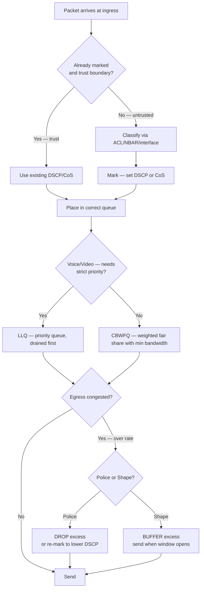
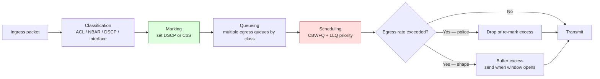

# QoS — Per-Hop Behavior, Marking, Queuing, Policing/Shaping

> **Domain 4.0 IP Services (10% of exam)** · Blueprint 4.7 (explain forwarding per-hop behavior — classification, marking, queuing, congestion, policing, shaping)

## 📺 Sources
- [[../jeremy-it-videos/093-qos-part-1-day-46]] — Day 46 — QoS Part 1 (PoE, Voice VLAN, QoS metrics, queueing)
- [[../jeremy-it-videos/095-qos-part-2-day-47]] — Day 47 — QoS Part 2 (DSCP/CoS marking, CBWFQ/LLQ, policing/shaping)
- Inline `[Day N @ MM:SS]` anchors back to the transcripts.

## 🎯 What you must walk away with
- Recall the 4 QoS metrics + voice/video targets cold (bandwidth, delay ≤ 150 ms, jitter ≤ 30 ms, loss ≤ 1%).
- Compute any **AF marking** instantly using `8X + 2Y` where X=class, Y=drop precedence.
- Distinguish **classification vs marking** and **policing vs shaping** in one sentence each.
- Pick the right scheduler — **CBWFQ** for guaranteed minimums, **LLQ** when voice needs strict priority.

## 🧠 Core Concept

**QoS is a router/switch's way of saying: not every packet is equal. Voice and video can't tolerate delay or jitter; bulk file transfers can. The QoS pipeline is classify → mark → queue → schedule → police/shape, and the marking lives in the IP header (DSCP, 6 bits) or 802.1Q tag (CoS, 3 bits) so EVERY hop honors the priority.** Per-Hop Behavior (PHB) means each device makes an independent forwarding decision based on the marking — there's no end-to-end signaling, just consistent treatment hop-by-hop. Mark once at the edge, trust everywhere downstream.

`[Day 46 @ ~03:30]` — Voice targets: ≤ 150 ms one-way delay, ≤ 30 ms jitter, ≤ 1% loss. `[Day 47 @ ~04:00]` — DSCP is 6 bits in the IPv4 ToS byte (64 possible values).

## 🔄 Decision Flow



## 🔑 Reference Tables

### The 4 marking fields

| Field | Layer | Bits | Values | Where it lives |
|---|---|---|---|---|
| **CoS / PCP** | L2 | 3 | 8 (0-7) | 802.1Q tag — only on tagged frames |
| **IPP** (IP Precedence) | L3 | 3 | 8 (0-7) | First 3 bits of IPv4 ToS byte (legacy) |
| **DSCP** | L3 | 6 | 64 (0-63) | First 6 bits of IPv4 ToS byte (modern) |
| **ECN** | L3 | 2 | 4 | Last 2 bits of ToS — congestion notification, not class |

DSCP and IPP **share the same byte** — DSCP is the modern superset. The original 8 IPP values map directly to DSCP values 0/8/16/24/32/40/48/56 (the **CS0–CS7** Class Selectors).

### IEEE 802.1p CoS values

| CoS | Use |
|---|---|
| 0 | Best Effort (default) |
| 1 | Background |
| 2 | Excellent Effort |
| 3 | Critical Apps / Signaling |
| 4 | Video |
| **5** | **Voice** |
| 6 | Internetwork Control |
| 7 | Network Control |

### IPP (legacy IP Precedence) values

| IPP | Name | DSCP equivalent (CS) |
|---|---|---|
| 0 | Routine | CS0 (0) |
| 1 | Priority | CS1 (8) |
| 2 | Immediate | CS2 (16) |
| 3 | Flash | CS3 (24) |
| 4 | Flash Override | CS4 (32) |
| **5** | **Critical** | **CS5 (40)** — was old voice |
| 6 | Internetwork Control | CS6 (48) |
| 7 | Network Control | CS7 (56) |

### DSCP — the four PHB classes

| PHB | Marking name | DSCP | Use |
|---|---|---|---|
| **DF** (Default Forwarding) | DF | **0** | Best effort — no QoS guarantees |
| **EF** (Expedited Forwarding) | EF | **46** | Voice — strict priority, low loss/latency/jitter |
| **AF** (Assured Forwarding) | AFxy | 8X+2Y (see below) | Video, high-priority data — 4 classes × 3 drop precedences |
| **CS** (Class Selector) | CSx | 8X | Backwards compatibility with IPP |

### AF formula — the keystone

**`DSCP = 8X + 2Y`** where:
- **X** = class (1, 2, 3, or 4)
- **Y** = drop precedence (1, 2, or 3) — **lower Y is BETTER**

| AF marking | X | Y | DSCP | Use case |
|---|---|---|---|---|
| AF11 | 1 | 1 | 8(1)+2(1) = **10** | Low-priority data, low drop |
| AF12 | 1 | 2 | 8(1)+2(2) = **12** | Low-priority data, medium drop |
| AF13 | 1 | 3 | 8(1)+2(3) = **14** | Low-priority data, high drop |
| AF21 | 2 | 1 | 8(2)+2(1) = **18** | Medium-priority data, low drop |
| AF22 | 2 | 2 | 8(2)+2(2) = **20** |  |
| AF23 | 2 | 3 | 8(2)+2(3) = **22** |  |
| AF31 | 3 | 1 | 8(3)+2(1) = **26** | Streaming video, low drop |
| AF32 | 3 | 2 | 8(3)+2(2) = **28** |  |
| AF33 | 3 | 3 | 8(3)+2(3) = **30** |  |
| **AF41** | 4 | 1 | 8(4)+2(1) = **34** | **Interactive video — best AF** |
| AF42 | 4 | 2 | 8(4)+2(2) = **36** |  |
| AF43 | 4 | 3 | 8(4)+2(3) = **38** |  |

**Mnemonic:** **AF41 > AF11.** Higher X = higher class (better service). Lower Y = lower drop precedence (less likely to be dropped under congestion). So **AF41 (X=4, Y=1)** is the best AF marking. AF13 is the worst.

`[Day 47 @ ~10:00]` AF only goes up to class 4 — there is NO AF51 / AF52 / AF53. CS5/CS6/CS7 cover that range.

### CS (Class Selector) — IPP compatibility

| CS | DSCP | Use |
|---|---|---|
| CS0 | 0 | Default (= DF) |
| CS1 | 8 | Scavenger |
| CS2 | 16 | OAM |
| CS3 | 24 | Call signaling (SIP, H.323) |
| CS4 | 32 | Real-time interactive |
| CS5 | 40 | Broadcast video |
| **CS6** | **48** | **Network control** (OSPF, BGP, EIGRP keepalives) |
| **CS7** | **56** | Reserved network control |

### Voice traffic targets (memorize)

| Metric | Target | Why |
|---|---|---|
| One-way delay | ≤ **150 ms** | Above this, conversation feels laggy |
| Jitter | ≤ **30 ms** | Variance in delay; above this, jitter buffer drops |
| Loss | ≤ **1%** | Voice codecs tolerate tiny loss, not more |
| Bandwidth | ~80 kbps for G.711, ~24 kbps for G.729 | Per call — plus overhead |

### Policing vs Shaping

| | Policing | Shaping |
|---|---|---|
| Excess traffic | **DROPPED** (or re-marked) | **BUFFERED** (queued) |
| Where | Ingress (and egress possible) | Egress only |
| Effect | TCP retransmits | Adds latency |
| Analogy | Bouncer turns extras away | Bouncer makes extras wait |

### Schedulers

| Scheduler | What it does | Voice fit? |
|---|---|---|
| **FIFO** | First In, First Out — no QoS | No |
| **WFQ** | Weighted Fair Queueing — automatic, by IPP | No |
| **CBWFQ** | Class-Based WFQ — manually defined classes, each with min bandwidth | OK for video |
| **LLQ** | CBWFQ + a strict-priority queue drained first | **Yes — voice goes here** |

## 🧪 Worked Examples

### Example 1 — Mark voice (RTP) with DSCP EF (46)

**Requirement:** RTP voice traffic enters G0/0; mark it EF so all downstream hops give it priority.

```
R1(config)# class-map match-any VOICE
R1(config-cmap)# match protocol rtp                    ! NBAR2 classification
R1(config-cmap)# exit
R1(config)# policy-map MARK-VOICE
R1(config-pmap)# class VOICE
R1(config-pmap-c)#  set dscp ef
R1(config-pmap-c)# exit
R1(config-pmap)# class class-default
R1(config-pmap-c)#  set dscp default                   ! DF / 0 for everything else
R1(config-pmap-c)# exit
R1(config)# interface GigabitEthernet0/0
R1(config-if)# service-policy input MARK-VOICE         ! mark on ingress
```

**Walk-through:**
1. **class-map** identifies WHAT to mark — RTP via NBAR2 here, but you could `match access-group` with a numbered ACL.
2. **policy-map** says what to DO with each class — `set dscp ef` writes 46 into the 6-bit DSCP field.
3. **class-default** catches everything not matched and marks it as best-effort (DF/0). You could omit this and existing DSCP would be preserved, but explicit > implicit on the exam.
4. **service-policy input** binds the policy on ingress so every downstream device sees the marking.

### Example 2 — LLQ policy-map for voice + class-default

**Requirement:** On a 10 Mbps WAN link, give voice a strict-priority 20% slice (2 Mbps), keep best-effort traffic on whatever's left.

```
R1(config)# class-map match-all VOICE
R1(config-cmap)#  match dscp ef                          ! trust upstream marking
R1(config-cmap)# exit

R1(config)# policy-map WAN-OUT
R1(config-pmap)# class VOICE
R1(config-pmap-c)#  priority percent 20                  ! LLQ — strict-priority, 20% = 2 Mbps cap
R1(config-pmap-c)# exit
R1(config-pmap)# class class-default
R1(config-pmap-c)#  fair-queue                           ! WFQ for everything else
R1(config-pmap-c)# exit

R1(config)# interface Serial0/0/0
R1(config-if)#  service-policy output WAN-OUT             ! shape/queue on egress
```

**Walk-through:**
1. `match dscp ef` — we trust upstream (the access switch's trust boundary handled marking).
2. `priority percent 20` is the LLQ trigger. It builds a strict-priority queue + auto-polices it at 20% of interface bandwidth so voice can't starve everything else.
3. `fair-queue` under `class-default` gives the rest of the traffic WFQ — fair sharing without congestion collapse.
4. `service-policy output` because queueing/shaping happen as packets LEAVE the interface.

### Example 3 — Convert DSCP 26 (AF31) to binary + verify with the formula

**Question:** What's AF31 in binary? Decimal? Verify with the AF formula.

**Step 1 — formula:** AF31 → X=3, Y=1. DSCP = 8(3) + 2(1) = 24 + 2 = **26**. ✅

**Step 2 — binary:** DSCP is 6 bits in the upper bits of the ToS byte.
26 in 6-bit binary: 16 + 8 + 2 = **011010**.

| Bit position | 32 | 16 | 8 | 4 | 2 | 1 |
|---|---|---|---|---|---|---|
| Binary | 0 | 1 | 1 | 0 | 1 | 0 |

**Step 3 — sanity:** First 3 bits = `011` = 3 → that's the AF class. Next 3 bits = `010` = 2, but with AF the drop precedence uses only 2 bits with a leading-zero pattern (00=low, 01=med, 10=high in the spec, but Cisco maps `001/010/011` for Y=1/2/3 in the simplified `8X+2Y` math). For exam math, just use `8X+2Y`.

**Step 4 — full ToS byte:** With ECN bits = 00, the ToS byte for AF31 traffic is `01101000` = decimal **104**. (The DSCP value is 26 even though the whole byte is 104 — exam questions ask DSCP, not the full byte.)

## 📊 Diagram — QoS pipeline



## 🚨 Exam Traps (8)

1. **Classification ≠ marking.** Classification IDENTIFIES traffic (via ACL, NBAR, interface, existing DSCP). Marking SETS the DSCP/CoS field. They are separate steps in the policy-map.
2. **Trust boundary ≠ shaping.** Trust boundary is WHERE you start believing markings (usually the access switch or IP phone). Shaping is bandwidth control. Different concepts.
3. **Policing DROPS, shaping BUFFERS.** Police drops or re-marks excess; shape queues it until rate allows. Memorize this exact phrasing.
4. **Higher AF number is NOT always better.** AF**41** > AF**43** because lower Y (drop precedence) = less likely to be dropped first under congestion. Higher X = better class. AF11 is the worst-served AF.
5. **AF only goes up to class 4.** There is NO AF51 / AF52 / AF53. CS5/CS6/CS7 cover that range.
6. **EF = 46.** Not 64. Not 63. **46.** Voice marking. Memorize.
7. **CoS lives in 802.1Q only.** Pure routed traffic between routers (no VLAN tag) carries no CoS — only DSCP survives. Voice VLAN access ports DO carry CoS in the tag.
8. **LLQ alone doesn't prevent starvation.** The strict-priority queue is auto-policed (via `priority percent X` or `priority X`) so it cannot exceed its slice and starve other classes. Miss the policer and voice can crowd everything else out.

## ⚙️ Key Cisco IOS Commands

### Modular QoS CLI (MQC)

```
class-map match-any VOICE
 match protocol rtp                ! NBAR
 match dscp ef                     ! trust upstream marking
 match access-group 101            ! ACL-based classification

policy-map WAN-OUT
 class VOICE
  set dscp ef                      ! marking
  priority percent 20              ! LLQ — strict priority
 class STREAMING
  bandwidth percent 30             ! CBWFQ — min bandwidth
 class class-default
  fair-queue                       ! WFQ for the rest
  random-detect dscp-based         ! WRED — early drop instead of tail drop

interface Serial0/0/0
 service-policy input MARK-EDGE    ! ingress: classify + mark
 service-policy output WAN-OUT     ! egress: queue + schedule
```

### Verify

```
show policy-map interface Se0/0/0
show class-map
show mls qos                       ! switch-side
show mls qos interface Fa0/1
```

### Other useful

```
auto qos voip trust                 ! one-shot voice QoS preset
mls qos trust dscp                  ! trust DSCP from upstream
mls qos trust cos                   ! trust CoS from 802.1Q tag
```

## 🧪 Self-Check Quiz

1. Voice DSCP marking?
   <details><summary>Answer</summary>**EF / 46**.</details>

2. What's AF42 in decimal DSCP?
   <details><summary>Answer</summary>8(4) + 2(2) = **36**.</details>

3. AF marking with the BEST service?
   <details><summary>Answer</summary>**AF41** — highest class (X=4), lowest drop precedence (Y=1) → DSCP 34.</details>

4. CoS 5 = ?
   <details><summary>Answer</summary>**Voice.** CoS 4 = video, CoS 5 = voice, CoS 6/7 = network control.</details>

5. Police vs shape — what's the difference in ONE sentence?
   <details><summary>Answer</summary>**Police drops (or re-marks) excess; shape buffers it.**</details>

6. Which scheduler should carry voice — CBWFQ or LLQ?
   <details><summary>Answer</summary>**LLQ** (Low Latency Queueing). It's CBWFQ + a strict-priority queue. Voice goes in the priority queue.</details>

7. CoS lives in which header?
   <details><summary>Answer</summary>The **802.1Q tag** (3-bit PCP field). Pure routed packets without a VLAN tag carry no CoS.</details>

8. Compute AF13 in DSCP and explain its rank within the AF set.
   <details><summary>Answer</summary>8(1) + 2(3) = **14**. Lowest class (1) + highest drop precedence (3) = **worst AF marking**.</details>

## 🧾 Recap

- **The QoS pipeline is classify → mark → queue → schedule → police/shape.** Mark once at the trust boundary; every hop honors the marking (PHB).
- **Voice = EF (DSCP 46) + CoS 5.** Targets: ≤ 150 ms delay, ≤ 30 ms jitter, ≤ 1% loss.
- **AF DSCP = 8X + 2Y.** AF41 is best, AF13 is worst. There's no AF beyond class 4 — CS5/CS6/CS7 take over above that.
- **Police drops, shape buffers.** Police on ingress, shape on egress. CBWFQ guarantees minimums; LLQ adds strict priority for voice.
- **Green light:** if you can compute AF31 (= 26) cold, write a policy-map with VOICE class + LLQ + class-default, and explain WHY policing differs from shaping in one sentence — 4.7 is in the bag. Move to the next domain.
