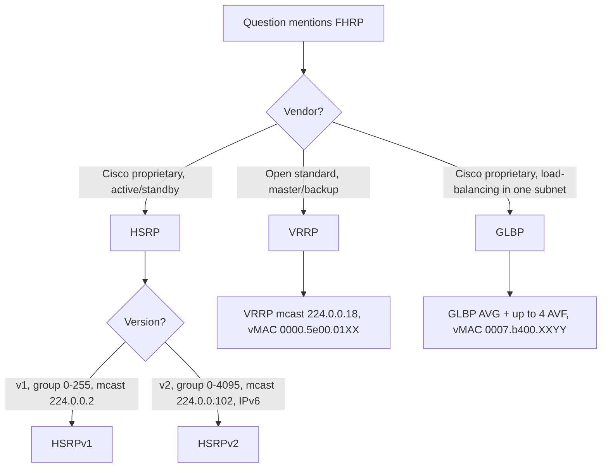
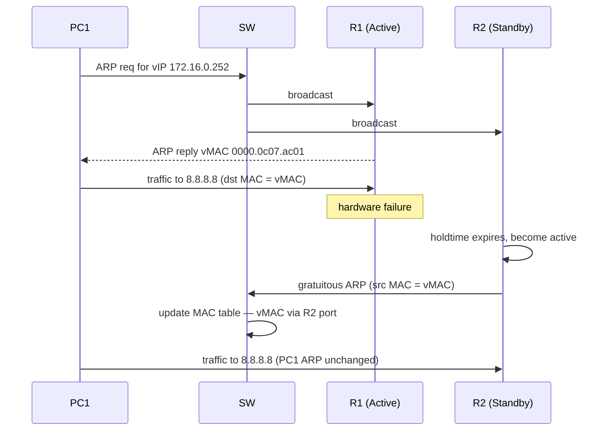

# First Hop Redundancy Protocols — HSRP, VRRP, GLBP
> **Domain 3.0 IP Connectivity (25%)** · Blueprint 3.5 (Describe the purpose of first hop redundancy protocols)

## 📺 Sources

- **[Day 29 — First Hop Redundancy Protocols](https://www.youtube.com/watch?v=43WnpwQMolo)** — purpose of FHRPs, HSRP/VRRP/GLBP comparison, basic HSRP configuration.

Inline source anchors throughout: `[Day 29 @ MM:SS]`.

## 🎯 What you must walk away with

1. **Why FHRPs exist** — without one, end hosts have a single default gateway and lose connectivity if it dies even when a backup router exists `[Day 29 @ 03:38]`.
2. **HSRP vs VRRP vs GLBP** — vendor, role names, multicast IP, virtual MAC format, load-balancing capability.
3. **The failover mechanism** — gratuitous ARP from the new active router updates switch MAC tables; end hosts never re-ARP `[Day 29 @ 09:27]`.
4. **HSRP priority and preemption** — default priority 100, higher wins, **preemption is OFF by default** `[Day 29 @ 11:36]`.
5. **Basic HSRP CLI** — `standby <group> ip <vip>`, `priority`, `preempt`, `version 2`.

---

## 🧠 Core Concept

**Two (or more) routers share a single virtual IP and virtual MAC. End hosts point their default gateway at the virtual IP. The FHRP elects an active router that owns the vIP/vMAC; if it dies, a standby takes over and broadcasts a gratuitous ARP so switches relearn the path. End hosts never change anything.**

The problem statement: PCs in a subnet are configured with a single default-gateway IP (say `172.16.0.254`) `[Day 29 @ 03:06]`. If R1 owning that IP fails, the PCs keep sending traffic to `.254` even though backup R2 is alive — they have no way to know about R2 `[Day 29 @ 03:38]`.

The fix: configure both routers with the same **virtual IP** (e.g. `172.16.0.252`) and point the PCs at *that*. The routers negotiate roles via multicast hellos; the active router answers ARP for the vIP with a **virtual MAC**. If active dies, standby takes over the same vIP+vMAC pair `[Day 29 @ 05:13]`.

---

## 🔄 Decision Flow — "Which FHRP fits this question?"



When a question gives you a virtual MAC, that alone identifies the protocol:
- `0000.0c07.acXX` → HSRPv1
- `0000.0c9f.fXXX` → HSRPv2
- `0000.5e00.01XX` → VRRP
- `0007.b400.XXYY` → GLBP

---

## 🔑 Reference Tables

### The headline comparison — memorize cold

| Trait | HSRPv1 | HSRPv2 | VRRP | GLBP |
|---|---|---|---|---|
| **Vendor** | Cisco | Cisco | Open (RFC 5798) | Cisco |
| **Role names** | Active / Standby | Active / Standby | Master / Backup | AVG + up to 4 AVF |
| **Multicast IP** | `224.0.0.2` | `224.0.0.102` | `224.0.0.18` | `224.0.0.102` |
| **Virtual MAC** | `0000.0c07.acXX` | `0000.0c9f.fXXX` | `0000.5e00.01XX` | `0007.b400.XXYY` |
| **Group range** | 0–255 | 0–4095 | 0–255 | 0–1023 |
| **Default priority** | 100 | 100 | 100 | 100 |
| **Preemption default** | OFF | OFF | **ON** | OFF |
| **Load balance in one subnet?** | No | No | No | **Yes** |
| **IPv6 support** | No | Yes | VRRPv3 only | Yes |

### HSRP virtual MAC walk

The vMAC `0000.0c07.acXX` ends in two hex chars = the **HSRP group number in hex**.
- Group 1 → `0000.0c07.ac01`
- Group 10 → `0000.0c07.ac0a`
- Group 171 → `0000.0c07.acab` (because 171 = 0xAB)

HSRPv2 uses three hex chars (`0000.0c9f.fXXX`) because the group range expands to 0–4095.

### Active-router election order

| Tiebreaker | Rule |
|---|---|
| 1 | **Highest priority** wins (default 100, range 0–255). |
| 2 | Tie → **highest interface IP** wins. |
| 3 | Without preemption, the current active **keeps the role even if a higher-priority router comes online later** `[Day 29 @ 11:36]`. |

### GLBP load-balancing methods

| Method | Behavior |
|---|---|
| Round-robin (default) | AVG hands out the next AVF's vMAC in rotation. |
| Weighted | Heavier-weighted AVFs get more ARP replies. |
| Host-dependent | Same client always gets the same vMAC (sticky). |

---

## 🧪 Worked Examples

### Example A — Configure HSRP group 1 with priority 110 + preempt on R1

R1's interface is `Gi0/0` with real IP `10.10.10.2/24`. The virtual IP is `10.10.10.1`. R1 should be the active router (priority 110 vs R2's default 100) and should reclaim the role after a reboot.

```
R1(config)# interface gigabitethernet0/0
R1(config-if)# ip address 10.10.10.2 255.255.255.0
R1(config-if)# no shutdown
R1(config-if)# standby version 2
R1(config-if)# standby 1 ip 10.10.10.1
R1(config-if)# standby 1 priority 110
R1(config-if)# standby 1 preempt
R1(config-if)# end
R1# show standby brief
```

**Verify line by line:**
- `standby version 2` → uses HSRPv2 (multicast `224.0.0.102`, vMAC `0000.0c9f.fXXX`).
- `standby 1 ip 10.10.10.1` → group 1 owns vIP `10.10.10.1`.
- `standby 1 priority 110` → beats default 100 on R2.
- `standby 1 preempt` → R1 takes the active role back when it recovers.

### Example B — Calculate the HSRPv1 virtual MAC for group 5

Format: `0000.0c07.acXX` where `XX` = group number in hex.
- Group **5** in hex = `05`.
- vMAC = **`0000.0c07.ac05`**.

Now reverse: a packet's destination MAC is `0000.0c07.ac1f`. What HSRP group?
- `1f` hex = **31** decimal → group **31**.

### Example C — Failover sequence

Initial state: R1 active, R2 standby. PC1 has ARP entry mapping `vIP → vMAC` `[Day 29 @ 09:27]`.

1. R1's hardware fails. R2 stops hearing hellos.
2. After ~10 s (HSRP holdtime) R2 declares itself active `[Day 29 @ 08:53]`.
3. R2 broadcasts a **gratuitous ARP** with source MAC = vMAC, source IP = vIP `[Day 29 @ 10:02]`.
4. Every switch that receives the broadcast updates its MAC-address table — vMAC is now reachable via R2's interface `[Day 29 @ 10:34]`.
5. PC1's ARP table is **unchanged** — it still maps vIP to vMAC; the next packet just lands on R2 instead of R1 `[Day 29 @ 11:04]`.
6. R1 comes back. With preemption OFF (default), R1 stays standby `[Day 29 @ 11:36]`. With preemption ON and higher priority, R1 reclaims active.

---

## 📊 Diagram — HSRP failover sequence



---

## 🚨 Exam Traps (the high-frequency wrong-answer bait)

- **HSRP is Cisco-proprietary**; **VRRP is the open-standard** equivalent (RFC 5798).
- **HSRPv1 multicast = `224.0.0.2`**, **HSRPv2 = `224.0.0.102`** — same address as GLBP. Easy to confuse.
- **VRRP virtual IP CAN match a real interface IP** of the master — when it does, master priority is forced to **255** (and preemption is implicit).
- **HSRP and VRRP do NOT load-balance within one subnet** — only **GLBP** does. (You *can* alternate active routers per VLAN with HSRP, but that's per-VLAN, not within one subnet.)
- **Preemption is OFF by default in HSRP** `[Day 29 @ 11:36]` — just having a higher priority is not enough.
- **End hosts do NOT change their ARP entry** during failover `[Day 29 @ 09:27]` — vIP→vMAC stays put, switches do the relearning via gratuitous ARP.
- **HSRPv1 group range is 0–255** (one hex byte in the vMAC). **HSRPv2 = 0–4095** (three hex chars).
- **VRRP master vs HSRP active** — same role, different name. Don't get tripped up by terminology.

---

## ⚙️ Key Cisco IOS Commands

| Command | Purpose |
|---|---|
| `standby version 2` | Switch to HSRPv2 (mcast `224.0.0.102`, larger group range, IPv6). |
| `standby <group> ip <vip>` | Configure the virtual IP for a group. |
| `standby <group> priority <0-255>` | Set this router's priority (default 100). |
| `standby <group> preempt` | Allow this router to take active role when it has higher priority. |
| `standby <group> track <object>` | Lower priority if a tracked interface/route fails (forces failover for non-router-down reasons). |
| `standby <group> authentication md5 key-string <key>` | MD5 authentication between HSRP peers. |
| `show standby` | Verbose HSRP state per interface. |
| `show standby brief` | One-line summary — group, priority, state, active/standby IPs. |

`show standby brief` example output:
```
Interface   Grp  Pri P State    Active           Standby          Virtual IP
Gi0/0       1    110 P Active   local            10.10.10.3       10.10.10.1
```
The `P` in column 4 means preempt is enabled.

---

## 🧪 Self-Check Quiz

**Q1.** A switch shows a frame destined for `0000.0c07.ac0a`. What FHRP and which group?
<details><summary>Answer</summary>HSRPv1, group **10** (`0a` hex = 10 decimal). HSRPv2 would use `0000.0c9f.fXXX` and VRRP would use `0000.5e00.01XX`.</details>

**Q2.** Why does the new active router send a gratuitous ARP after failover?
<details><summary>Answer</summary>So the broadcast frame's source MAC (= the virtual MAC) hits every switch's MAC-address table and triggers a relearn — switches now point the vMAC to the new active router's port. End hosts' ARP tables don't change; the switches' MAC tables do `[Day 29 @ 10:02]`.</details>

**Q3.** Two HSRP routers both have priority 100 and preempt enabled. Their interface IPs are `10.0.0.2` and `10.0.0.3`. Which becomes active?
<details><summary>Answer</summary>**`10.0.0.3`** — tiebreaker on equal priority is **highest interface IP**.</details>

**Q4.** Which FHRP load-balances multiple active routers within a single subnet?
<details><summary>Answer</summary>**GLBP.** It uses one Active Virtual Gateway (AVG) that hands out up to four different vMACs (one per Active Virtual Forwarder, AVF), so different hosts ARP-resolve to different routers.</details>

**Q5.** R1 has HSRP priority 200, R2 has 100. R1 reboots; R2 becomes active. R1 comes back. R1 stays standby — why?
<details><summary>Answer</summary>**Preemption is off by default.** Without `standby <group> preempt` on R1, the higher priority is irrelevant after a non-preempt-capable router has already taken the active role `[Day 29 @ 11:36]`.</details>

**Q6.** A VRRP master's virtual IP is the same as its real interface IP. What is its priority?
<details><summary>Answer</summary>**255** (forced). When the master "owns" the vIP, it always wins.</details>

**Q7.** Configure R1 Gi0/1 for HSRPv2 group 5 with vIP `192.168.1.254`, priority 150, and preempt.
<details><summary>Answer</summary>

```
interface gigabitethernet0/1
 standby version 2
 standby 5 ip 192.168.1.254
 standby 5 priority 150
 standby 5 preempt
```
</details>

**Q8.** What multicast IP does VRRP use, and what is its virtual MAC format?
<details><summary>Answer</summary>Multicast **`224.0.0.18`**, vMAC **`0000.5e00.01XX`** where `XX` = VRRP group number in hex.</details>

---

## 🧾 Recap

- **FHRP = shared vIP + vMAC across two routers** so end hosts have a single, redundant default gateway.
- **HSRP (Cisco), VRRP (open), GLBP (Cisco load-balancing)** — memorize multicast IPs and vMAC formats.
- **Failover = gratuitous ARP** from the new active router; switches relearn, end hosts don't.
- **HSRP priority default = 100**, **higher wins**, **preempt is off by default**.
- **Green-light:** if you can fill the headline comparison table from memory and decode any vMAC into protocol+group, move to Day 30 (TCP/UDP).

---

**Source transcripts:** `[[../jeremy-it-videos/059-first-hop-redundancy-protocols-day-29]]`
**Cheat sheet companion:** `[[../cheat-sheets/day-29-fhrp]]`
