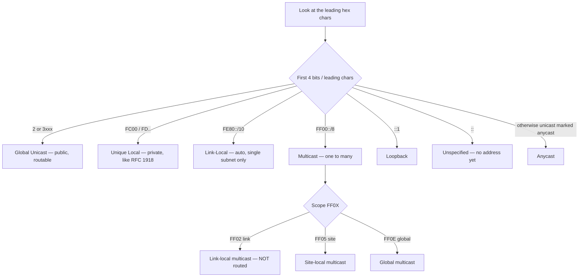
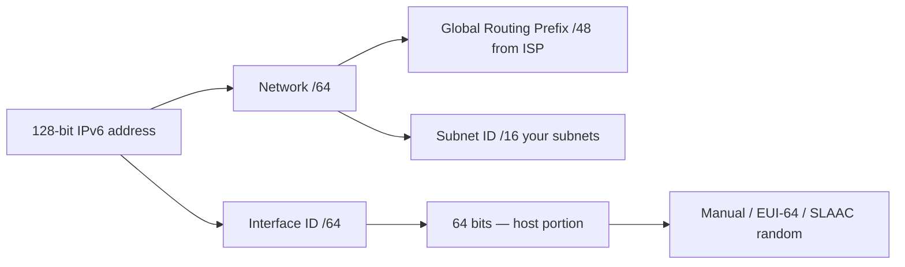

# IPv6 — Addressing, Address Types, Configuration
> **Domain 1.0 Network Fundamentals (20%)** · Blueprint 1.8 (Configure & verify IPv6 addressing & prefix) + 1.9 (Describe IPv6 address types)

## 📺 Sources

- **[Day 31 — IPv6 Part 1](https://www.youtube.com/watch?v=ZNuXyOXae5U)** — 128-bit addressing, hex, compression rules, prefix length.
- **[Day 32 — IPv6 Part 2](https://www.youtube.com/watch?v=BrTMMOXFhDU)** — global unicast, ULA, link-local, multicast, anycast, EUI-64.
- **[Day 33 — IPv6 Part 3](https://www.youtube.com/watch?v=rwkHfsWQwy8)** — NDP, SLAAC, DHCPv6, IPv6 static routing.

Inline anchors throughout: `[Day 31 @ MM:SS]`, `[Day 32 @ MM:SS]`, `[Day 33 @ MM:SS]`.

## 🎯 What you must walk away with

1. **Compress and expand any IPv6 address** — leading-zero rule + single `::` rule.
2. **Identify any address by its leading bits** — GUA (2000s), ULA (FD..), link-local (FE80), multicast (FF), loopback (`::1`), unspecified (`::`).
3. **Compute an EUI-64 interface ID from a MAC** — split, insert `FFFE`, flip the 7th bit (U/L bit).
4. **Configure a static IPv6 address + a default static route** on a Cisco router — including the `ipv6 unicast-routing` global step.
5. **Recognize the four NDP message types** — RS/RA (133/134) for routers, NS/NA (135/136) for neighbors.

---

## 🧠 Core Concept

**IPv6 = 128 bits, written as 8 four-character hex groups (quartets) separated by colons. The first /64 typically identifies the network, the last /64 identifies the host. Every IPv6 interface carries at minimum one auto-generated link-local address (FE80::/10), and IPv6 has no broadcast — it uses multicast (FF00::/8) and NDP (ICMPv6) instead.**

A bare IPv6 address looks like `2001:0db8:0000:0000:0000:00ff:fe00:0001` `[Day 31 @ 11:20]`. Compression rules collapse this to `2001:db8::ff:fe00:1`. Two compression operations, applied independently:
1. **Drop leading zeros** in any quartet (`0db8` → `db8`, `00ff` → `ff`).
2. **Replace one run of all-zero quartets with `::`** (only once per address) `[Day 31 @ 14:05]`.

---

## 🔄 Decision Flow — "What kind of IPv6 address is this?"



---

## 🔑 Reference Tables

### Address types — recognize on sight

| Type | Prefix / Pattern | Routable? | Use case | Exam giveaway |
|---|---|---|---|---|
| **Global Unicast (GUA)** | `2000::/3` (in practice 2xxx, 3xxx) | Yes — Internet | Public address | "registered, public" |
| **Unique Local (ULA)** | `FC00::/7` (in practice **FD..**) | Within org only | RFC 1918 equivalent | "private, ISP drops" |
| **Link-Local** | `FE80::/10` (in practice FE80) | **NO** — single link | Auto on every interface | "automatic, FE80" |
| **Multicast** | `FF00::/8` | Depends on scope | One-to-many | "starts with FF" |
| **Anycast** | Any unicast marked `anycast` | Yes | Nearest-of-many | "same IP, multiple routers" |
| **Loopback** | `::1` | Local only | Self-ping | "IPv6 127.0.0.1" |
| **Unspecified** | `::` | N/A | "no address yet" / default route `::/0` | "all zeros" |

### Well-known multicast addresses

| Address | Meaning |
|---|---|
| `FF02::1` | All nodes on the link (broadcast replacement) |
| `FF02::2` | All routers on the link |
| `FF02::5` | All OSPFv3 routers |
| `FF02::6` | OSPFv3 designated routers |
| `FF02::9` | RIPng routers |
| `FF02::A` | EIGRP for IPv6 routers |
| `FF02::1:FFXX:XXXX` | Solicited-node multicast (used by NDP/DAD) |

### Address structure — `/48` from ISP, `/64` per subnet

```
| Global routing prefix (/48) | Subnet ID (16 bits) | Interface ID (/64) |
|     bits 0-47               |     bits 48-63      |     bits 64-127     |
```

### Compression rules cheat

| Original | Compressed | Why |
|---|---|---|
| `2001:0db8:0000:0000:0000:0000:0000:0001` | `2001:db8::1` | Leading zeros + one `::` |
| `fe80:0000:0000:0000:0000:0000:0000:0001` | `fe80::1` | Same |
| `2001:0db8:0000:0001:0000:0000:0000:0001` | `2001:db8:0:1::1` | Two zero runs — `::` collapses the **longer** one |
| `2001::1::2` | **INVALID** | `::` may appear only once `[Day 31 @ 16:20]` |

### EUI-64 — three-step recipe

| Step | Operation |
|---|---|
| 1 | Split the 48-bit MAC in half, insert `FFFE` between → 64 bits. |
| 2 | Flip the 7th bit (U/L bit) of the first byte. |
| 3 | Prepend the /64 prefix → full 128-bit address. |

---

## 🧪 Worked Examples

### Example A — Compress `2001:0db8:0000:0000:0000:00ff:fe00:0001`

**Step 1 — drop leading zeros in each quartet.**
- `0db8` → `db8`
- `0000` → `0`
- `00ff` → `ff`
- `fe00` → `fe00` (no leading zeros)
- `0001` → `1`

Result: `2001:db8:0:0:0:ff:fe00:1`.

**Step 2 — collapse the longest all-zero run with `::`.**

The longest run is the three `0`'s (positions 3,4,5).

Result: **`2001:db8::ff:fe00:1`**.

### Example B — Convert MAC `00:1B:44:11:3A:B7` to an EUI-64 interface ID

**Step 1 — split the MAC into two halves.**
```
00:1B:44   |   11:3A:B7
```

**Step 2 — insert `FFFE` between the halves.**
```
00:1B:44 : FF:FE : 11:3A:B7
```

That's now 64 bits → `001B:44FF:FE11:3AB7`.

**Step 3 — flip the 7th bit (U/L bit) of the first byte.**

The first byte is `00` = `0000 0000`. Flip bit 7 (counting from the left, position 7) → `0000 0010` = `02`.

Result of Step 3: `021B:44FF:FE11:3AB7`.

**Step 4 — prepend the /64 prefix.** If the prefix is `2001:db8::/64`, the full address is:

**`2001:db8::21b:44ff:fe11:3ab7`**

(After leading-zero compression `021B` becomes `21b` lowercase per RFC 5952.)

The bit-flip detail `[Day 32 @ 21:14]` — the U/L bit flips because EUI-64 inverts the meaning: a `0` here originally meant "globally unique" in IEEE EUI but "locally administered" in IPv6 IID. Flipping ensures the IPv6 IID has the correct interpretation.

### Example C — Configure IPv6 on a router with a static default route

R1 connects to R2 over `Gi0/0`. R1's address is `2001:db8:0:1::1/64`, R2's is `2001:db8:0:1::2/64`. R1 needs IPv6 routing enabled and a default route pointing to R2.

```
R1(config)# ipv6 unicast-routing
R1(config)# interface gigabitethernet0/0
R1(config-if)# ipv6 address 2001:db8:0:1::1/64
R1(config-if)# no shutdown
R1(config-if)# exit
R1(config)# ipv6 route ::/0 2001:db8:0:1::2
R1(config)# end
R1# show ipv6 interface brief
R1# show ipv6 route
```

**Notes:**
- `ipv6 unicast-routing` **must** be enabled globally `[Day 31 @ 24:50]` — without it the router won't forward IPv6 packets even though interfaces have addresses.
- Bringing up an IPv6 address auto-generates a **link-local FE80** address on the same interface.
- `ipv6 route ::/0 <next-hop>` is the IPv6 default route. `::/0` is the IPv6 equivalent of `0.0.0.0/0`.
- Directly-attached static routes (only the exit interface, no next-hop) **fail on Ethernet links** in IPv6 — use a recursive (next-hop) or fully-specified (interface + next-hop) route `[Day 33 @ 18:30]`.

### Example D — SLAAC vs DHCPv6 vs Manual

| Method | Who picks the address? |
|---|---|
| **Manual** | You — `ipv6 address 2001:db8::1/64` |
| **EUI-64** | Router builds IID from MAC — `ipv6 address 2001:db8::/64 eui-64` |
| **SLAAC** | Host listens for RA, builds its own address |
| **DHCPv6 stateless** | RA gives prefix; DHCPv6 gives DNS/options |
| **DHCPv6 stateful** | DHCPv6 server hands out the full address |

---

## 📊 Diagram — IPv6 address structure



---

## 🚨 Exam Traps

- **Link-local is REQUIRED on every IPv6 interface** — it auto-generates the moment any IPv6 config touches the interface. You cannot disable it.
- **`::` appears only ONCE per address** — `2001::1::1` is invalid because the parser cannot tell where the zeros go `[Day 31 @ 16:20]`.
- **Only LEADING zeros drop** — `2001:db00::` cannot become `2001:db::` (that changes the value).
- **EUI-64 inserts `FFFE` AND flips the 7th bit** — both, not just the insertion.
- **IPv6 has NO broadcast** — `FF02::1` (all nodes) is the broadcast replacement.
- **`ipv6 unicast-routing` is OFF by default** — most common "IPv6 doesn't work" cause `[Day 31 @ 24:50]`.
- **Directly-attached static routes fail on Ethernet in IPv6** `[Day 33 @ 18:30]` — use recursive or fully-specified.
- **Unique Local Addresses (FD..) are NOT public** — your ISP drops them, but they ARE routable inside your org.
- **Link-local FE80 addresses are NOT routed between subnets** — routers drop packets destined to FE80.
- **NDP replaces ARP** — uses ICMPv6 messages 133–136, not ARP broadcasts.

---

## ⚙️ Key Cisco IOS Commands

| Command | Purpose |
|---|---|
| `ipv6 unicast-routing` | Global — turn on IPv6 forwarding (off by default). |
| `ipv6 address 2001:db8::1/64` | Manual address on interface. |
| `ipv6 address 2001:db8::/64 eui-64` | Auto-build last /64 via EUI-64. |
| `ipv6 address autoconfig` | SLAAC on the interface. |
| `ipv6 enable` | Add only a link-local FE80 address (no global). |
| `ipv6 route 2001:db8:1::/64 2001:db8::2` | Static route, recursive. |
| `ipv6 route ::/0 2001:db8::2` | IPv6 default route. |
| `ipv6 route 2001:db8:1::/64 gigabitethernet0/0 fe80::1` | Fully-specified (required for link-local next-hop). |
| `show ipv6 interface brief` | Per-interface IPv6 state + addresses. |
| `show ipv6 interface gi0/0` | Verbose — link-local, all-nodes, solicited-node multicast groups. |
| `show ipv6 route` | IPv6 routing table. |
| `show ipv6 neighbors` | IPv6 ARP-equivalent (NDP cache). |

---

## 🧪 Self-Check Quiz

**Q1.** Compress `2001:0db8:0000:0000:00aa:0000:0000:0001`.
<details><summary>Answer</summary>Drop leading zeros: `2001:db8:0:0:aa:0:0:1`. Two zero runs (positions 3-4 and 6-7), tied length — convention picks the **first/leftmost** when tied. Result: **`2001:db8::aa:0:0:1`**.</details>

**Q2.** What is the EUI-64 interface ID for MAC `0050.7966.6843`?
<details><summary>Answer</summary>Split → `0050.79 | 66.6843`. Insert `FFFE` → `0050.79FF.FE66.6843`. Flip 7th bit of first byte (`00` → `02`): **`0250:79FF:FE66:6843`**.</details>

**Q3.** Why is `::` allowed only once per address?
<details><summary>Answer</summary>`::` means "as many all-zero quartets as needed to fill 8 quartets total." If two `::` appeared, the parser couldn't determine how many zero quartets each one represents — the address would be ambiguous.</details>

**Q4.** Identify the type of `FE80::1`.
<details><summary>Answer</summary>**Link-local** (FE80::/10) — auto-generated, single-link only, never routed.</details>

**Q5.** What multicast address does OSPFv3 use for "all OSPF routers"?
<details><summary>Answer</summary>**`FF02::5`** (link-local scope). DR multicast is `FF02::6`.</details>

**Q6.** Configure interface `Gi0/1` with prefix `2001:db8:cafe:1::/64` using EUI-64, and enable IPv6 routing globally.
<details><summary>Answer</summary>

```
configure terminal
 ipv6 unicast-routing
 interface gigabitethernet0/1
  ipv6 address 2001:db8:cafe:1::/64 eui-64
  no shutdown
```
</details>

**Q7.** A static IPv6 route to `2001:db8:5::/64` via link-local next-hop `fe80::1` on `Gi0/0`. Write it.
<details><summary>Answer</summary>**`ipv6 route 2001:db8:5::/64 gigabitethernet0/0 fe80::1`** — fully-specified is required because the router can't resolve a link-local next-hop without knowing which interface.</details>

**Q8.** What ICMPv6 message types implement NDP's neighbor MAC lookup?
<details><summary>Answer</summary>**Neighbor Solicitation = type 135** (asks for MAC), **Neighbor Advertisement = type 136** (replies with MAC). Compare RS/RA (133/134) which discover routers.</details>

---

## 🧾 Recap

- **128 bits, 8 hex quartets, slash notation only.** Drop leading zeros + one `::` for the longest zero run.
- **Address types by prefix:** GUA (2000::/3), ULA (FC00::/7 → FD..), link-local (FE80::/10), multicast (FF00::/8), loopback (`::1`), unspecified (`::`).
- **EUI-64** = split MAC, insert `FFFE`, flip the 7th bit.
- **`ipv6 unicast-routing` is the on-switch** — turn it on first, then configure interfaces.
- **NDP replaces ARP** (NS/NA 135/136) and broadcast (FF02::1 all-nodes); SLAAC builds host addresses from RA + EUI-64.
- **Green-light:** if you can compress any address, identify any prefix, and run a manual EUI-64 calculation by hand, move to ACLs (Day 34).

---

**Source transcripts:** `[[../jeremy-it-videos/063-ipv6-part-1-day-31]]` · `[[../jeremy-it-videos/065-ipv6-part-2-day-32]]` · `[[../jeremy-it-videos/067-ipv6-part-3-day-33]]`
**Cheat sheet companions:** `[[../cheat-sheets/day-31-ipv6-part-1]]` · `[[../cheat-sheets/day-32-ipv6-part-2]]` · `[[../cheat-sheets/day-33-ipv6-pt3]]`
