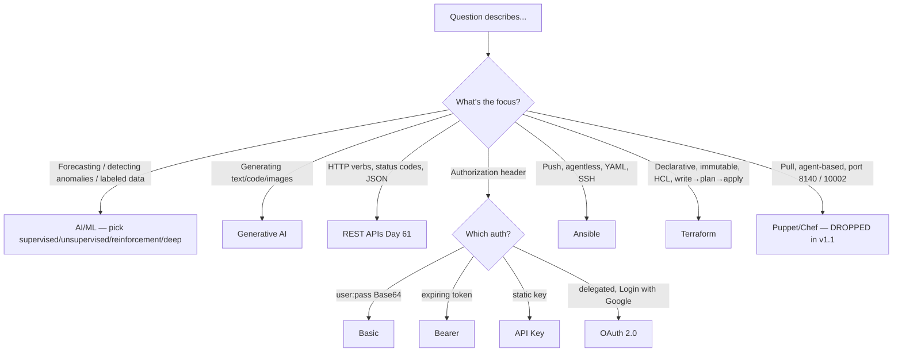
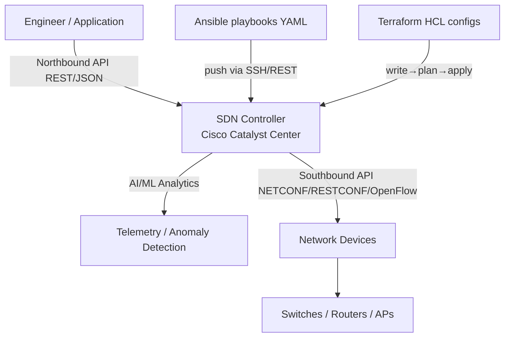

# v1.1 Modern Cluster — AI/ML, REST APIs, IaC (Ansible + Terraform)
> **Domain 6.0 Automation & Programmability (10%)** · Blueprint 6.4 (AI/ML in network ops — NEW v1.1) + 6.5 (REST API characteristics + auth) + 6.6 (Ansible + Terraform — Puppet/Chef DROPPED in v1.1)

> ⚠️ **v1.1 BLUEPRINT CHANGES** — this note covers the three biggest deltas vs v1.0:
> 1. **6.4 NEW**: AI generative + predictive + ML in network operations.
> 2. **6.5 EXPANDED**: REST API authentication methods including OAuth 2.0.
> 3. **6.6 CHANGED**: Puppet and Chef **removed**, **Terraform added**. Ansible kept.
> Expect 2–4 questions on this cluster on the actual exam.

## 📺 Sources

- **[Day 59 (pt 2) — AI & Machine Learning](https://www.youtube.com/watch?v=Fn_kAv35W5A)** — AI ⊃ ML ⊃ Deep Learning, four ML types, predictive vs generative, Catalyst Center features.
- **[Day 61 — REST APIs](https://www.youtube.com/watch?v=Luei0p-2h10)** — REST constraints, CRUD ↔ HTTP verbs, response codes.
- **[Day 61 (pt 2) — REST API Authentication](https://www.youtube.com/watch?v=bmqr_xpt6sc)** — Basic, Bearer, API Key, OAuth 2.0.
- **[Day 63 (pt 1) — Ansible, Puppet, Chef](https://www.youtube.com/watch?v=Kog9gHTjALI)** — push/pull, agent/agentless, language, ports.
- **[Day 63 (pt 2) — Terraform](https://www.youtube.com/watch?v=VAwUaffejWU)** — IaC, declarative vs procedural, mutable vs immutable, write/plan/apply.

Inline anchors throughout: `[Day 59p2 @ MM:SS]`, `[Day 61 @ MM:SS]`, `[Day 61p2 @ MM:SS]`, `[Day 63p1 @ MM:SS]`, `[Day 63p2 @ MM:SS]`.

## 🎯 What you must walk away with

1. **AI ⊃ ML ⊃ Deep Learning** — four ML types (supervised, unsupervised, reinforcement, deep), predictive vs generative AI applications, Catalyst Center AI features.
2. **CRUD ↔ HTTP verbs** — POST/GET/PUT (or PATCH)/DELETE, plus response code classes (2xx/3xx/4xx/5xx).
3. **Four REST auth methods** — Basic, Bearer, API Key, OAuth 2.0 — and the OAuth 2.0 four-role flow.
4. **Ansible vs Terraform** — push/pull, agent/agentless, procedural vs declarative, mutable vs immutable, configuration management vs provisioning.
5. **Recognize JSON, YAML, HCL syntax** at a glance — cite the language by shape.

---

## 🧠 Core Concept

**Modern network operations layer software on top of devices: AI/ML for analysis, REST APIs for control-plane access, and IaC (Ansible/Terraform) to roll out config or provision infrastructure repeatably. The CCNA tests recognition, not depth — you need to identify which tool/term matches a given description.**

The connecting thread: a controller (Cisco Catalyst Center, formerly DNA Center) ingests telemetry → runs ML models → exposes a REST API northbound → engineers drive that API from Ansible playbooks or Terraform configs.

---

## 🔄 Decision Flow — "Which tool fits this description?"



---

## 🔑 Reference Tables

### CRUD ↔ HTTP verb mapping `[Day 61 @ 06:30]`

| CRUD operation | HTTP verb | Idempotent? |
|---|---|---|
| **C**reate | **POST** | No |
| **R**ead | **GET** | Yes |
| **U**pdate (full replace) | **PUT** | Yes |
| **U**pdate (partial) | **PATCH** | No |
| **D**elete | **DELETE** | Yes |

### HTTP response code classes `[Day 61 @ 12:40]`

| Class | Meaning | Common examples |
|---|---|---|
| **1xx** | Informational | 100 Continue, 102 Processing |
| **2xx** | **Success** | **200 OK**, **201 Created**, 204 No Content |
| **3xx** | Redirection | 301 Moved Permanently, 302 Found |
| **4xx** | **Client error** | **400 Bad Request**, **401 Unauthorized**, 403 Forbidden, **404 Not Found** |
| **5xx** | Server error | **500 Internal Server Error**, 503 Service Unavailable |

### REST auth methods — the four `[Day 61p2 @ 04:10]`

| Method | What's sent | Header format | Expires? | Best fit |
|---|---|---|---|---|
| **Basic** | `username:password` Base64-encoded | `Authorization: Basic <b64>` | Never | Quick internal use |
| **Bearer** | Token issued by auth server | `Authorization: Bearer <token>` | **Yes** | Modern APIs |
| **API Key** | Static key from provider | `Authorization: <key>` (or custom header) | Manual revoke | Per-customer usage tracking |
| **OAuth 2.0** | Access token via delegation flow | `Authorization: Bearer <token>` | Yes + refresh token | "Log in with Google" |

### OAuth 2.0 four roles `[Day 61p2 @ 11:25]`

| Role | "Log in with Google" example |
|---|---|
| **Resource Owner** | The Google account user |
| **Client** | Third-party app |
| **Authorization Server** | Google's OAuth service (issues tokens) |
| **Resource Server** | Server hosting Google Calendar / Drive data |

### Four ML types `[Day 59p2 @ 08:00]`

| Type | Training data | Example |
|---|---|---|
| **Supervised** | **Labeled** data | Spam classifier, image recognition |
| **Unsupervised** | **Unlabeled** data | Clustering, anomaly detection |
| **Reinforcement** | Reward / penalty in environment | Self-driving, game AI |
| **Deep** | Multi-layer neural networks (any of the above) | LLMs, computer vision |

### Predictive vs Generative AI `[Day 59p2 @ 14:30]`

| Application | Description | Example |
|---|---|---|
| **Predictive AI** | Forecast outcome from past data | Traffic-anomaly detection, capacity forecasting |
| **Generative AI** | Create new content | ChatGPT, DALL-E, code completion |

### Cisco Catalyst Center AI features (formerly DNA Center)

| Feature | Function |
|---|---|
| **AI Network Analytics** | Baselines normal behavior, flags anomalies |
| **Machine Reasoning Engine (MRE)** | Automated root-cause analysis |
| **AI Endpoint Analytics** | Classifies endpoints from traffic patterns |
| **AI-enhanced RRM** | Optimizes Wi-Fi (radio resource management) |

### Ansible vs Terraform vs (legacy) Puppet/Chef

| Trait | **Ansible ✅v1.1** | **Terraform ✅v1.1** | Puppet (dropped) | Chef (dropped) |
|---|---|---|---|---|
| **Language** | Python | Go (core) / HCL (configs) | Ruby | Ruby |
| **Config files** | YAML playbooks, Jinja2 templates | HCL `.tf` files | Manifests | Cookbooks/Recipes |
| **Agent?** | **Agentless (SSH)** | **Agentless** | **Agent-based** | **Agent-based** |
| **Model** | **Push** | **Push** | Pull | Pull |
| **Style** | Procedural | **Declarative** | Declarative | Procedural |
| **Mutability** | Mutable | **Immutable** | Mutable | Mutable |
| **Primary use** | Configuration management | **Provisioning** | Config mgmt | Config mgmt |
| **Port** | SSH 22 | varies (provider APIs) | TCP 8140 | TCP 10002 |
| **Workflow** | Run playbook | **Write → Plan → Apply** | run agent | run agent |

---

## 🧪 Worked Examples

### Example A — Build a curl request to a Cisco Catalyst Center REST API with a bearer token

The flow: **POST credentials → get token → use token on subsequent calls** `[Day 61p2 @ 16:40]`.

**Step 1 — get a bearer token** (Catalyst Center sandbox):
```bash
curl -X POST https://sandboxdnac.cisco.com/dna/system/api/v1/auth/token \
     -H "Content-Type: application/json" \
     -u devnetuser:Cisco123!
```

Response (truncated):
```json
{
  "Token": "eyJhbGciOiJIUzI1NiJ9.eyJzdWIiOiI..."
}
```

**Step 2 — list devices using the token:**
```bash
curl -X GET https://sandboxdnac.cisco.com/dna/intent/api/v1/network-device \
     -H "X-Auth-Token: eyJhbGciOiJIUzI1NiJ9.eyJzdWIiOiI..." \
     -H "Content-Type: application/json"
```

Sample JSON response:
```json
{
  "response": [
    {
      "hostname": "edge-router-1",
      "managementIpAddress": "10.10.10.1",
      "softwareVersion": "16.9.3",
      "reachabilityStatus": "Reachable"
    }
  ]
}
```

**What to recognize on the exam:**
- `-X POST/GET` → HTTP verb (CRUD).
- `-H "Authorization: ..."` → auth header (Basic/Bearer/API Key).
- `-H "Content-Type: application/json"` → request body format.
- `-d '{"key":"value"}'` → JSON body (for POST/PUT/PATCH).
- `{}` braces = JSON object, `[]` brackets = JSON array.

### Example B — A 5-line Ansible playbook that sets a Cisco hostname

```yaml
- name: Configure hostname on Cisco IOS
  hosts: routers
  gather_facts: no
  tasks:
    - name: Set hostname to R1
      cisco.ios.ios_config:
        lines:
          - hostname R1
```

**What to recognize:**
- **YAML** — indentation-sensitive, `key: value`, `-` for list items.
- `hosts: routers` → references the **inventory file**.
- `cisco.ios.ios_config` → Ansible **module** for IOS config commands.
- The playbook is **pushed** over SSH from the Ansible control node to the device — no agent on the router `[Day 63p1 @ 14:20]`.

### Example C — Recognize Terraform HCL syntax

```hcl
terraform {
  required_providers {
    aws = {
      source  = "hashicorp/aws"
      version = "~> 5.0"
    }
  }
}

provider "aws" {
  region = "us-east-1"
}

resource "aws_instance" "web" {
  ami           = "ami-0c55b159cbfafe1f0"
  instance_type = "t2.micro"

  tags = {
    Name = "ExampleInstance"
  }
}
```

**What to recognize:**
- **HCL** — `block_type "label" { key = value }` shape.
- `terraform { ... }` → core block (required providers).
- `provider "aws" { ... }` → which platform Terraform talks to.
- `resource "aws_instance" "web" { ... }` → desired-state declaration; Terraform figures out the API calls.
- The workflow `[Day 63p2 @ 19:50]`:
  1. **Write** the `.tf` file.
  2. **`terraform plan`** → preview the diff vs state file.
  3. **`terraform apply`** → make it real, update the state file.
  4. (Optional) **`terraform destroy`** → tear it down.

### Example D — Identify the tool from a description

| Description | Answer |
|---|---|
| Agentless, push, YAML, Python | **Ansible** |
| Declarative, immutable, HCL, state file | **Terraform** |
| Reward/penalty ML | **Reinforcement** |
| Base64 user:pass | **Basic** |
| Resource Owner / Client / Auth Server / Resource Server | **OAuth 2.0** |
| HTTP 401 | **Unauthorized** |
| HTTP 404 | **Not Found (client error)** |
| Cisco's renamed AI/ML platform | **Catalyst Center** (was DNA Center) |

---

## 📊 Diagram — SDN controller architecture (north/south APIs)



REST APIs typically sit on the **northbound** side `[Day 61 @ 28:10]` — apps and engineers drive the controller. The southbound side (controller → devices) tends to use NETCONF, RESTCONF, or OpenFlow.

---

## 🚨 Exam Traps

- **PATCH ≠ PUT** — PATCH is a partial update; PUT replaces the entire resource.
- **200 OK ≠ 201 Created ≠ 204 No Content** — all 2xx successes, but distinct meanings (200: resource returned, 201: new resource created (POST), 204: success no body).
- **404 is a client error** (4xx), not a server error.
- **401 vs 403** — 401 means "you need to authenticate," 403 means "you authenticated but you're forbidden."
- **REST is stateless** — every request must carry its own auth; the server keeps no session state.
- **Base64 is encoding, not encryption** — Basic auth must run over **HTTPS** or credentials leak.
- **API keys must NOT go in the URL** — URLs end up in logs. Use the `Authorization` header.
- **Ansible is agentless via SSH** — `[Day 63p1 @ 09:50]`. Puppet and Chef are agent-based (and dropped in v1.1).
- **Terraform Core is written in Go**, configs in HCL — they are different things.
- **Terraform is declarative + immutable + provisioning-focused** `[Day 63p2 @ 12:00]`. Ansible is procedural + mutable + configuration-management-focused.
- **Terraform workflow = write → plan → apply** (NOT "build/test/deploy").
- **Deep learning is a subset of ML, not a separate category** — neural networks specifically.
- **Generative AI can hallucinate** — always verify outputs `[Day 59p2 @ 21:30]`. Common v1.1 framing.
- **Cisco DNA Center = Catalyst Center** (renamed). Same product, expect either name on the exam.

---

## ⚙️ Key recognition cues (mostly conceptual — no IOS commands)

**JSON** — `{}` object, `[]` array, keys quoted:
```json
{ "device": "R1", "interfaces": ["Gi0/0", "Gi0/1"], "up": true }
```

**YAML** — indentation-sensitive, `-` list, `key: value`:
```yaml
device: R1
interfaces:
  - Gi0/0
  - Gi0/1
```

**HCL** — `block_type "label" { key = value }`:
```hcl
resource "aws_instance" "web" {
  instance_type = "t2.micro"
}
```

**Curl flags:** `-X POST` (verb) · `-H "Authorization: Bearer ..."` (header) · `-d '{"key":"value"}'` (body) · `-u user:pass` (Basic auth).

---

## 🧪 Self-Check Quiz

**Q1.** A REST API call returns HTTP 401. What does the client need to do?
<details><summary>Answer</summary>**Authenticate.** 401 = Unauthorized → either no credentials sent or credentials invalid. Compare 403 (authenticated but forbidden) and 404 (resource not found).</details>

**Q2.** Map CRUD to HTTP verbs.
<details><summary>Answer</summary>**Create → POST**, **Read → GET**, **Update → PUT (full) or PATCH (partial)**, **Delete → DELETE**.</details>

**Q3.** Which automation tool is **agentless, push, YAML-based, and written in Python**?
<details><summary>Answer</summary>**Ansible.** This is the v1.1 default for network configuration management.</details>

**Q4.** Which auth method uses an authorization server and a resource server, and lets a third-party app act on a user's behalf without ever seeing the password?
<details><summary>Answer</summary>**OAuth 2.0.** The four roles are Resource Owner, Client, Authorization Server, Resource Server.</details>

**Q5.** Name the four ML types covered for v1.1.
<details><summary>Answer</summary>**Supervised** (labeled data), **Unsupervised** (unlabeled / clustering), **Reinforcement** (reward/penalty), **Deep** (multi-layer neural networks).</details>

**Q6.** Which tool is declarative, immutable, agentless, and uses HCL?
<details><summary>Answer</summary>**Terraform.** Declarative + immutable + state file = Terraform fingerprint. Workflow: write → plan → apply.</details>

**Q7.** What does an HSRP-equivalent question for AI sound like? "ML type that mimics the human brain with multiple hidden layers."
<details><summary>Answer</summary>**Deep learning.** Specifically, multi-layer neural networks. It's a subset of ML, not a separate top-level category.</details>

**Q8.** Why is Basic auth dangerous over plain HTTP?
<details><summary>Answer</summary>Because **Base64 is encoding, not encryption** — anyone capturing the packet can decode the credentials. Always run Basic auth over HTTPS.</details>

---

## 🧾 Recap

- **AI ⊃ ML ⊃ Deep Learning.** Predictive AI = forecasts; Generative AI = creates content. Catalyst Center features (AI Network Analytics, MRE, AI Endpoint Analytics, AI-enhanced RRM) are the canonical Cisco examples.
- **REST = stateless client-server over HTTP.** CRUD ↔ POST/GET/PUT-or-PATCH/DELETE. 2xx success, 4xx client error, 5xx server error. JSON is the dominant data format.
- **Four REST auth methods**: Basic (Base64), Bearer (expiring token), API Key (static), OAuth 2.0 (delegated). Always over HTTPS, always in the `Authorization:` header.
- **Ansible (v1.1)** = Python, agentless, push, YAML, SSH, configuration management.
- **Terraform (v1.1)** = Go core / HCL configs, agentless, push, declarative, immutable, provisioning. Workflow: write → plan → apply.
- **Green-light:** if you can fill the Ansible-vs-Terraform comparison table from memory, identify any HTTP status class on sight, and name the four OAuth 2.0 roles, you're exam-ready on Domain 6.0's modern cluster.

---

**Source transcripts:** `[[../jeremy-it-videos/119-ai-machine-learning-ccna-200-301-day-59-part-2]]` · `[[../jeremy-it-videos/121-rest-apis-day-61]]` · `[[../jeremy-it-videos/122-rest-api-authentication-ccna-200-301-day-61-part-2]]` · `[[../jeremy-it-videos/124-ansible-puppet-chef-day-63-part-1]]` · `[[../jeremy-it-videos/125-terraform-ccna-200-301-day-63-part-2]]`
**Cheat sheet companions:** `[[../cheat-sheets/day-59p2-ai-ml]]` · `[[../cheat-sheets/day-61-rest-apis]]` · `[[../cheat-sheets/day-61p2-rest-api-auth]]` · `[[../cheat-sheets/day-63p1-ansible]]` · `[[../cheat-sheets/day-63p2-terraform]]`
